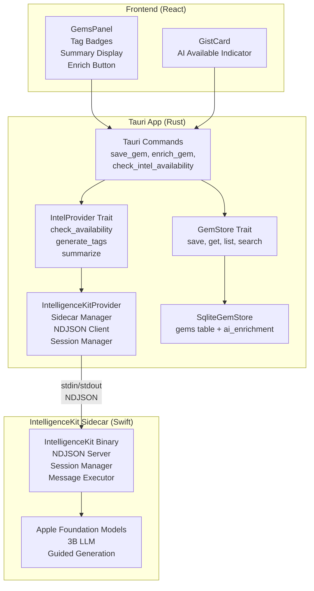
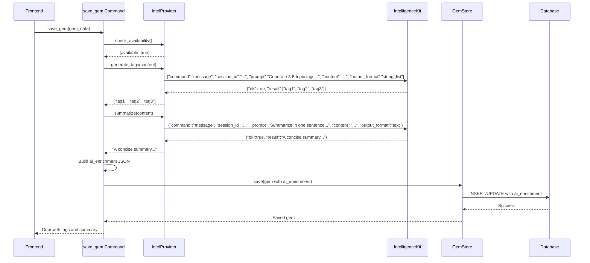
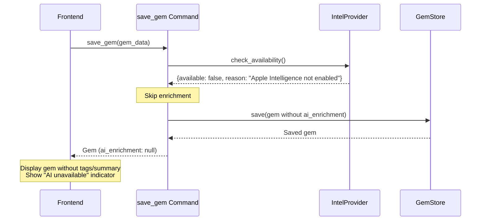

# Design Document: IntelligenceKit Integration

## Overview

This design integrates IntelligenceKit — a macOS Swift server wrapping Apple's on-device Foundation Models (3B parameter LLM) — into the Jarvis Tauri app as a sidecar process. The integration adds automatic AI enrichment to Gems: when a user saves a Gem (from YouTube, Medium, Gmail, ChatGPT, or any page), the system generates 3-5 topic tags and a one-sentence summary using Apple Intelligence, running entirely on-device with zero API keys or network requests.

The design uses a **different sidecar approach than JarvisListen** due to different communication requirements. JarvisListen uses `tauri_plugin_shell` with event-based stdout delivery (streaming PCM audio), while IntelligenceKit requires synchronous request-response over stdin/stdout (write NDJSON command → read one NDJSON response line). To achieve this, IntelligenceKit is spawned using `tokio::process::Command` directly for clean stdin/stdout access, while still being registered in `externalBin` for bundling and using Tauri's path resolver to locate the binary. The system degrades gracefully when Apple Intelligence is unavailable (older Mac, Intel hardware, or user hasn't enabled it) — Gems are saved without enrichment, and the app continues to function normally.

The architecture introduces an `IntelProvider` trait (analogous to `GemStore` for persistence) that abstracts the intelligence backend. The default implementation is `IntelligenceKitProvider`, which manages the sidecar lifecycle and NDJSON communication. Future implementations (e.g., `ClaudeProvider` for cloud-based enrichment, `KeywordProvider` for simple keyword extraction) can be added by implementing the trait without modifying commands or frontend code.

All AI-generated metadata is stored in a single `ai_enrichment` JSON column on the `gems` table, mirroring the existing `source_meta` pattern. This design separates derived AI data from user-provided data, enables future enrichment types (embeddings, sentiment, key quotes) without schema migrations, and includes provenance metadata (`provider`, `enriched_at`) to track who generated the data and when.

## Architecture

### Component Diagram



### Data Flow: Gem Save with Enrichment



### Graceful Degradation Flow



## Sidecar Spawn Approach

### Divergence from JarvisListen Pattern

IntelligenceKit uses a **different sidecar spawn approach** than JarvisListen due to fundamentally different communication requirements:

**JarvisListen (Event-Based Streaming):**
- Uses `tauri_plugin_shell` sidecar API
- Communication: One-way streaming (stdout → Rust via `Receiver<CommandEvent>`)
- Pattern: Fire-and-forget with event callbacks
- Use case: Continuous PCM audio stream

```rust
// JarvisListen approach (event-based)
let sidecar = app_handle.shell().sidecar("JarvisListen")?;
let (rx, child) = sidecar.spawn()?;
// stdout arrives via rx.recv() -> CommandEvent::Stdout
// stdin via child.write(&[u8])
```

**IntelligenceKit (Synchronous Request-Response):**
- Uses `tokio::process::Command` directly
- Communication: Synchronous request-response (write NDJSON command → read one NDJSON response line)
- Pattern: Blocking read after each write
- Use case: NDJSON protocol with line-delimited messages

```rust
// IntelligenceKit approach (request-response)
let mut child = tokio::process::Command::new(binary_path)
    .stdin(Stdio::piped())
    .stdout(Stdio::piped())
    .stderr(Stdio::piped())
    .spawn()?;
let stdin = child.stdin.take().unwrap();
let stdout = BufReader::new(child.stdout.take().unwrap());
// Write command, then immediately read one line from stdout
```

**Why the Tauri shell plugin doesn't work for IntelligenceKit:**

The Tauri shell plugin returns `CommandChild` with a `Receiver<CommandEvent>` for stdout. This event-based delivery makes synchronous request-response awkward:
1. Write command to stdin
2. Wait for `CommandEvent::Stdout` to arrive via receiver
3. Accumulate bytes until newline
4. Parse response
5. Repeat for next command

This requires a background task routing events into per-request channels, adding complexity and latency. The direct `tokio::process::Command` approach gives us clean `AsyncBufReadExt::read_line()` for immediate response reading.

**What we keep from the JarvisListen pattern:**
- Register IntelligenceKit in `tauri.conf.json` `externalBin` for bundling
- Use Tauri's `PathResolver` to locate the binary at runtime
- Monitor stderr for logs (prefix with `[IntelligenceKit]`)
- Graceful shutdown on app exit

**Design Rationale:**
- Direct process control enables synchronous NDJSON protocol
- Simpler implementation (no event routing layer)
- Lower latency (no event queue)
- Still benefits from Tauri's binary bundling and path resolution

## Components and Interfaces

### IntelProvider Trait

The `IntelProvider` trait abstracts the intelligence backend, enabling swappable implementations without modifying commands or frontend code.

```rust
// src-tauri/src/intelligence/provider.rs

use async_trait::async_trait;

/// Result of an availability check
#[derive(Debug, Clone, serde::Serialize, serde::Deserialize)]
pub struct AvailabilityResult {
    pub available: bool,
    pub reason: Option<String>,
}

/// Backend-agnostic intelligence provider interface
#[async_trait]
pub trait IntelProvider: Send + Sync {
    /// Check if the provider is available and ready to process requests
    async fn check_availability(&self) -> AvailabilityResult;
    
    /// Generate topic tags from content
    /// Returns a vector of short topic strings (1-3 words each)
    /// Implementation should request 3-5 tags but accept 1-10, trimming to max 5
    /// Returns error if model returns empty array
    async fn generate_tags(&self, content: &str) -> Result<Vec<String>, String>;
    
    /// Generate a one-sentence summary from content
    /// Returns a single sentence capturing the key idea
    async fn summarize(&self, content: &str) -> Result<String, String>;
}
```

**Design Rationale:**
- Trait object compatible (`Send + Sync`) for use as Tauri managed state: `Arc<dyn IntelProvider>`
- Async methods for non-blocking I/O with the sidecar process
- Simple error type (`String`) for user-facing error messages
- `AvailabilityResult` struct matches IntelligenceKit's response format
- `generate_tags` documents the 1-10 range with trimming to 5 (LLM may not follow exact count)

### IntelligenceKitProvider

The default `IntelProvider` implementation that manages the IntelligenceKit sidecar process and NDJSON communication.

```rust
// src-tauri/src/intelligence/intelligencekit_provider.rs

use std::sync::Arc;
use std::process::Stdio;
use tokio::sync::Mutex;
use tokio::process::{Child, Command};
use tokio::io::{AsyncBufReadExt, AsyncWriteExt, BufReader, BufWriter};
use serde::{Deserialize, Serialize};

/// NDJSON command structures
#[derive(Serialize)]
struct NdjsonCommand {
    command: String,
    #[serde(skip_serializing_if = "Option::is_none")]
    session_id: Option<String>,
    #[serde(skip_serializing_if = "Option::is_none")]
    instructions: Option<String>,
    #[serde(skip_serializing_if = "Option::is_none")]
    prompt: Option<String>,
    #[serde(skip_serializing_if = "Option::is_none")]
    content: Option<String>,
    #[serde(skip_serializing_if = "Option::is_none")]
    output_format: Option<String>,
}

/// NDJSON response structures
#[derive(Deserialize)]
struct NdjsonResponse {
    ok: bool,
    #[serde(default)]
    session_id: Option<String>,
    #[serde(default)]
    result: Option<serde_json::Value>,
    #[serde(default)]
    error: Option<String>,
    #[serde(default)]
    available: Option<bool>,
    #[serde(default)]
    reason: Option<String>,
}

pub struct IntelligenceKitProvider {
    /// Shared state protected by mutex (only one command in-flight at a time)
    state: Arc<Mutex<ProviderState>>,
}

struct ProviderState {
    /// Child process handle (tokio::process::Child, not Tauri CommandChild)
    child: Option<Child>,
    /// Current session ID (None if no session open)
    session_id: Option<String>,
    /// Cached availability result
    availability: AvailabilityResult,
    /// Stdin writer (buffered for efficiency)
    stdin: Option<BufWriter<tokio::process::ChildStdin>>,
    /// Stdout reader (buffered for line reading)
    stdout: Option<BufReader<tokio::process::ChildStdout>>,
}

impl IntelligenceKitProvider {
    /// Create a new provider and spawn the sidecar using tokio::process::Command
    pub async fn new(app_handle: tauri::AppHandle) -> Result<Self, String> {
        // Resolve binary path using Tauri v2 PathResolver
        let binary_path = app_handle
            .path()
            .resolve("binaries/IntelligenceKit", tauri::path::BaseDirectory::Resource)
            .ok_or("IntelligenceKit binary not found")?;
        
        // Spawn using tokio::process::Command for direct stdin/stdout access
        let mut child = Command::new(binary_path)
            .stdin(Stdio::piped())
            .stdout(Stdio::piped())
            .stderr(Stdio::piped())
            .spawn()
            .map_err(|e| format!("Failed to spawn IntelligenceKit: {}", e))?;
        
        // Take ownership of stdio handles
        let stdin = child.stdin.take()
            .ok_or("Failed to get stdin handle")?;
        let stdout = child.stdout.take()
            .ok_or("Failed to get stdout handle")?;
        let stderr = child.stderr.take()
            .ok_or("Failed to get stderr handle")?;
        
        // Spawn stderr monitoring task
        tokio::spawn(async move {
            let mut reader = BufReader::new(stderr);
            let mut line = String::new();
            while let Ok(n) = reader.read_line(&mut line).await {
                if n == 0 { break; }
                eprint!("[IntelligenceKit] {}", line);
                line.clear();
            }
        });
        
        let state = ProviderState {
            child: Some(child),
            session_id: None,
            availability: AvailabilityResult { available: false, reason: None },
            stdin: Some(BufWriter::new(stdin)),
            stdout: Some(BufReader::new(stdout)),
        };
        
        let provider = Self {
            state: Arc::new(Mutex::new(state)),
        };
        
        // Check availability and open initial session
        let availability = provider.check_availability_internal().await?;
        {
            let mut state = provider.state.lock().await;
            state.availability = availability.clone();
        }
        
        if availability.available {
            provider.open_session().await?;
        }
        
        Ok(provider)
    }
    
    /// Send a command and receive a response (with 30s timeout)
    async fn send_command(&self, cmd: NdjsonCommand) -> Result<NdjsonResponse, String> {
        let mut state = self.state.lock().await;
        
        let stdin = state.stdin.as_mut()
            .ok_or("Stdin not available")?;
        let stdout = state.stdout.as_mut()
            .ok_or("Stdout not available")?;
        
        // Serialize command to JSON + newline
        let json = serde_json::to_string(&cmd)
            .map_err(|e| format!("Failed to serialize command: {}", e))?;
        
        // Write to stdin with 30s timeout
        let write_future = async {
            stdin.write_all(json.as_bytes()).await?;
            stdin.write_all(b"\n").await?;
            stdin.flush().await?;
            Ok::<_, std::io::Error>(())
        };
        
        tokio::time::timeout(std::time::Duration::from_secs(30), write_future)
            .await
            .map_err(|_| "Command write timeout".to_string())?
            .map_err(|e| format!("Failed to write command: {}", e))?;
        
        // Read one line from stdout with 30s timeout
        let mut response_line = String::new();
        let read_future = stdout.read_line(&mut response_line);
        
        tokio::time::timeout(std::time::Duration::from_secs(30), read_future)
            .await
            .map_err(|_| "Command read timeout".to_string())?
            .map_err(|e| format!("Failed to read response: {}", e))?;
        
        // Deserialize response
        serde_json::from_str(&response_line)
            .map_err(|e| format!("Failed to parse response: {}", e))
    }
    
    /// Internal availability check (sends check-availability command)
    async fn check_availability_internal(&self) -> Result<AvailabilityResult, String> {
        let cmd = NdjsonCommand {
            command: "check-availability".to_string(),
            session_id: None,
            instructions: None,
            prompt: None,
            content: None,
            output_format: None,
        };
        
        let response = self.send_command(cmd).await?;
        
        if !response.ok {
            return Ok(AvailabilityResult {
                available: false,
                reason: response.error.or(Some("Unknown error".to_string())),
            });
        }
        
        Ok(AvailabilityResult {
            available: response.available.unwrap_or(false),
            reason: response.reason,
        })
    }
    
    /// Open a new session
    async fn open_session(&self) -> Result<String, String> {
        let cmd = NdjsonCommand {
            command: "open-session".to_string(),
            session_id: None,
            instructions: Some("You are a content analysis assistant. Follow the user's instructions precisely.".to_string()),
            prompt: None,
            content: None,
            output_format: None,
        };
        
        let response = self.send_command(cmd).await?;
        
        if !response.ok {
            return Err(response.error.unwrap_or_else(|| "Failed to open session".to_string()));
        }
        
        let session_id = response.session_id
            .ok_or("No session_id in response")?;
        
        {
            let mut state = self.state.lock().await;
            state.session_id = Some(session_id.clone());
        }
        
        Ok(session_id)
    }
    
    /// Ensure a session is open (create if needed)
    async fn ensure_session(&self) -> Result<String, String> {
        let state = self.state.lock().await;
        if let Some(session_id) = &state.session_id {
            return Ok(session_id.clone());
        }
        drop(state);
        
        self.open_session().await
    }
    
    /// Shutdown the sidecar gracefully
    pub async fn shutdown(&self) {
        let cmd = NdjsonCommand {
            command: "shutdown".to_string(),
            session_id: None,
            instructions: None,
            prompt: None,
            content: None,
            output_format: None,
        };
        
        // Try to send shutdown command (ignore errors)
        let _ = self.send_command(cmd).await;
        
        // Wait up to 3 seconds for graceful exit
        let mut state = self.state.lock().await;
        if let Some(mut child) = state.child.take() {
            let wait_future = child.wait();
            if tokio::time::timeout(std::time::Duration::from_secs(3), wait_future).await.is_err() {
                // Timeout - send SIGTERM
                let _ = child.kill().await;
            }
        }
    }
}
```

**Design Rationale:**
- Uses `tokio::process::Command` directly for synchronous stdin/stdout access
- Single mutex protects all state, ensuring sequential command processing (IntelligenceKit requirement)
- Session management is transparent: `ensure_session` automatically re-creates sessions after idle timeout
- Timeout enforcement (30s) prevents indefinite hangs
- Stderr monitoring emits logs prefixed with `[IntelligenceKit]` for debugging
- Buffered I/O (`BufWriter`/`BufReader`) for efficiency

### IntelProvider Implementation for IntelligenceKitProvider

```rust
#[async_trait]
impl IntelProvider for IntelligenceKitProvider {
    async fn check_availability(&self) -> AvailabilityResult {
        let state = self.state.lock().await;
        state.availability.clone()
    }
    
    async fn generate_tags(&self, content: &str) -> Result<Vec<String>, String> {
        // Try with retry on session_not_found
        match self.generate_tags_internal(content).await {
            Err(e) if e.contains("session_not_found") => {
                // Session expired, re-open and retry once
                self.open_session().await?;
                self.generate_tags_internal(content).await
            }
            result => result,
        }
    }
    
    async fn generate_tags_internal(&self, content: &str) -> Result<Vec<String>, String> {
        let session_id = self.ensure_session().await?;
        
        let cmd = NdjsonCommand {
            command: "message".to_string(),
            session_id: Some(session_id),
            instructions: None,
            prompt: Some("Generate 3-5 topic tags (1-3 words each) that capture the main themes of this content. Return only the tags as a list.".to_string()),
            content: Some(content.to_string()),
            output_format: Some("string_list".to_string()),
        };
        
        let response = self.send_command(cmd).await?;
        
        if !response.ok {
            return Err(response.error.unwrap_or_else(|| "Tag generation failed".to_string()));
        }
        
        let tags: Vec<String> = serde_json::from_value(response.result.unwrap_or(serde_json::Value::Array(vec![])))
            .map_err(|e| format!("Failed to parse tags: {}", e))?;
        
        // Validate and trim tags
        if tags.is_empty() {
            return Err("Model returned no tags".to_string());
        }
        
        // Trim to max 5 tags if model returned more
        let trimmed_tags: Vec<String> = tags.into_iter().take(5).collect();
        
        Ok(trimmed_tags)
    }
    
    async fn summarize(&self, content: &str) -> Result<String, String> {
        // Try with retry on session_not_found
        match self.summarize_internal(content).await {
            Err(e) if e.contains("session_not_found") => {
                // Session expired, re-open and retry once
                self.open_session().await?;
                self.summarize_internal(content).await
            }
            result => result,
        }
    }
    
    async fn summarize_internal(&self, content: &str) -> Result<String, String> {
        let session_id = self.ensure_session().await?;
        
        let cmd = NdjsonCommand {
            command: "message".to_string(),
            session_id: Some(session_id),
            instructions: None,
            prompt: Some("Summarize this content in one sentence (max 100 words) suitable for display in a list view.".to_string()),
            content: Some(content.to_string()),
            output_format: Some("text".to_string()),
        };
        
        let response = self.send_command(cmd).await?;
        
        if !response.ok {
            return Err(response.error.unwrap_or_else(|| "Summarization failed".to_string()));
        }
        
        let summary: String = serde_json::from_value(response.result.unwrap_or(serde_json::Value::String(String::new())))
            .map_err(|e| format!("Failed to parse summary: {}", e))?;
        
        if summary.is_empty() {
            return Err("Model returned empty summary".to_string());
        }
        
        Ok(summary)
    }
}
```

**Design Rationale:**
- `generate_tags` and `summarize` detect `session_not_found` errors and retry once after re-opening session
- Internal methods (`*_internal`) contain the actual logic
- Public methods wrap with retry logic for session recovery
- Trims to maximum 5 tags if model returns more (takes first 5)
- Returns error if model returns empty array (ensures at least 1 tag)
- `summarize` validates that summary is non-empty
- Both methods use `ensure_session` for automatic session management
- Errors are descriptive and user-facing

**Implementation Note:** The `*_internal` helper methods should be placed in a separate `impl IntelligenceKitProvider` block (inherent methods), while the trait methods (`check_availability`, `generate_tags`, `summarize`) go in the `impl IntelProvider for IntelligenceKitProvider` block. Rust does not allow mixing inherent methods with trait implementation methods in the same impl block.

### Gem Schema Extension

The `Gem` and `GemPreview` structs are extended with AI enrichment fields.

```rust
// src-tauri/src/gems/store.rs

#[derive(Debug, Clone, Serialize, Deserialize)]
pub struct Gem {
    pub id: String,
    pub source_type: String,
    pub source_url: String,
    pub domain: String,
    pub title: String,
    pub author: Option<String>,
    pub description: Option<String>,
    pub content: Option<String>,
    pub source_meta: serde_json::Value,
    pub captured_at: String,
    
    /// AI-generated enrichment metadata (JSON blob)
    /// Structure: {"tags": ["tag1", ...], "summary": "...", "provider": "intelligencekit", "enriched_at": "ISO 8601"}
    /// NULL when no enrichment has been applied
    pub ai_enrichment: Option<serde_json::Value>,
}

#[derive(Debug, Clone, Serialize, Deserialize)]
pub struct GemPreview {
    pub id: String,
    pub source_type: String,
    pub source_url: String,
    pub domain: String,
    pub title: String,
    pub author: Option<String>,
    pub description: Option<String>,
    pub content_preview: Option<String>,
    pub captured_at: String,
    
    /// Extracted from ai_enrichment.tags for frontend convenience
    pub tags: Option<Vec<String>>,
    /// Extracted from ai_enrichment.summary for frontend convenience
    pub summary: Option<String>,
}

/// Storage interface for gems - implementations are swappable
#[async_trait]
pub trait GemStore: Send + Sync {
    /// Save or update a gem (upsert by source_url)
    async fn save(&self, gem: Gem) -> Result<Gem, String>;
    
    /// Get a gem by ID
    async fn get(&self, id: &str) -> Result<Option<Gem>, String>;
    
    /// List gems with pagination (ordered by captured_at DESC)
    async fn list(&self, limit: usize, offset: usize) -> Result<Vec<GemPreview>, String>;
    
    /// Search gems by keyword (FTS on title, description, content)
    async fn search(&self, query: &str, limit: usize) -> Result<Vec<GemPreview>, String>;
    
    /// Filter gems by tag (exact match on ai_enrichment.tags array)
    async fn filter_by_tag(&self, tag: &str, limit: usize, offset: usize) -> Result<Vec<GemPreview>, String>;
    
    /// Delete a gem by ID
    async fn delete(&self, id: &str) -> Result<(), String>;
}
```

**Design Rationale:**
- `ai_enrichment` is a JSON blob (not individual columns) for flexibility and future-proofing
- `GemPreview` extracts `tags` and `summary` at the Rust layer to simplify frontend code
- NULL `ai_enrichment` means "never enriched" (distinct from empty JSON)
- New `filter_by_tag` method added to GemStore trait for tag-based filtering

### Database Schema Migration

```sql
-- Migration: Add ai_enrichment column to gems table

ALTER TABLE gems ADD COLUMN ai_enrichment TEXT;

-- Update FTS5 triggers to include summary in search index

DROP TRIGGER IF EXISTS gems_ai;
CREATE TRIGGER gems_ai AFTER INSERT ON gems BEGIN
    INSERT INTO gems_fts(rowid, title, description, content)
    VALUES (
        new.rowid,
        new.title,
        new.description,
        COALESCE(new.content, '') || ' ' || COALESCE(json_extract(new.ai_enrichment, '$.summary'), '')
    );
END;

DROP TRIGGER IF EXISTS gems_au;
CREATE TRIGGER gems_au AFTER UPDATE ON gems BEGIN
    INSERT INTO gems_fts(gems_fts, rowid, title, description, content)
    VALUES('delete', old.rowid, old.title, old.description, 
        COALESCE(old.content, '') || ' ' || COALESCE(json_extract(old.ai_enrichment, '$.summary'), ''));
    INSERT INTO gems_fts(rowid, title, description, content)
    VALUES (
        new.rowid,
        new.title,
        new.description,
        COALESCE(new.content, '') || ' ' || COALESCE(json_extract(new.ai_enrichment, '$.summary'), '')
    );
END;

DROP TRIGGER IF EXISTS gems_ad;
CREATE TRIGGER gems_ad AFTER DELETE ON gems BEGIN
    INSERT INTO gems_fts(gems_fts, rowid, title, description, content)
    VALUES('delete', old.rowid, old.title, old.description,
        COALESCE(old.content, '') || ' ' || COALESCE(json_extract(old.ai_enrichment, '$.summary'), ''));
END;
```

**Design Rationale:**
- `ai_enrichment` is TEXT (JSON string) and nullable
- FTS5 triggers extract summary via `json_extract` and append to searchable content
- All three triggers (insert, update, delete) use the same content concatenation formula: `content || ' ' || summary`
- This ensures FTS5 can properly match and remove entries on delete/update
- Backwards compatible: existing gems have NULL `ai_enrichment` (COALESCE handles this)

### SqliteGemStore Implementation

The `filter_by_tag` method implementation in SqliteGemStore:

```rust
// src-tauri/src/gems/sqlite_store.rs

impl GemStore for SqliteGemStore {
    // ... existing methods ...
    
    async fn filter_by_tag(&self, tag: &str, limit: usize, offset: usize) -> Result<Vec<GemPreview>, String> {
        let conn = self.pool.get()
            .map_err(|e| format!("Failed to get connection: {}", e))?;
        
        let mut stmt = conn.prepare(
            "SELECT DISTINCT g.* 
             FROM gems g, json_each(json_extract(g.ai_enrichment, '$.tags'))
             WHERE json_each.value = ?1
             ORDER BY g.captured_at DESC
             LIMIT ?2 OFFSET ?3"
        ).map_err(|e| format!("Failed to prepare statement: {}", e))?;
        
        let gems = stmt.query_map(params![tag, limit, offset], |row| {
            Ok(gem_to_preview(row_to_gem(row)?))
        })
        .map_err(|e| format!("Failed to execute query: {}", e))?
        .collect::<Result<Vec<_>, _>>()
        .map_err(|e| format!("Failed to collect results: {}", e))?;
        
        Ok(gems)
    }
}
```

**Design Rationale:**
- Uses SQLite's `json_each` to expand the tags array into rows
- Filters by exact tag match using `json_each.value = ?1`
- Returns DISTINCT gems (in case of multiple tag matches)
- Ordered by `captured_at DESC` for consistency with `list`
- Supports pagination via `LIMIT` and `OFFSET`

### GemPreview Extraction Logic

The `gem_to_preview` helper extracts `tags` and `summary` from the `ai_enrichment` JSON:

```rust
// src-tauri/src/gems/sqlite_store.rs

fn gem_to_preview(gem: Gem) -> GemPreview {
    // Extract tags and summary from ai_enrichment JSON
    let (tags, summary) = if let Some(ai_enrichment) = &gem.ai_enrichment {
        let tags = ai_enrichment
            .get("tags")
            .and_then(|v| serde_json::from_value::<Vec<String>>(v.clone()).ok());
        
        let summary = ai_enrichment
            .get("summary")
            .and_then(|v| v.as_str())
            .map(|s| s.to_string());
        
        (tags, summary)
    } else {
        (None, None)
    };
    
    GemPreview {
        id: gem.id,
        source_type: gem.source_type,
        source_url: gem.source_url,
        domain: gem.domain,
        title: gem.title,
        author: gem.author,
        description: gem.description,
        content_preview: gem.content.as_ref().map(|c| {
            c.chars().take(200).collect::<String>()
        }),
        captured_at: gem.captured_at,
        tags,
        summary,
    }
}
```

**Design Rationale:**
- Extracts `tags` as `Vec<String>` using `serde_json::from_value`
- Extracts `summary` as `String` using `.as_str()`
- Returns `None` for both if `ai_enrichment` is NULL
- Handles JSON parsing errors gracefully (returns None on failure)
- Content preview is truncated to 200 characters

### Tauri Commands

```rust
// src-tauri/src/commands.rs

use crate::intelligence::provider::{IntelProvider, AvailabilityResult};
use crate::gems::store::{GemStore, Gem};
use crate::browser::extractors::PageGist;

#[tauri::command]
pub async fn save_gem(
    gist: PageGist,  // Preserve existing parameter type
    intel_provider: tauri::State<'_, Arc<dyn IntelProvider>>,
    gem_store: tauri::State<'_, Arc<dyn GemStore>>,
) -> Result<Gem, String> {
    // Convert PageGist to Gem using existing helper (handles UUID, timestamp, source_meta)
    let mut gem = page_gist_to_gem(gist);
    
    // Attempt enrichment (non-blocking)
    if intel_provider.check_availability().await.available {
        let content_for_enrichment = gem.content.as_deref()
            .or(gem.description.as_deref())
            .unwrap_or("");
        
        if !content_for_enrichment.is_empty() {
            match enrich_content(&intel_provider, content_for_enrichment).await {
                Ok(enrichment) => {
                    gem.ai_enrichment = Some(enrichment);
                }
                Err(e) => {
                    eprintln!("[IntelligenceKit] Enrichment failed: {}", e);
                    // Continue without enrichment
                }
            }
        }
    }
    
    // Save gem (with or without enrichment)
    gem_store.save(gem).await
}

#[tauri::command]
pub async fn enrich_gem(
    id: String,
    intel_provider: tauri::State<'_, Arc<dyn IntelProvider>>,
    gem_store: tauri::State<'_, Arc<dyn GemStore>>,
) -> Result<Gem, String> {
    // Check availability first
    let availability = intel_provider.check_availability().await;
    if !availability.available {
        return Err(format!(
            "AI enrichment unavailable: {}",
            availability.reason.unwrap_or_else(|| "Unknown reason".to_string())
        ));
    }
    
    // Fetch gem
    let mut gem = gem_store.get(&id).await?
        .ok_or_else(|| format!("Gem not found: {}", id))?;
    
    // Enrich
    let content_for_enrichment = gem.content.as_deref()
        .or(gem.description.as_deref())
        .ok_or("Gem has no content to enrich")?;
    
    let enrichment = enrich_content(&intel_provider, content_for_enrichment).await?;
    gem.ai_enrichment = Some(enrichment);
    
    // Save updated gem
    gem_store.save(gem).await
}

#[tauri::command]
pub async fn check_intel_availability(
    intel_provider: tauri::State<'_, Arc<dyn IntelProvider>>,
) -> Result<AvailabilityResult, String> {
    Ok(intel_provider.check_availability().await)
}

#[tauri::command]
pub async fn filter_gems_by_tag(
    tag: String,
    limit: Option<usize>,
    offset: Option<usize>,
    gem_store: tauri::State<'_, Arc<dyn GemStore>>,
) -> Result<Vec<GemPreview>, String> {
    let limit = limit.unwrap_or(50);
    let offset = offset.unwrap_or(0);
    gem_store.filter_by_tag(&tag, limit, offset).await
}

/// Helper: Enrich content with tags and summary
async fn enrich_content(
    provider: &Arc<dyn IntelProvider>,
    content: &str,
) -> Result<serde_json::Value, String> {
    let tags = provider.generate_tags(content).await?;
    let summary = provider.summarize(content).await?;
    
    Ok(serde_json::json!({
        "tags": tags,
        "summary": summary,
        "provider": "intelligencekit",
        "enriched_at": chrono::Utc::now().to_rfc3339(),
    }))
}
```

**Design Rationale:**
- `save_gem` preserves existing `gist: PageGist` parameter (backwards compatible with frontend)
- Uses existing `page_gist_to_gem` helper for UUID generation, timestamp, and source_meta merging
- Enrichment happens after conversion but before persistence
- `save_gem` attempts enrichment but never fails the save operation
- `enrich_gem` explicitly checks availability and returns errors (user-initiated action)
- `check_intel_availability` is lightweight (cached state check)
- `filter_gems_by_tag` enables tag-based filtering using SQLite's json_each
- Helper function `enrich_content` centralizes enrichment logic

## Data Models

### AI Enrichment JSON Structure

```json
{
  "tags": ["rust", "async programming", "tokio"],
  "summary": "An introduction to asynchronous programming in Rust using the Tokio runtime.",
  "provider": "intelligencekit",
  "enriched_at": "2024-01-15T10:30:00Z"
}
```

**Fields:**
- `tags`: Array of 3-5 short topic strings (1-3 words each)
- `summary`: Single sentence capturing the key idea (max ~100 words)
- `provider`: String identifying which provider generated the enrichment ("intelligencekit", "claude", "keyword", etc.)
- `enriched_at`: ISO 8601 timestamp of when enrichment was generated

**Future Extensions:**
- `embeddings`: Vector representation for semantic search
- `sentiment`: Positive/negative/neutral classification
- `key_quotes`: Array of notable excerpts
- `reading_difficulty`: Flesch-Kincaid grade level
- `language`: Detected language code

### NDJSON Protocol Examples

**Check Availability:**
```json
Request:  {"command":"check-availability"}
Response: {"ok":true,"available":true}
Response: {"ok":true,"available":false,"reason":"Apple Intelligence not enabled by user"}
```

**Open Session:**
```json
Request:  {"command":"open-session","instructions":"You are a content analysis assistant. Follow the user's instructions precisely."}
Response: {"ok":true,"session_id":"550e8400-e29b-41d4-a716-446655440000"}
```

**Generate Tags:**
```json
Request:  {"command":"message","session_id":"550e8400-e29b-41d4-a716-446655440000","prompt":"Generate 3-5 topic tags (1-3 words each) that capture the main themes of this content. Return only the tags as a list.","content":"Rust is a systems programming language...","output_format":"string_list"}
Response: {"ok":true,"result":["rust","systems programming","memory safety"]}
```

**Generate Summary:**
```json
Request:  {"command":"message","session_id":"550e8400-e29b-41d4-a716-446655440000","prompt":"Summarize this content in one sentence (max 100 words) suitable for display in a list view.","content":"Rust is a systems programming language...","output_format":"text"}
Response: {"ok":true,"result":"Rust is a systems programming language focused on memory safety and performance."}
```

**Error Response:**
```json
Response: {"ok":false,"error":"session_not_found"}
Response: {"ok":false,"error":"guardrail_blocked"}
```

**Shutdown:**
```json
Request:  {"command":"shutdown"}
Response: {"ok":true}
```


## Correctness Properties

*A property is a characteristic or behavior that should hold true across all valid executions of a system—essentially, a formal statement about what the system should do. Properties serve as the bridge between human-readable specifications and machine-verifiable correctness guarantees.*

After analyzing all acceptance criteria, I've identified the following testable properties. Many criteria relate to UI rendering, architecture decisions, or compiler-enforced constraints, which are not suitable for property-based testing. The properties below focus on functional behaviors that can be validated through automated testing.

### Property Reflection

Before listing the properties, I reviewed all testable criteria from the prework to eliminate redundancy:

- **Tag count validation (1.3)** stands alone as a constraint on the generate_tags output
- **NDJSON round-trip (3.1, 3.2)** can be combined into a single serialization property
- **Error handling (3.6, 5.5, 11.1, 11.2)** represents graceful degradation across multiple scenarios - these are distinct enough to keep separate
- **Enrichment pipeline (5.1, 5.2, 5.7, 5.8)** covers the save flow - these are examples rather than properties
- **Search integration (6.6)** is a property about FTS5 behavior
- **Tag filtering (6.8)** is a property about query behavior
- **Backwards compatibility (11.1, 11.2, 11.4, 11.6)** represents multiple independent properties about existing functionality

### Property 1: Tag Count Constraint

*For any* content string passed to `generate_tags`, the returned vector should contain at least 1 tag and at most 10 tags. The implementation should trim results to a maximum of 5 tags if more are returned.

**Implementation Strategy:** The `generate_tags` method will:
1. Request 3-5 tags in the prompt (guidance to the model)
2. Accept any non-empty array the model returns (1-10 tags)
3. If more than 5 tags are returned, take the first 5
4. If 0 tags are returned, return an error

**Validates: Requirements 1.3**

**Rationale:** The on-device 3B LLM may not strictly follow the "3-5 tags" instruction. Guided generation constrains output to `[String]` but not array length. This property reflects the actual enforceable constraint: the implementation ensures at least 1 tag (non-empty) and at most 5 tags (by trimming).

### Property 2: NDJSON Serialization Round Trip

*For any* valid Command struct, serializing to JSON, appending a newline, and deserializing should produce an equivalent Command.

**Validates: Requirements 3.1, 3.2**

### Property 3: Concurrent Request Serialization

*For any* set of concurrent requests to the IntelligenceKitProvider, all requests should complete successfully without interleaving (commands are processed sequentially, not in parallel).

**Validates: Requirements 3.4**

### Property 4: Error Handling Never Panics

*For any* error condition (timeout, invalid response, session not found, guardrail blocked), the client should return a Result::Err with a descriptive message and never panic.

**Validates: Requirements 3.6**

### Property 5: Save Succeeds Without Enrichment

*For any* gem data, when the IntelProvider is unavailable, `save_gem` should successfully save the gem with `ai_enrichment` set to NULL.

**Validates: Requirements 5.5, 11.1**

### Property 6: Summary Searchability

*For any* gem with an `ai_enrichment.summary` field, searching for words from the summary should return that gem in the results.

**Validates: Requirements 6.6**

### Property 7: GemPreview Extraction

*For any* Gem with a populated `ai_enrichment` JSON blob, converting to GemPreview should correctly extract `tags` and `summary` fields.

**Validates: Requirements 6.7**

### Property 8: Tag Filtering Accuracy

*For any* tag string, filtering gems by that tag should return only gems whose `ai_enrichment.tags` array contains that exact tag.

**Validates: Requirements 6.8**

### Property 9: List Command Backwards Compatibility

*For any* database state (with or without `ai_enrichment` data), the `list_gems` command should return all gems without errors.

**Validates: Requirements 11.2**

### Property 10: Search Command Backwards Compatibility

*For any* search query and database state (with or without `ai_enrichment` data), the `search_gems` command should execute without errors.

**Validates: Requirements 11.2**

### Property 11: Delete Command Backwards Compatibility

*For any* gem (with or without `ai_enrichment`), the `delete_gem` command should successfully delete the gem.

**Validates: Requirements 11.4**

### Property 12: Existing Features Unaffected

*For any* existing feature (recording, transcription, browser observation), the feature should continue to work identically before and after IntelligenceKit integration.

**Validates: Requirements 11.6**

### Example-Based Tests

The following criteria are best validated with specific examples rather than property-based tests:

**Stderr Logging (2.4)**: Test that IntelligenceKit stderr output is prefixed with `[IntelligenceKit]`

**Unexpected Termination (2.5)**: Test that when the sidecar terminates unexpectedly, availability is marked as false

**Graceful Shutdown (2.6)**: Test that shutdown sends the shutdown command and waits up to 3 seconds before SIGTERM

**Binary Not Found (2.8)**: Test that when IntelligenceKit binary is missing, the app starts successfully with availability=false

**Response Parsing (3.3)**: Test parsing of `{"ok":true}` and `{"ok":false,"error":"..."}` response formats

**Command Timeout (3.5)**: Test that commands timing out after 30 seconds return an error

**Session Recovery (4.3)**: Test that after a session timeout, the next request automatically re-opens a session

**Session Not Found Recovery (4.4)**: Test that `session_not_found` errors trigger automatic session re-creation

**Save Triggers Enrichment (5.1)**: Test that saving a gem calls generate_tags and summarize

**Content Fallback (5.2)**: Test that enrichment uses `description` when `content` is empty

**Enrichment Structure (5.7)**: Test that successful enrichment produces JSON with tags, summary, provider, enriched_at

**Enrichment Status in Response (5.8)**: Test that saved gem includes ai_enrichment in the response

**Enrichment JSON Structure (6.2)**: Test that ai_enrichment has the correct schema

**Schema Migration (6.4)**: Test that the ai_enrichment column exists after migration

**Migration Backwards Compatibility (6.5)**: Test that existing gems have NULL ai_enrichment after migration

**On-Demand Enrichment (7.2)**: Test that enrich_gem updates the database

**Re-Enrichment (7.3)**: Test that enrich_gem overwrites existing ai_enrichment

**Enrichment Unavailable Error (7.4)**: Test that enrich_gem returns an error when provider is unavailable

**Backlog Enrichment (7.6)**: Test that enrich_gem works on gems saved before IntelligenceKit was available

**Availability Command (8.2)**: Test that check_intel_availability returns the correct structure

**Sidecar Independence (11.5)**: Test that JarvisListen and IntelligenceKit can run simultaneously

**App Starts Without Binary (11.8)**: Test that the app starts successfully when IntelligenceKit binary is not present

## Error Handling

### Error Categories

1. **Sidecar Lifecycle Errors**
   - Binary not found: Log warning, mark unavailable, continue startup
   - Spawn failure: Log error, mark unavailable, continue startup
   - Unexpected termination: Log exit code, mark unavailable, continue operation
   - Shutdown timeout: Send SIGTERM after 3 seconds

2. **Communication Errors**
   - Command timeout (30s): Return error to caller, do not retry
   - Invalid JSON response: Return error with details, log to stderr
   - Broken pipe (stdin/stdout): Mark unavailable, log error

3. **Session Errors**
   - Session not found: Automatically re-open session, retry command once
   - Session idle timeout: Transparently re-open on next request
   - Open session failure: Return error, mark unavailable

4. **Model Errors**
   - Guardrail blocked: Return error to caller with explanation
   - Model unavailable: Mark provider unavailable, return error
   - Unknown output format: Return error (client bug)

5. **Enrichment Errors**
   - Provider unavailable during save: Skip enrichment, save gem without ai_enrichment
   - Provider unavailable during enrich_gem: Return error to user
   - Tag generation failure: Skip enrichment, save gem without ai_enrichment
   - Summarization failure: Skip enrichment, save gem without ai_enrichment

### Error Recovery Strategies

**Automatic Recovery:**
- Session not found → Re-open session, retry command once
- Session idle timeout → Re-open session on next request
- Sidecar crash → Mark unavailable, log error, continue operation

**User-Facing Errors:**
- enrich_gem when unavailable → Return descriptive error
- Command timeout → Return timeout error
- Guardrail blocked → Return content policy error

**Silent Degradation:**
- save_gem enrichment failure → Save without enrichment, log to stderr
- Availability check failure → Cache last known state

### Logging Strategy

All errors are logged to stderr with appropriate prefixes:

```
[IntelligenceKit] Sidecar stderr: <message>
[IntelligenceKit] Unexpected termination: exit code 1
[IntelligenceKit] Command timeout after 30s: message
[IntelligenceKit] Enrichment failed: <error>
[IntelligenceKit] Session not found, re-opening session
```

## Testing Strategy

### Dual Testing Approach

This feature requires both unit tests and property-based tests for comprehensive coverage:

**Unit Tests** validate:
- Specific examples of NDJSON protocol messages
- Edge cases (empty content, missing fields, malformed JSON)
- Error conditions (timeouts, session not found, guardrail blocked)
- Integration points (sidecar spawn, shutdown sequence)
- Schema migration (column exists, NULL values for existing gems)

**Property-Based Tests** validate:
- Universal properties across all inputs (tag count, serialization round-trip)
- Concurrent request handling (serialization property)
- Error handling never panics (across all error types)
- Backwards compatibility (existing commands work with new schema)

Together, unit tests catch concrete bugs in specific scenarios, while property tests verify general correctness across the input space.

### Property-Based Testing Configuration

**Library**: Use `proptest` crate (Rust standard for property-based testing)

**Configuration**: Each property test runs minimum 100 iterations to ensure adequate coverage through randomization

**Tagging**: Each property test includes a comment referencing the design property:
```rust
// Feature: intelligence-kit-integration, Property 1: Tag Count Constraint
#[test]
fn prop_generate_tags_returns_1_to_5_tags() { ... }
```

### Test Organization

```
src-tauri/src/intelligence/
├── provider.rs              # IntelProvider trait
├── intelligencekit_provider.rs  # Implementation
└── tests/
    ├── provider_tests.rs    # Unit tests for trait implementations
    ├── protocol_tests.rs    # NDJSON protocol unit tests
    ├── session_tests.rs     # Session management unit tests
    ├── error_tests.rs       # Error handling unit tests
    └── properties.rs        # Property-based tests

src-tauri/src/gems/
└── tests/
    ├── enrichment_tests.rs  # Enrichment pipeline unit tests
    └── schema_tests.rs      # Migration and backwards compatibility tests
```

### Key Test Scenarios

**Unit Tests:**
1. Parse check-availability response (available=true, available=false with reason)
2. Parse open-session response (extract session_id)
3. Parse message response (string_list format, text format)
4. Parse error response (session_not_found, guardrail_blocked, etc.)
5. Command timeout returns error after 30 seconds
6. Session not found triggers automatic re-open
7. Sidecar stderr is prefixed with [IntelligenceKit]
8. Unexpected termination marks provider unavailable
9. Shutdown sends shutdown command and waits 3 seconds
10. App starts successfully when binary is missing
11. save_gem succeeds when provider is unavailable
12. enrich_gem returns error when provider is unavailable
13. Schema migration adds ai_enrichment column
14. Existing gems have NULL ai_enrichment after migration
15. FTS5 index includes summary in search
16. Tag filtering returns only matching gems

**Property Tests:**
1. generate_tags always returns 3-5 tags (Property 1)
2. Command serialization round-trip preserves data (Property 2)
3. Concurrent requests are serialized (Property 3)
4. Errors never panic (Property 4)
5. save_gem succeeds without enrichment (Property 5)
6. Summaries are searchable (Property 6)
7. GemPreview extraction is correct (Property 7)
8. Tag filtering is accurate (Property 8)
9. list_gems works with any schema state (Property 9)
10. search_gems works with any schema state (Property 10)
11. delete_gem works with any enrichment state (Property 11)
12. Existing features unaffected (Property 12)

### Integration Testing

**Manual Testing Checklist:**
1. Start app with IntelligenceKit binary present → Check availability=true
2. Start app without IntelligenceKit binary → Check availability=false, app starts
3. Save gem with AI available → Verify tags and summary appear
4. Save gem with AI unavailable → Verify gem saves without enrichment
5. Click "Enrich" button on unenriched gem → Verify enrichment appears
6. Click "Re-enrich" button on enriched gem → Verify enrichment updates
7. Search for words from AI summary → Verify gem appears in results
8. Filter by tag → Verify only matching gems appear
9. Run JarvisListen and IntelligenceKit simultaneously → Verify both work
10. Shutdown app → Verify IntelligenceKit receives shutdown command

### Performance Considerations

**Enrichment Latency:**
- Tag generation: ~1-3 seconds (depends on content length)
- Summarization: ~1-3 seconds (depends on content length)
- Total enrichment time: ~2-6 seconds per gem

**Optimization Strategies:**
- Run tag generation and summarization in the same session (reuse context)
- Use 30-second timeout to prevent indefinite hangs
- Cache availability check result (no need to re-check on every save)
- Skip enrichment for empty content (no API call)

**Scalability:**
- Single session handles all requests (no session-per-request overhead)
- Sequential processing ensures predictable behavior
- Automatic session recovery handles idle timeouts

## Frontend Integration

### GemsPanel Changes

**Tag Display:**
```tsx
{gem.tags && gem.tags.length > 0 && (
  <div className="gem-tags">
    {gem.tags.map(tag => (
      <span 
        key={tag} 
        className="tag-badge"
        onClick={() => filterByTag(tag)}
      >
        {tag}
      </span>
    ))}
  </div>
)}
```

**Summary Display:**
```tsx
<div className="gem-summary">
  {gem.summary ? (
    <p className="ai-summary">{gem.summary}</p>
  ) : (
    <p className="content-preview">{gem.content_preview}</p>
  )}
</div>
```

**Enrich Button:**
```tsx
{aiAvailable && !gem.ai_enrichment && (
  <button 
    className="enrich-button"
    onClick={() => enrichGem(gem.id)}
    disabled={enriching}
  >
    {enriching ? <Spinner /> : <SparkleIcon />}
    Enrich
  </button>
)}

{aiAvailable && gem.ai_enrichment && (
  <button 
    className="re-enrich-button"
    onClick={() => enrichGem(gem.id)}
    disabled={enriching}
  >
    {enriching ? <Spinner /> : <RefreshIcon />}
    Re-enrich
  </button>
)}
```

**AI Status Indicator:**
```tsx
<div className="gems-panel-header">
  <h2>Gems</h2>
  <div 
    className={`ai-status ${aiAvailable ? 'available' : 'unavailable'}`}
    title={aiAvailable 
      ? "Apple Intelligence active — gems will be enriched with tags and summary"
      : "Apple Intelligence unavailable — gems saved without enrichment"
    }
  >
    AI
  </div>
</div>
```

### GistCard Changes

**AI Available Indicator:**
```tsx
{aiAvailable && (
  <div className="ai-indicator">
    <SparkleIcon />
    <span>AI enrichment will be added on save</span>
  </div>
)}
```

### State Management

**Check availability on mount:**
```tsx
useEffect(() => {
  invoke('check_intel_availability')
    .then(result => setAiAvailable(result.available))
    .catch(err => {
      console.error('Failed to check AI availability:', err);
      setAiAvailable(false);
    });
}, []);
```

**Enrich gem handler:**
```tsx
const enrichGem = async (gemId: string) => {
  setEnriching(true);
  try {
    const updatedGem = await invoke('enrich_gem', { id: gemId });
    // Update gem in local state
    updateGemInList(updatedGem);
    toast.success('Gem enriched successfully');
  } catch (err) {
    toast.error(`Enrichment failed: ${err}`);
  } finally {
    setEnriching(false);
  }
};
```

**Filter by tag:**
```tsx
const filterByTag = (tag: string) => {
  setSelectedTag(tag);
  // Fetch gems filtered by tag
  invoke('filter_gems_by_tag', { tag, limit: 50, offset: 0 })
    .then(gems => setGems(gems))
    .catch(err => console.error('Failed to filter by tag:', err));
};
```

## Deployment Considerations

### Binary Packaging

**tauri.conf.json:**
```json
{
  "tauri": {
    "bundle": {
      "externalBin": [
        "binaries/JarvisListen",
        "binaries/IntelligenceKit"
      ]
    }
  }
}
```

**Build Script:**
```bash
# Build IntelligenceKit
cd intelligence-kit
swift build -c release
cp .build/release/IntelligenceKit ../jarvis-app/src-tauri/binaries/

# Build Tauri app
cd ../jarvis-app
npm run tauri build
```

### System Requirements

**Minimum Requirements:**
- macOS 26.0+ (for Foundation Models framework)
- Apple Silicon (M1/M2/M3/M4)
- Apple Intelligence enabled in System Settings

**Graceful Degradation:**
- Intel Macs: App works, AI enrichment unavailable
- macOS 25.x or earlier: App works, AI enrichment unavailable
- Apple Intelligence disabled: App works, AI enrichment unavailable

### Privacy and Security

**On-Device Processing:**
- All AI processing happens on-device via Apple Foundation Models
- No data sent to external servers
- No API keys or network requests required

**User Consent:**
- Apple Intelligence requires user opt-in at the OS level
- App respects user's choice (graceful degradation when disabled)

**Data Storage:**
- AI-generated metadata stored locally in SQLite database
- No telemetry or analytics on AI usage

## Future Enhancements

### Additional Providers

**ClaudeProvider (Cloud-based):**
```rust
pub struct ClaudeProvider {
    api_key: String,
    client: reqwest::Client,
}

#[async_trait]
impl IntelProvider for ClaudeProvider {
    async fn generate_tags(&self, content: &str) -> Result<Vec<String>, String> {
        // Call Claude API with tag generation prompt
    }
    
    async fn summarize(&self, content: &str) -> Result<String, String> {
        // Call Claude API with summarization prompt
    }
}
```

**KeywordProvider (Simple fallback):**
```rust
pub struct KeywordProvider;

#[async_trait]
impl IntelProvider for KeywordProvider {
    async fn generate_tags(&self, content: &str) -> Result<Vec<String>, String> {
        // Extract keywords using TF-IDF or similar
    }
    
    async fn summarize(&self, content: &str) -> Result<String, String> {
        // Extract first sentence or use TextRank
    }
}
```

### Composite Provider

```rust
pub struct CompositeProvider {
    primary: Arc<dyn IntelProvider>,
    fallback: Arc<dyn IntelProvider>,
}

#[async_trait]
impl IntelProvider for CompositeProvider {
    async fn generate_tags(&self, content: &str) -> Result<Vec<String>, String> {
        match self.primary.generate_tags(content).await {
            Ok(tags) => Ok(tags),
            Err(_) => self.fallback.generate_tags(content).await,
        }
    }
}
```

### Additional Enrichment Types

**Embeddings for Semantic Search:**
```json
{
  "embeddings": [0.123, -0.456, ...],  // 768-dim vector
  "embedding_model": "apple-foundation-models-v1"
}
```

**Sentiment Analysis:**
```json
{
  "sentiment": "positive",  // positive, negative, neutral
  "confidence": 0.87
}
```

**Key Quotes Extraction:**
```json
{
  "key_quotes": [
    "The most important insight is...",
    "This fundamentally changes..."
  ]
}
```

**Reading Difficulty:**
```json
{
  "reading_level": 12.5,  // Flesch-Kincaid grade level
  "complexity": "advanced"
}
```

### Batch Enrichment

**Command for enriching multiple gems:**
```rust
#[tauri::command]
pub async fn batch_enrich_gems(
    ids: Vec<String>,
    intel_provider: tauri::State<'_, Arc<dyn IntelProvider>>,
    gem_store: tauri::State<'_, Arc<dyn GemStore>>,
) -> Result<Vec<Gem>, String> {
    // Enrich gems in parallel (up to N concurrent sessions)
    // Return updated gems
}
```

**Frontend progress indicator:**
```tsx
<div className="batch-enrich">
  <button onClick={enrichAllUnenrichedGems}>
    Enrich All ({unenrichedCount} gems)
  </button>
  {batchEnriching && (
    <div className="progress">
      {enrichedCount} / {totalCount}
    </div>
  )}
</div>
```

## Conclusion

This design integrates IntelligenceKit into Jarvis as a sidecar process, adding automatic AI enrichment to Gems with tags and summaries. The architecture follows established patterns (trait-based abstraction, sidecar lifecycle management, JSON column for metadata), ensures graceful degradation when Apple Intelligence is unavailable, and maintains backwards compatibility with existing functionality.

The implementation prioritizes:
- **Reliability**: Graceful error handling, automatic session recovery, timeout enforcement
- **Privacy**: On-device processing, no external API calls, user consent respected
- **Extensibility**: Trait-based design enables future providers (Claude, keyword extraction)
- **User Experience**: Non-blocking enrichment, on-demand re-enrichment, clear availability indicators

The system is ready for implementation following the task breakdown in tasks.md.
