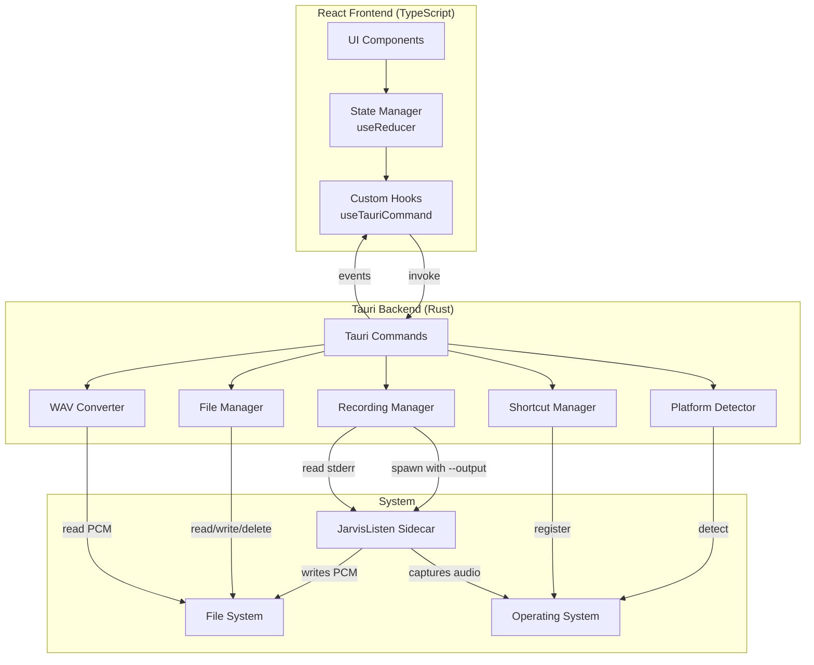

# Design Document: JarvisApp Desktop Application

## Overview

JarvisApp is a cross-platform desktop application built with Tauri v2 that provides a graphical interface for recording, managing, and playing back audio captured via the JarvisListen CLI tool. The application follows a hybrid architecture where a Rust backend manages system operations and process lifecycle, while a React/TypeScript frontend provides the user interface.

The core design principle is separation of concerns: the Rust backend handles all system-level operations (sidecar process management, file I/O, platform detection), while the React frontend focuses purely on UI state and user interactions. Communication between layers happens through Tauri's command and event system.

### Key Design Decisions

1. **Sidecar Pattern**: Bundle JarvisListen CLI as a sidecar binary rather than embedding audio capture logic directly. This maintains separation between the CLI tool and the desktop app, allowing independent development and testing.

2. **Direct File Writing**: The sidecar writes PCM data directly to disk using the `--output <filepath>` flag. This avoids binary data corruption issues that occur when piping PCM through Tauri's shell plugin (which splits on newline bytes).

3. **Event-Driven Architecture**: Use Tauri events to push state changes and errors from backend to frontend asynchronously, allowing the UI to respond to sidecar lifecycle events in real-time.

4. **On-Demand WAV Conversion**: Store recordings as raw PCM and convert to WAV only when playback is requested. This minimizes storage overhead and conversion time during recording.

5. **Platform-Specific Builds**: Use conditional compilation and runtime platform detection to handle macOS-specific features gracefully on other platforms.

6. **Global Shortcuts**: Register system-wide keyboard shortcuts for hands-free recording control, allowing users to start/stop recording without switching to the app.

## Architecture



### Data Flow

**Application Initialization:**
1. Tauri backend starts → Creates recordings directory if missing
2. Backend verifies sidecar binary exists for current platform
3. Backend registers global shortcut (Cmd+Shift+R on macOS)
4. Frontend loads → Fetches list of existing recordings
5. Frontend displays idle state with record button enabled

**Recording Start:**
1. User clicks record button OR presses global shortcut → UI dispatches action
2. State reducer updates to "processing" → UI shows loading state
3. Frontend calls `startRecording()` Tauri command
4. Backend generates timestamped PCM file path in app data directory
5. Backend spawns sidecar with `--mono --sample-rate 16000 --output <filepath>`
6. Backend monitors sidecar stderr for errors
7. Backend emits "recording-started" event → frontend updates to "recording" state and starts timer

**Recording Stop:**
1. User clicks stop button OR presses global shortcut → UI dispatches action
2. State reducer updates to "processing" → UI shows loading state
3. Frontend calls `stopRecording()` Tauri command
4. Backend sends SIGTERM to sidecar process using nix crate (not CommandChild::kill() which sends SIGKILL)
5. Backend waits for process exit with timeout (5 seconds)
6. Backend verifies PCM file exists and has data
7. Backend emits "recording-stopped" event → frontend updates to "idle" state and refreshes list

**Note on Process Termination:** Tauri's `CommandChild::kill()` sends SIGKILL on Unix, which cannot be caught by signal handlers. JarvisListen has SIGTERM/SIGINT handlers that flush audio buffers before exit. To avoid data loss, we use the `nix` crate to send SIGTERM explicitly, allowing graceful shutdown. If the process doesn't exit within the timeout, we fall back to SIGKILL as a last resort.

**Playback:**
1. User clicks recording row → UI dispatches action
2. Frontend calls `convertToWav(filename)` Tauri command
3. Backend reads PCM file
4. Backend prepends 44-byte WAV header
5. Backend returns WAV bytes to frontend
6. Frontend creates blob URL from bytes
7. Frontend loads blob into HTML5 Audio element
8. User interacts with audio controls

**Permission Error Handling:**
1. Sidecar fails with permission error → writes to stderr
2. Backend detects "permission" keyword in stderr
3. Backend emits "permission-error" event with message
4. Frontend displays PermissionDialog with guidance
5. User clicks "Open System Settings" → Backend opens macOS System Settings
6. User grants permissions → clicks "Retry" → Recording starts successfully

## Components and Interfaces

### Rust Backend Components

#### Recording Manager

```rust
use tauri_plugin_shell::{ShellExt, process::CommandEvent};

pub struct RecordingManager {
    current_child: Option<CommandChild>,
    current_filepath: Option<PathBuf>,
    app_handle: AppHandle,
}

impl RecordingManager {
    pub fn new(app_handle: AppHandle) -> Self;
    pub fn start_recording(&mut self) -> Result<String, String>;
    pub fn stop_recording(&mut self) -> Result<(), String>;
    pub fn is_recording(&self) -> bool;
    fn spawn_sidecar(&self, output_path: &Path) -> Result<(Receiver<CommandEvent>, CommandChild), String>;
    fn generate_timestamped_path(&self) -> PathBuf;
    fn monitor_events(&self, rx: Receiver<CommandEvent>);
}
```

**Responsibilities:**
- Generate timestamped PCM file paths in app data directory
- Spawn JarvisListen sidecar with `--output` flag pointing to the file path
- Monitor sidecar events (stderr, termination) and emit Tauri events
- Gracefully terminate sidecar on stop
- Verify PCM file exists after recording completes
- Prevent concurrent recordings

**Sidecar Spawn Pattern:**
```rust
use tauri_plugin_shell::ShellExt;

fn spawn_sidecar(&self, output_path: &Path) -> Result<(Receiver<CommandEvent>, CommandChild), String> {
    let sidecar = self.app_handle
        .shell()
        .sidecar("JarvisListen")
        .map_err(|e| format!("Failed to get sidecar: {}", e))?
        .args([
            "--mono",
            "--sample-rate", "16000",
            "--output", output_path.to_str().unwrap()
        ]);
    
    let (rx, child) = sidecar.spawn()
        .map_err(|e| format!("Failed to spawn sidecar: {}", e))?;
    
    Ok((rx, child))
}
```

**Event Monitoring Pattern:**
```rust
use tauri_plugin_shell::process::CommandEvent;

fn monitor_events(&self, mut rx: Receiver<CommandEvent>) {
    let app_handle = self.app_handle.clone();
    
    tauri::async_runtime::spawn(async move {
        while let Some(event) = rx.recv().await {
            match event {
                CommandEvent::Stderr(line) => {
                    // Parse stderr and classify errors
                    if line.contains("permission") || line.contains("Screen Recording") || line.contains("Microphone") {
                        app_handle.emit("permission-error", line).ok();
                    } else {
                        app_handle.emit("sidecar-error", line).ok();
                    }
                }
                CommandEvent::Terminated(status) => {
                    // Handle process termination
                    if status.code != Some(0) {
                        app_handle.emit("sidecar-crashed", status.code).ok();
                    }
                }
                _ => {}
            }
        }
    });
}
```

**Graceful Process Termination Pattern:**
```rust
use nix::sys::signal::{kill, Signal};
use nix::unistd::Pid;
use std::time::Duration;

pub fn stop_recording(&mut self) -> Result<(), String> {
    let child = self.current_child.take()
        .ok_or("No recording in progress")?;
    
    let pid = child.pid();
    
    // Send SIGTERM to allow signal handlers to flush buffers
    kill(Pid::from_raw(pid as i32), Signal::SIGTERM)
        .map_err(|e| format!("Failed to send SIGTERM: {}", e))?;
    
    // Wait for graceful exit with timeout
    let timeout = Duration::from_secs(5);
    let start = std::time::Instant::now();
    
    // Poll for process exit (Tauri doesn't provide async wait)
    while start.elapsed() < timeout {
        // Check if process has exited by attempting to send signal 0
        if kill(Pid::from_raw(pid as i32), None).is_err() {
            // Process has exited
            self.current_filepath = None;
            self.app_handle.emit("recording-stopped", ()).ok();
            return Ok(());
        }
        std::thread::sleep(Duration::from_millis(100));
    }
    
    // Timeout expired - force kill with SIGKILL as last resort
    eprintln!("Warning: Process didn't exit gracefully, sending SIGKILL");
    child.kill().map_err(|e| format!("Failed to kill process: {}", e))?;
    
    self.current_filepath = None;
    self.app_handle.emit("recording-stopped", ()).ok();
    Ok(())
}
```

**Note:** This approach uses the `nix` crate to send SIGTERM, allowing JarvisListen's signal handlers to flush audio buffers before exit. Tauri's `CommandChild::kill()` sends SIGKILL which cannot be caught, causing data loss. The `CommandChild::pid()` method (available in tauri-plugin-shell 2.0+) returns the process ID as `u32`.

#### File Manager

```rust
pub struct FileManager {
    recordings_dir: PathBuf,
}

#[derive(Serialize, Deserialize, Clone)]
pub struct RecordingMetadata {
    pub filename: String,
    pub size_bytes: u64,
    pub created_at: u64, // Unix timestamp (seconds since epoch)
    pub duration_seconds: f64,
}

impl FileManager {
    pub fn new() -> Result<Self, String>;
    pub fn list_recordings(&self) -> Result<Vec<RecordingMetadata>, String>;
    pub fn delete_recording(&self, filename: &str) -> Result<(), String>;
    pub fn get_recordings_dir(&self) -> &Path;
    fn calculate_duration(size_bytes: u64) -> f64;
}
```

**Responsibilities:**
- Manage recordings directory (create if missing on initialization)
- List all PCM files with metadata
- Calculate duration from file size: `duration = size_bytes / (sample_rate * bytes_per_sample * channels)`
- Delete recordings by filename
- Sort recordings by creation date (newest first)

**Constants:**
```rust
const SAMPLE_RATE: u32 = 16000;
const BYTES_PER_SAMPLE: u32 = 2; // s16le
const CHANNELS: u32 = 1; // mono
```

**Duration Calculation:**
```rust
fn calculate_duration(size_bytes: u64) -> f64 {
    size_bytes as f64 / (SAMPLE_RATE * BYTES_PER_SAMPLE * CHANNELS) as f64
}
```

#### WAV Converter

```rust
pub struct WavConverter;

impl WavConverter {
    pub fn pcm_to_wav(pcm_path: &Path) -> Result<Vec<u8>, String>;
    fn create_wav_header(data_size: u32) -> [u8; 44];
}
```

**Responsibilities:**
- Read raw PCM file
- Generate 44-byte WAV header with correct parameters
- Return complete WAV file as byte vector

**WAV Header Structure:**
```
Bytes 0-3:   "RIFF"
Bytes 4-7:   File size - 8 (little-endian u32)
Bytes 8-11:  "WAVE"
Bytes 12-15: "fmt "
Bytes 16-19: 16 (PCM format chunk size)
Bytes 20-21: 1 (PCM format code)
Bytes 22-23: 1 (number of channels - mono)
Bytes 24-27: 16000 (sample rate)
Bytes 28-31: 32000 (byte rate = sample_rate * channels * bytes_per_sample)
Bytes 32-33: 2 (block align = channels * bytes_per_sample)
Bytes 34-35: 16 (bits per sample)
Bytes 36-39: "data"
Bytes 40-43: Data size (little-endian u32)
```

#### Platform Detector

```rust
pub struct PlatformDetector;

impl PlatformDetector {
    pub fn is_supported() -> bool;
    pub fn get_sidecar_name() -> &'static str;
    pub fn open_system_settings() -> Result<(), String>;
}
```

**Responsibilities:**
- Detect current platform at runtime
- Return appropriate sidecar binary name
- Indicate if platform is supported for recording
- Open platform-specific system settings (for permission guidance)

**Platform Support:**
- macOS (aarch64): Binary file named `JarvisListen-aarch64-apple-darwin` in `src-tauri/binaries/` → supported
- Windows: stub → not supported
- Linux: stub → not supported

**System Settings Opening:**
```rust
#[cfg(target_os = "macos")]
pub fn open_system_settings() -> Result<(), String> {
    std::process::Command::new("open")
        .arg("x-apple.systempreferences:com.apple.preference.security?Privacy_ScreenCapture")
        .spawn()
        .map_err(|e| format!("Failed to open System Settings: {}", e))?;
    Ok(())
}

#[cfg(not(target_os = "macos"))]
pub fn open_system_settings() -> Result<(), String> {
    Err("System settings not available on this platform".to_string())
}
```

#### Shortcut Manager

```rust
pub struct ShortcutManager {
    app_handle: AppHandle,
}

impl ShortcutManager {
    pub fn new(app_handle: AppHandle) -> Self;
    pub fn register_shortcuts(&self) -> Result<(), String>;
    fn toggle_recording(&self);
}
```

**Responsibilities:**
- Register Cmd+Shift+R global shortcut on macOS
- Toggle recording state when shortcut is pressed
- Emit events to frontend for UI updates
- Handle registration failures gracefully (log warning, continue without shortcut)

**Implementation Pattern:**
```rust
use tauri_plugin_global_shortcut::{GlobalShortcutExt, ShortcutState};

impl ShortcutManager {
    pub fn register_shortcuts(&self) -> Result<(), String> {
        let result = self.app_handle
            .global_shortcut()
            .on_shortcut("Cmd+Shift+R", |app, _shortcut, event| {
                if event.state == ShortcutState::Pressed {
                    let recording_mgr = app.state::<Mutex<RecordingManager>>();
                    let is_recording = recording_mgr.lock().unwrap().is_recording();
                    
                    if is_recording {
                        app.emit("shortcut-triggered", "stop").ok();
                    } else {
                        app.emit("shortcut-triggered", "start").ok();
                    }
                }
            });
        
        if let Err(e) = result {
            eprintln!("Warning: Failed to register global shortcut: {}", e);
            // Continue without shortcut - not a fatal error
        }
        
        Ok(())
    }
}
```

### Tauri Commands

```rust
#[tauri::command]
async fn start_recording(
    state: State<'_, Mutex<RecordingManager>>
) -> Result<String, String>;

#[tauri::command]
async fn stop_recording(
    state: State<'_, Mutex<RecordingManager>>
) -> Result<(), String>;

#[tauri::command]
fn list_recordings(
    state: State<'_, FileManager>
) -> Result<Vec<RecordingMetadata>, String>;

#[tauri::command]
fn convert_to_wav(
    filename: String,
    state: State<'_, FileManager>
) -> Result<Vec<u8>, String>;

#[tauri::command]
fn delete_recording(
    filename: String,
    state: State<'_, FileManager>
) -> Result<(), String>;

#[tauri::command]
fn check_platform_support() -> Result<bool, String>;

#[tauri::command]
fn open_system_settings() -> Result<(), String>;
```

### Tauri Events

```typescript
// Backend → Frontend events
type TauriEvent = 
  | { type: "recording-started"; filename: string }
  | { type: "recording-stopped" }
  | { type: "permission-error"; message: string }
  | { type: "sidecar-error"; message: string }
  | { type: "sidecar-crashed"; code: number | null }
  | { type: "shortcut-triggered"; action: "start" | "stop" };
```

### React Frontend Components

#### State Management

```typescript
type RecordingState = "idle" | "recording" | "processing";

interface AppState {
  recordingState: RecordingState;
  currentRecording: string | null;
  recordings: RecordingMetadata[];
  selectedRecording: string | null;
  error: string | null;
  elapsedTime: number;
  showPermissionDialog: boolean;
}

type AppAction =
  | { type: "START_RECORDING" }
  | { type: "RECORDING_STARTED"; filename: string }
  | { type: "STOP_RECORDING" }
  | { type: "RECORDING_STOPPED" }
  | { type: "SET_RECORDINGS"; recordings: RecordingMetadata[] }
  | { type: "SELECT_RECORDING"; filename: string }
  | { type: "DESELECT_RECORDING" }
  | { type: "REMOVE_RECORDING"; filename: string }
  | { type: "SET_ERROR"; error: string }
  | { type: "CLEAR_ERROR" }
  | { type: "SHOW_PERMISSION_DIALOG" }
  | { type: "HIDE_PERMISSION_DIALOG" }
  | { type: "TICK_TIMER" }
  | { type: "RESET_TIMER" };

function appReducer(state: AppState, action: AppAction): AppState;
```

**State Transition Rules:**
- idle → processing: User clicks record button
- processing → recording: Backend emits recording-started event
- recording → processing: User clicks stop button
- processing → idle: Backend emits recording-stopped event
- Any state → idle: Error occurs

#### Custom Hooks

```typescript
// Hook for invoking Tauri commands with error handling
function useTauriCommand<T, Args extends any[]>(
  commandName: string
): [
  (...args: Args) => Promise<T>,
  { loading: boolean; error: string | null }
];

// Hook for listening to Tauri events
function useTauriEvent<T>(
  eventName: string,
  handler: (payload: T) => void
): void;

// Hook for managing recording state
function useRecording(): {
  state: AppState;
  startRecording: () => Promise<void>;
  stopRecording: () => Promise<void>;
  selectRecording: (filename: string) => void;
  deleteRecording: (filename: string) => Promise<void>;
  refreshRecordings: () => Promise<void>;
  openSystemSettings: () => Promise<void>;
  retryRecording: () => Promise<void>;
};
```

#### Component Structure

```typescript
// Main application component
function App(): JSX.Element;

// Large record button with state indicator
function RecordButton(props: {
  state: RecordingState;
  onStart: () => void;
  onStop: () => void;
}): JSX.Element;

// Status indicator (idle/recording/processing)
function StatusIndicator(props: {
  state: RecordingState;
  elapsedTime: number;
}): JSX.Element;

// List of recordings with metadata
function RecordingsList(props: {
  recordings: RecordingMetadata[];
  selectedRecording: string | null;
  onSelect: (filename: string) => void;
  onDelete: (filename: string) => void;
}): JSX.Element;

// Individual recording row
function RecordingRow(props: {
  recording: RecordingMetadata;
  selected: boolean;
  onSelect: () => void;
  onDelete: () => void;
}): JSX.Element;

// Audio player with controls
function AudioPlayer(props: {
  filename: string | null;
  onClose: () => void;
}): JSX.Element;

// Error dialog for permission issues
function PermissionDialog(props: {
  visible: boolean;
  message: string;
  onOpenSettings: () => void;
  onRetry: () => void;
  onClose: () => void;
}): JSX.Element;

// Generic error toast
function ErrorToast(props: {
  message: string | null;
  onClose: () => void;
}): JSX.Element;

// Deletion confirmation dialog
function DeleteConfirmDialog(props: {
  visible: boolean;
  recordingName: string;
  onConfirm: () => void;
  onCancel: () => void;
}): JSX.Element;
```

**Note:** The DeleteConfirmDialog component was added during task planning to satisfy Requirement 6.1 (deletion confirmation prompt). The design originally left the confirmation mechanism unspecified.

## Data Models

### Rust Types

```rust
// Recording metadata returned to frontend
#[derive(Serialize, Deserialize, Clone)]
pub struct RecordingMetadata {
    pub filename: String,
    pub size_bytes: u64,
    pub created_at: u64, // Unix timestamp (seconds since epoch)
    pub duration_seconds: f64,
}

// Application configuration
#[derive(Serialize, Deserialize)]
pub struct AppConfig {
    pub recordings_dir: PathBuf,
    pub sidecar_name: String,
    pub sample_rate: u32,
    pub bytes_per_sample: u32,
    pub channels: u32,
}

// Error types
#[derive(Debug)]
pub enum AppError {
    SidecarSpawnFailed(String),
    SidecarCrashed(String),
    FileIOError(String),
    PermissionDenied(String),
    PlatformNotSupported,
    InvalidRecording(String),
    ConcurrentRecording,
}

impl Display for AppError {
    fn fmt(&self, f: &mut Formatter) -> fmt::Result;
}
```

### TypeScript Types

```typescript
// Matches Rust RecordingMetadata
interface RecordingMetadata {
  filename: string;
  size_bytes: number;
  created_at: number; // Unix timestamp
  duration_seconds: number;
}

// Frontend-only state types
type RecordingState = "idle" | "recording" | "processing";

interface AppState {
  recordingState: RecordingState;
  currentRecording: string | null;
  recordings: RecordingMetadata[];
  selectedRecording: string | null;
  error: string | null;
  elapsedTime: number;
  showPermissionDialog: boolean;
}

// Event payload types
interface RecordingStartedEvent {
  filename: string;
}

interface ErrorEvent {
  message: string;
}

interface ShortcutEvent {
  action: "start" | "stop";
}
```

## Correctness Properties

*A property is a characteristic or behavior that should hold true across all valid executions of a system—essentially, a formal statement about what the system should do. Properties serve as the bridge between human-readable specifications and machine-verifiable correctness guarantees.*


### Property 1: Recordings List Load on Startup

*For any* application startup, the frontend should invoke the list_recordings command and update the state with the returned recordings.

**Validates: Requirements 1.2**

### Property 2: Timestamped Filepath Generation

*For any* recording start request, the generated PCM filepath should match the pattern `YYYYMMDD_HHMMSS.pcm` and be located in the App_Data_Directory.

**Validates: Requirements 2.1, 3.1, 3.2**

### Property 3: Sidecar Spawn Arguments

*For any* recording start request, the spawned sidecar process should be invoked with the arguments `--mono --sample-rate 16000 --output <filepath>` where filepath is the generated timestamped path.

**Validates: Requirements 2.2**

### Property 4: Process Termination on Stop

*For any* active recording, calling stop should terminate the sidecar process within a reasonable timeout (e.g., 5 seconds).

**Validates: Requirements 2.4**

### Property 5: Recording Completion Notification

*For any* completed recording (successful or stopped), the backend should emit a recording-stopped event and the frontend should refresh the recordings list.

**Validates: Requirements 2.5, 2.8**

### Property 6: Concurrent Recording Prevention

*For any* attempt to start recording while already recording, the backend should return an error indicating a concurrent recording is not allowed.

**Validates: Requirements 2.6**

### Property 7: Recording State UI Display

*For any* time when the recording state is "recording", the UI should display a recording status indicator and an elapsed time counter that increases monotonically.

**Validates: Requirements 2.7**

### Property 8: Duration Calculation Formula

*For any* PCM file with size S bytes, the calculated duration should equal `S / (16000 * 2 * 1)` seconds.

**Validates: Requirements 3.4**

### Property 9: Metadata Completeness

*For any* recording returned by list_recordings, the metadata should contain non-empty filename, size_bytes > 0, created_at > 0, and duration_seconds >= 0.

**Validates: Requirements 3.5**

### Property 10: Recording Sort Order

*For any* list of recordings displayed in the UI, they should be sorted by created_at in descending order (newest first).

**Validates: Requirements 4.1**

### Property 11: Recording Display Fields

*For any* recording row rendered in the UI, it should display the timestamp (formatted from created_at), duration (formatted as MM:SS), and file size (formatted as KB/MB).

**Validates: Requirements 4.2**

### Property 12: Playback Initiation

*For any* recording selection (click/tap), the frontend should invoke the convert_to_wav command with the recording filename.

**Validates: Requirements 4.3**

### Property 13: List Update After Deletion

*For any* successful deletion, the recording should no longer appear in the displayed recordings list.

**Validates: Requirements 4.5**

### Property 14: WAV Conversion and Return

*For any* PCM file converted to WAV, the backend should prepend a valid 44-byte WAV header (with sample rate 16000, bits per sample 16, channels 1, PCM format code 1) and return the complete WAV data to the frontend.

**Validates: Requirements 5.1, 5.2**

### Property 15: Blob URL Creation for Playback

*For any* WAV byte array received from the backend, the frontend should create a valid blob URL and assign it to the audio element's src attribute.

**Validates: Requirements 5.3**

### Property 16: Playback Reset on Completion

*For any* audio playback completion (ended event), the audio element's currentTime should be reset to 0.

**Validates: Requirements 5.6**

### Property 17: Deletion Confirmation Dialog

*For any* deletion request, a confirmation dialog should be displayed before the delete_recording command is invoked.

**Validates: Requirements 6.1**

### Property 18: File Deletion and Notification

*For any* confirmed deletion, the backend should remove the PCM file from the recordings directory and return success to the frontend.

**Validates: Requirements 6.2, 6.3, 6.4**

### Property 19: Platform Error Propagation

*For any* stderr output from the sidecar, the backend should capture it and either emit a permission-error event (if stderr contains "permission" or "Screen Recording") or a sidecar-error event.

**Validates: Requirements 7.4**

### Property 20: Platform Error Display

*For any* platform-specific error (unsupported platform or stub sidecar), the frontend should display an appropriate error message to the user.

**Validates: Requirements 7.5**

### Property 21: Crash Detection and Notification

*For any* sidecar process that exits unexpectedly (non-zero exit code) during recording, the backend should emit a sidecar-crashed event to the frontend.

**Validates: Requirements 8.2**

### Property 22: File I/O Error Messages

*For any* file I/O operation failure (read, write, delete), the error message should include the file path and the system error description.

**Validates: Requirements 8.3**

### Property 23: Error Display and State Transition

*For any* error event or command failure, the frontend should display the error message to the user and transition to an appropriate state (idle if recording, error state otherwise).

**Validates: Requirements 8.4, 9.4**

### Property 24: Atomic State Updates

*For any* state transition triggered by a Tauri command or event, all dependent UI elements should update atomically (no partial updates visible to the user).

**Validates: Requirements 9.3**

### Property 25: Error Recovery to Idle

*For any* error state, the user should be able to dismiss the error and return to the idle state, allowing them to retry the operation.

**Validates: Requirements 9.5**

### Property 26: Recordings Directory Creation

*For any* application startup, the recordings directory should be created in the App_Data_Directory if it does not exist.

**Validates: Requirements 1.1**

### Property 27: Sidecar Binary Verification

*For any* application startup, the backend should verify the sidecar binary exists and return an initialization error if it is missing.

**Validates: Requirements 1.3, 1.4, 1.5**

### Property 28: Empty Recordings List Message

*For any* empty recordings list, the frontend should display a message indicating no recordings exist.

**Validates: Requirements 4.4**

## Error Handling

### Backend Error Handling

**Error Classification:**
1. **Spawn Errors**: Sidecar binary not found, permission denied, invalid arguments
2. **Process Errors**: Sidecar crashes, unexpected exit codes
3. **File I/O Errors**: Cannot create file, disk full, permission denied
4. **Platform Errors**: Unsupported platform, missing platform-specific features
5. **Permission Errors**: Screen Recording or Microphone permissions not granted
6. **Concurrent Operation Errors**: Attempting to start recording while already recording

**Error Propagation:**
- Synchronous errors (spawn, file creation, concurrent recording) → Return `Result<T, String>` from commands
- Asynchronous errors (crashes, stderr) → Emit events to frontend

**Error Recovery:**
- Spawn failures → Clean up partial state, return to idle
- Crashes during recording → Verify file exists, emit error event, return to idle
- File I/O errors → Return descriptive error with file path and system message
- Permission errors → Emit special permission-error event for UI guidance
- Concurrent recording → Return error immediately without spawning process

**Permission Error Detection:**
The backend monitors sidecar stderr for permission-related keywords:
- "permission"
- "Screen Recording"
- "Microphone"

When detected, emit `permission-error` event instead of generic `sidecar-error`.

### Frontend Error Handling

**Error Display:**
- Permission errors → Show PermissionDialog with guidance and action buttons
- Concurrent recording errors → Show inline error message "A recording is already in progress"
- General errors → Show ErrorToast with message
- Command errors → Display inline near the affected component

**Error Recovery:**
- All errors → Provide dismiss/close button
- Permission errors → Provide "Open System Settings" and "Retry" buttons
- Transient errors → Allow immediate retry
- State cleanup → Always return to idle state after error dismissal

**Error Logging:**
- All errors logged to console for debugging
- User-facing messages are simplified and actionable
- Technical details available in console for troubleshooting

### Permission Dialog Flow

1. User starts recording → Sidecar fails with permission error
2. Backend detects "permission" in stderr → Emits permission-error event
3. Frontend receives event → Shows PermissionDialog
4. User clicks "Open System Settings" → Backend opens macOS System Settings
5. User grants permissions in System Settings
6. User returns to app → Clicks "Retry"
7. Frontend calls startRecording again → Should succeed

## Testing Strategy

### Dual Testing Approach

This project requires both unit tests and property-based tests for comprehensive coverage:

**Unit Tests** focus on:
- Specific examples and edge cases (empty list, missing binary, permission errors)
- Integration points between Rust and React (command invocations, event handling)
- Error conditions and boundary cases (concurrent recording, file not found)
- UI component rendering and interactions (button states, dialog display)

**Property-Based Tests** focus on:
- Universal properties that hold for all inputs (filename format, duration calculation)
- Comprehensive input coverage through randomization (various file sizes, timestamps)
- Invariants that must always hold (state transitions, atomic updates)
- Round-trip properties (PCM → WAV → playback)

Both testing approaches are complementary and necessary. Unit tests catch concrete bugs in specific scenarios, while property tests verify general correctness across all possible inputs.

### Rust Backend Testing

**Unit Tests:**
- Test sidecar spawning with correct arguments including --output flag
- Test file verification after sidecar completion
- Test WAV header generation with known PCM files
- Test platform detection on different OS
- Test error handling for various failure modes (spawn failure, crash, I/O error)
- Test stderr parsing and error classification (permission vs general)
- Test concurrent recording prevention
- Test directory creation on initialization

**Property-Based Tests:**
- Use `proptest` or `quickcheck` crate
- Minimum 100 iterations per property test
- Each test tagged with: `// Feature: jarvis-app, Property N: [property text]`

**Example Property Tests:**

```rust
#[cfg(test)]
mod tests {
    use proptest::prelude::*;
    
    // Feature: jarvis-app, Property 8: Duration Calculation Formula
    proptest! {
        #[test]
        fn duration_calculation_property(file_size in 0u64..1_000_000_000) {
            let duration = calculate_duration(file_size);
            let expected = file_size as f64 / (16000.0 * 2.0 * 1.0);
            assert!((duration - expected).abs() < 0.001);
        }
    }
    
    // Feature: jarvis-app, Property 2: Timestamped Filepath Generation
    proptest! {
        #[test]
        fn filename_format_property(timestamp in 0u64..2_000_000_000) {
            let filename = generate_filename(timestamp);
            let regex = Regex::new(r"^\d{8}_\d{6}\.pcm$").unwrap();
            assert!(regex.is_match(&filename));
        }
    }
}
```

**Integration Tests:**
- Test full recording lifecycle (start → stop → verify file)
- Test error recovery flows (permission error → settings → retry)
- Test concurrent recording prevention
- Test global shortcut triggering

### React Frontend Testing

**Unit Tests:**
- Test reducer state transitions with specific actions
- Test custom hooks with React Testing Library
- Test component rendering with various props
- Test event handlers and command invocations
- Test error display for different error types
- Test permission dialog flow
- Test audio player controls

**Property-Based Tests:**
- Use `fast-check` library
- Minimum 100 iterations per property test
- Each test tagged with: `// Feature: jarvis-app, Property N: [property text]`

**Example Property Tests:**

```typescript
import fc from 'fast-check';

// Feature: jarvis-app, Property 11: Recording Display Fields
test('duration formatting property', () => {
  fc.assert(
    fc.property(fc.integer({ min: 0, max: 86400 }), (seconds) => {
      const formatted = formatDuration(seconds);
      const regex = /^\d{2}:\d{2}$/;
      expect(formatted).toMatch(regex);
      
      const [mins, secs] = formatted.split(':').map(Number);
      expect(mins).toBe(Math.floor(seconds / 60));
      expect(secs).toBe(seconds % 60);
    }),
    { numRuns: 100 }
  );
});

// Feature: jarvis-app, Property 10: Recording Sort Order
test('recordings sort order property', () => {
  fc.assert(
    fc.property(
      fc.array(fc.record({
        filename: fc.string(),
        size_bytes: fc.nat(),
        created_at: fc.nat(),
        duration_seconds: fc.float()
      })),
      (recordings) => {
        const sorted = sortRecordings(recordings);
        for (let i = 0; i < sorted.length - 1; i++) {
          expect(sorted[i].created_at).toBeGreaterThanOrEqual(sorted[i + 1].created_at);
        }
      }
    ),
    { numRuns: 100 }
  );
});
```

**Integration Testing:**

**End-to-End Scenarios:**
1. Start recording → Stop recording → Verify file exists and appears in list
2. List recordings → Select recording → Play audio → Verify playback
3. Delete recording → Confirm → Verify file removed and list updated
4. Trigger permission error → Display dialog → Open settings → Retry
5. Global shortcut → Toggle recording → Verify state change and UI update
6. Sidecar crash → Verify error event and state reset to idle
7. Concurrent recording attempt → Verify error message displayed

**Tauri Testing:**
- Use Tauri's testing utilities for command testing
- Mock sidecar processes for predictable behavior
- Test event emission and handling
- Test state management across command/event boundaries

### Test Configuration

**Property Test Settings:**
- Minimum 100 iterations per property test
- Seed randomization for reproducibility
- Shrinking enabled to find minimal failing cases
- Timeout: 30 seconds per property test

**Coverage Goals:**
- Backend: 80% line coverage, 90% for critical paths (recording management, file operations)
- Frontend: 70% line coverage, 80% for state management
- All correctness properties must have corresponding tests

### Continuous Integration

**Pre-commit:**
- Run all unit tests
- Run linters (clippy for Rust, eslint for TypeScript)
- Format check (rustfmt, prettier)

**CI Pipeline:**
- Run all unit tests and property tests
- Generate coverage reports
- Build for all target platforms
- Run integration tests on macOS (only platform with full functionality)

## Implementation Notes

### Rust Backend

**Dependencies:**
```toml
[dependencies]
tauri = "2.0"
tauri-plugin-shell = "2"
tauri-plugin-global-shortcut = "2"
serde = { version = "1.0", features = ["derive"] }
serde_json = "1.0"
tokio = { version = "1", features = ["full"] }
nix = { version = "0.27", features = ["signal"] }

[dev-dependencies]
proptest = "1.0"
```

**Project Structure:**
```
src-tauri/
├── src/
│   ├── main.rs              # Tauri app setup, command registration
│   ├── commands.rs          # Tauri command handlers
│   ├── recording.rs         # RecordingManager implementation
│   ├── files.rs             # FileManager implementation
│   ├── wav.rs               # WavConverter implementation
│   ├── platform.rs          # PlatformDetector implementation
│   ├── shortcuts.rs         # ShortcutManager implementation
│   └── error.rs             # Error types and Display impl
├── binaries/
│   ├── JarvisListen-aarch64-apple-darwin  # macOS sidecar
│   ├── JarvisListen-x86_64-pc-windows-msvc.exe  # Windows stub
│   └── JarvisListen-x86_64-unknown-linux-gnu  # Linux stub
├── Cargo.toml
├── tauri.conf.json
└── capabilities/
    └── default.json         # Permissions configuration
```

**Main Setup:**
```rust
fn main() {
    let file_manager = FileManager::new().expect("failed to initialize file manager");
    
    tauri::Builder::default()
        .plugin(tauri_plugin_shell::init())
        .plugin(tauri_plugin_global_shortcut::init())
        .manage(file_manager)
        .setup(|app| {
            // Create RecordingManager with AppHandle
            let recording_manager = RecordingManager::new(app.handle().clone());
            app.manage(std::sync::Mutex::new(recording_manager));
            
            // Register global shortcut
            let shortcut_manager = ShortcutManager::new(app.handle().clone());
            if let Err(e) = shortcut_manager.register_shortcuts() {
                eprintln!("Warning: Failed to register shortcuts: {}", e);
                // Continue without shortcuts - not a fatal error
            }
            
            Ok(())
        })
        .invoke_handler(tauri::generate_handler![
            start_recording,
            stop_recording,
            list_recordings,
            convert_to_wav,
            delete_recording,
            check_platform_support,
            open_system_settings
        ])
        .run(tauri::generate_context!())
        .expect("error while running tauri application");
}
```

**Tauri Configuration:**

`tauri.conf.json`:
```json
{
  "bundle": {
    "identifier": "com.jarvis.app",
    "externalBin": ["binaries/JarvisListen"]
  },
  "app": {
    "windows": [
      {
        "title": "JarvisApp",
        "width": 800,
        "height": 600
      }
    ]
  }
}
```

`src-tauri/capabilities/default.json`:
```json
{
  "permissions": [
    "core:default",
    "global-shortcut:default",
    {
      "identifier": "shell:allow-execute",
      "allow": [{ "name": "binaries/JarvisListen", "sidecar": true }]
    },
    "shell:allow-open"
  ]
}
```

**Note on Permissions:** File system operations are performed in Rust backend code using `std::fs`, which has full system access. The `fs:allow-*` permissions are only needed for frontend JavaScript file access via Tauri's FS API, which this app doesn't use.

**Note on State Management:** Use `std::sync::Mutex` for Tauri state. Locks are acquired, data is extracted, and locks are dropped before async operations, so `std::sync::Mutex` is appropriate (no need for `tokio::sync::Mutex`).

### React Frontend

**Dependencies:**
```json
{
  "dependencies": {
    "react": "^18.2.0",
    "react-dom": "^18.2.0",
    "@tauri-apps/api": "^2.0.0",
    "@tauri-apps/plugin-shell": "^2.0.0"
  },
  "devDependencies": {
    "typescript": "^5.0.0",
    "vite": "^5.0.0",
    "@vitejs/plugin-react": "^4.0.0",
    "fast-check": "^3.0.0",
    "@testing-library/react": "^14.0.0",
    "@testing-library/user-event": "^14.0.0",
    "vitest": "^1.0.0"
  }
}
```

**Project Structure:**
```
src/
├── App.tsx                  # Main app component
├── components/
│   ├── RecordButton.tsx     # Large record/stop button
│   ├── StatusIndicator.tsx  # Recording status display
│   ├── RecordingsList.tsx   # List of recordings
│   ├── RecordingRow.tsx     # Individual recording item
│   ├── AudioPlayer.tsx      # Audio playback controls
│   ├── PermissionDialog.tsx # Permission error guidance
│   └── ErrorToast.tsx       # Generic error display
├── hooks/
│   ├── useTauriCommand.ts   # Command invocation hook
│   ├── useTauriEvent.ts     # Event listening hook
│   └── useRecording.ts      # Recording state management
├── state/
│   ├── reducer.ts           # State reducer logic
│   └── types.ts             # TypeScript types
├── utils/
│   └── formatters.ts        # Duration and size formatting
└── main.tsx                 # React entry point
```

**State Reducer Example:**
```typescript
function appReducer(state: AppState, action: AppAction): AppState {
  switch (action.type) {
    case "START_RECORDING":
      return { ...state, recordingState: "processing" };
    
    case "RECORDING_STARTED":
      return {
        ...state,
        recordingState: "recording",
        currentRecording: action.filename,
        error: null
      };
    
    case "STOP_RECORDING":
      return { ...state, recordingState: "processing" };
    
    case "RECORDING_STOPPED":
      return {
        ...state,
        recordingState: "idle",
        currentRecording: null,
        elapsedTime: 0
      };
    
    case "SET_ERROR":
      return {
        ...state,
        recordingState: "idle",
        error: action.error,
        currentRecording: null
      };
    
    // ... other cases
  }
}
```

### Development Workflow

1. **Setup**: Initialize Tauri project with React template
2. **Backend First**: Implement Rust commands and test with unit tests
3. **Frontend Integration**: Build React UI and connect to commands
4. **Event Handling**: Implement event listeners and state updates
5. **Property Tests**: Add property-based tests for all correctness properties
6. **Integration**: Test end-to-end flows
7. **Polish**: Add error handling, loading states, animations
8. **Documentation**: Create developer onboarding guides

### Developer Onboarding Documentation

As specified in Requirement 10, the project should include concise learning guides:

**docs/101/rust-basics.md:**
- Ownership and borrowing concepts
- Structs and enums
- Result and Option types
- Cargo basics (build, test, dependencies)
- Code examples from the project

**docs/101/tauri-architecture.md:**
- Tauri's hybrid architecture (Rust + Web)
- Commands and how to define them
- Events and how to emit/listen
- Plugins (shell, global-shortcut)
- Sidecar pattern
- tauri.conf.json structure

**docs/101/tauri-shell-plugin.md:**
- Spawning sidecar processes
- Reading stdout and stderr
- Handling process events
- Killing processes gracefully
- Code examples from RecordingManager

**docs/101/react-state-patterns.md:**
- useReducer for complex state
- Custom hooks for Tauri commands
- Event listening patterns
- Atomic state updates
- Code examples from the app

Each guide should be 1-2 pages, include working code examples from the project, and link to official documentation.

### Deployment

**macOS Distribution:**
- Build universal binary (aarch64 for MVP, can add x86_64 later)
- Sign with Apple Developer certificate
- Notarize for Gatekeeper
- Distribute as DMG or via App Store

**Future Platforms:**
- Windows: Implement Windows-specific audio capture in JarvisListen
- Linux: Implement PulseAudio/PipeWire capture in JarvisListen
- Replace stub sidecars with functional implementations

### Platform-Specific Notes

**macOS:**
- Requires Screen Recording permission for system audio capture
- Requires Microphone permission for microphone capture
- Global shortcuts work natively
- Sidecar binary must be signed and notarized

**Windows (Future):**
- Will require WASAPI for audio capture
- Global shortcuts require different API
- Different system settings path for permissions

**Linux (Future):**
- Will require PulseAudio or PipeWire for audio capture
- Global shortcuts require X11 or Wayland integration
- Different permission model

