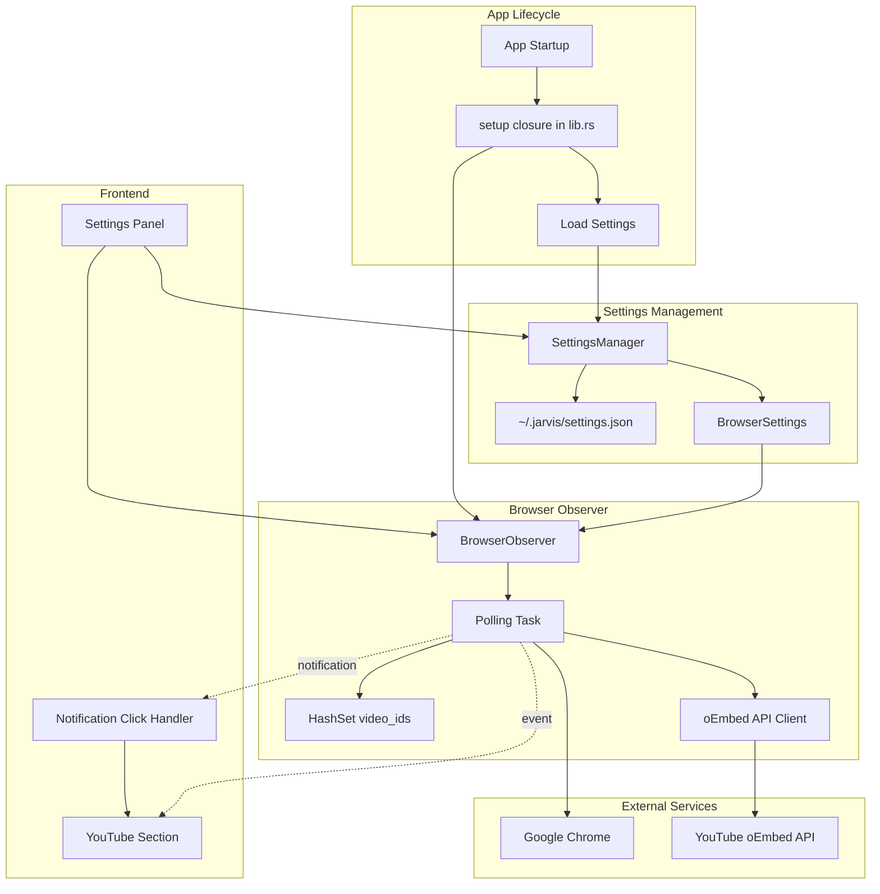

# Design Document: JARVIS Browser Vision v2

## Overview

JARVIS Browser Vision v2 transforms the browser observation system from a manual, user-initiated tool into a proactive background assistant. Building on the v1 foundation (AppleScript polling, HTML scraping, native notifications), v2 introduces automatic observation, intelligent deduplication, quick metadata via YouTube's oEmbed API, and seamless notification-to-app navigation.

The key architectural changes focus on lifecycle management (auto-start on app launch), performance optimization (video-ID based deduplication to prevent notification spam), and user experience enhancement (rich notifications with video titles, click-to-open functionality). The design maintains backward compatibility with all v1 commands and UI patterns while adding new capabilities through settings integration and extended event payloads.

### Key Design Decisions

1. **Auto-Start with Settings Control**: Observer starts automatically on app launch (following ShortcutManager pattern) but respects a user-configurable `observer_enabled` setting for privacy control
2. **Video-ID Deduplication**: HashSet-based tracking prevents duplicate notifications when users navigate back to previously seen videos within a session
3. **Two-Tier Metadata Fetching**: Lightweight oEmbed API (~200-600ms, ~1-2KB) for fast notifications, full HTML scraping only on user request for detailed gists
4. **Notification Click Handling**: Native macOS notification clicks bring app to foreground and auto-open YouTube section, creating a seamless workflow
5. **Settings Integration**: Browser observer settings added to existing SettingsManager infrastructure with persistence to `~/.jarvis/settings.json`
6. **Simplified UI**: YouTube section removes manual start/stop controls, focusing on video list and gist preparation

### Relationship to v1

v2 is an evolutionary enhancement, not a replacement:
- All v1 Tauri commands remain available (`start_browser_observer`, `stop_browser_observer`, `fetch_youtube_gist`, `get_observer_status`)
- Chrome polling mechanism unchanged (AppleScript, 3s interval, 2s timeout)
- YouTube URL detection regex unchanged
- Full HTML scraper unchanged
- v2 adds: auto-start logic, oEmbed fetching, video-ID deduplication, notification click handling, settings toggle, extended event payloads

## Architecture

### Module Structure

```
src-tauri/src/
├── browser/
│   ├── mod.rs           # Module exports (unchanged)
│   ├── observer.rs      # Enhanced with auto-start, dedup, oEmbed
│   └── youtube.rs       # Unchanged from v1
├── settings/
│   ├── manager.rs       # Enhanced with BrowserSettings
│   └── ...
└── lib.rs               # Enhanced with observer auto-start in setup()
```

**Frontend Dependencies:**

v2 requires the notification plugin npm package for the `onAction()` API:

```bash
npm install @tauri-apps/plugin-notification
```

This package is already included in Cargo.toml on the Rust side but needs to be added to package.json for frontend TypeScript bindings.

### Component Diagram



### State Management

The `BrowserObserver` struct remains unchanged from v1:

```rust
pub struct BrowserObserver {
    app_handle: AppHandle,
    stop_tx: Option<watch::Sender<bool>>,
    is_running: bool,
}
```

The observer maintains:
- **app_handle**: For emitting events and sending notifications (v1)
- **stop_tx**: Watch channel for graceful shutdown (v1)
- **is_running**: Boolean flag to prevent duplicate starts (v1)

**v2 Deduplication State:**
- `seen_video_ids`: Local `HashSet<String>` inside the polling task (same scope as `last_url`)
- Automatically cleared when polling task exits (on stop)
- No Arc/Mutex needed - single-threaded access within the task
- Not persisted across app restarts (session-scoped)

### Auto-Start Integration

The observer auto-starts in `lib.rs` setup closure:

```rust
// In lib.rs setup closure
tauri::async_runtime::spawn(async move {
    // Load settings
    let settings = settings_manager.get();
    
    // Auto-start observer if enabled
    if settings.browser.observer_enabled {
        let mut observer = browser_observer.lock().await;
        if let Err(e) = observer.start().await {
            eprintln!("Failed to auto-start browser observer: {}", e);
            // Continue app startup - don't crash
        }
    }
});
```

This follows the same pattern as ShortcutManager initialization.

## Components and Interfaces

### Enhanced BrowserObserver (src/browser/observer.rs)

**New Responsibilities:**
- Fetch quick metadata via oEmbed API
- Include metadata in notifications and events
- Maintain video-ID deduplication within polling task

**Enhanced Methods:**

```rust
impl BrowserObserver {
    pub fn new(app_handle: AppHandle) -> Self {
        Self {
            app_handle,
            stop_tx: None,
            is_running: false,
        }
    }
    
    pub async fn start(&mut self) -> Result<(), String> {
        // ... existing start logic ...
        
        // Spawn polling task with local deduplication
        tokio::spawn(async move {
            let mut last_url = String::new();
            let mut seen_video_ids = HashSet::new();  // Local to polling task
            
            // ... polling loop with deduplication ...
        });
        
        Ok(())
    }
    
    pub async fn stop(&mut self) -> Result<(), String> {
        // ... existing stop logic ...
        // seen_video_ids automatically cleared when polling task exits
        Ok(())
    }
}
```

**Enhanced Polling Loop:**

```rust
loop {
    tokio::select! {
        biased;
        
        _ = stop_rx.changed() => {
            if *stop_rx.borrow() {
                break;  // seen_video_ids automatically dropped here
            }
        }
        
        _ = tokio::time::sleep(Duration::from_secs(3)) => {
            match poll_chrome_url().await {
                Ok(url) if url != last_url => {
                    last_url = url.clone();
                    
                    if let Some((video_id, full_url)) = detect_youtube(&url) {
                        // Check deduplication set (local variable, no lock needed)
                        if seen_video_ids.contains(&video_id) {
                            eprintln!("BrowserObserver: Video {} already seen, skipping", video_id);
                            continue;
                        }
                        
                        // Add to seen set
                        seen_video_ids.insert(video_id.clone());
                        
                        // Fetch oEmbed metadata and emit single event
                        let app_handle_clone = app_handle.clone();
                        let full_url_clone = full_url.clone();
                        let video_id_clone = video_id.clone();
                        
                        tokio::spawn(async move {
                            // Fetch oEmbed with 3s timeout
                            let metadata_result = fetch_oembed_metadata(&full_url_clone).await;
                            
                            // Emit single event with whatever metadata we got
                            let event = match &metadata_result {
                                Ok(metadata) => YouTubeDetectedEvent {
                                    url: full_url_clone.clone(),
                                    video_id: video_id_clone.clone(),
                                    title: Some(metadata.title.clone()),
                                    author_name: Some(metadata.author_name.clone()),
                                },
                                Err(_) => YouTubeDetectedEvent {
                                    url: full_url_clone.clone(),
                                    video_id: video_id_clone.clone(),
                                    title: None,
                                    author_name: None,
                                },
                            };
                            let _ = app_handle_clone.emit("youtube-video-detected", &event);
                            
                            // Send notification
                            match metadata_result {
                                Ok(metadata) => {
                                    send_notification_with_title(&app_handle_clone, &metadata.title);
                                }
                                Err(e) => {
                                    eprintln!("BrowserObserver: oEmbed fetch failed: {}", e);
                                    send_notification_generic(&app_handle_clone);
                                }
                            }
                        });
                    }
                }
                Ok(_) => {}
                Err(e) => {
                    eprintln!("BrowserObserver: Chrome unavailable: {}", e);
                }
            }
        }
    }
}
```

**oEmbed API Integration:**

```rust
#[derive(Debug, Clone, Serialize, Deserialize)]
struct QuickMetadata {
    title: String,
    author_name: String,
    thumbnail_url: String,
}

async fn fetch_oembed_metadata(video_url: &str) -> Result<QuickMetadata, String> {
    let client = reqwest::Client::builder()
        .timeout(Duration::from_secs(3))
        .build()
        .map_err(|e| format!("Failed to create HTTP client: {}", e))?;
    
    let response = client
        .get("https://www.youtube.com/oembed")
        .query(&[("url", video_url), ("format", "json")])
        .send()
        .await
        .map_err(|e| format!("Failed to fetch oEmbed data: {}", e))?;
    
    if !response.status().is_success() {
        return Err(format!("oEmbed API returned status: {}", response.status()));
    }
    
    let metadata: QuickMetadata = response
        .json()
        .await
        .map_err(|e| format!("Failed to parse oEmbed JSON: {}", e))?;
    
    Ok(metadata)
}

fn send_notification_with_title(app_handle: &AppHandle, title: &str) {
    let body = format!("You're watching: {}. Want me to keep a gist?", title);
    
    match app_handle
        .notification()
        .builder()
        .title("YouTube Video Detected")
        .body(&body)
        .show()
    {
        Ok(()) => eprintln!("BrowserObserver: Notification sent with title"),
        Err(e) => eprintln!("BrowserObserver: WARNING - Failed to send notification: {}", e),
    }
}

fn send_notification_generic(app_handle: &AppHandle) {
    match app_handle
        .notification()
        .builder()
        .title("YouTube Video Detected")
        .body("New YouTube video detected. Open JarvisApp to prepare a gist.")
        .show()
    {
        Ok(()) => eprintln!("BrowserObserver: Generic notification sent"),
        Err(e) => eprintln!("BrowserObserver: WARNING - Failed to send notification: {}", e),
    }
}
```

**Enhanced Event Payload:**

```rust
#[derive(Debug, Clone, Serialize, Deserialize)]
pub struct YouTubeDetectedEvent {
    pub url: String,
    pub video_id: String,
    pub title: Option<String>,        // v2 addition
    pub author_name: Option<String>,  // v2 addition
}
```

### Enhanced SettingsManager (src/settings/manager.rs)

**New Data Structures:**

```rust
#[derive(Debug, Clone, Serialize, Deserialize)]
pub struct Settings {
    pub transcription: TranscriptionSettings,
    #[serde(default)]  // Backward compatibility: use default if missing
    pub browser: BrowserSettings,
}

#[derive(Debug, Clone, Serialize, Deserialize)]
pub struct BrowserSettings {
    pub observer_enabled: bool,
}

impl Default for BrowserSettings {
    fn default() -> Self {
        Self {
            observer_enabled: true,
        }
    }
}

impl Default for Settings {
    fn default() -> Self {
        Self {
            transcription: TranscriptionSettings::default(),
            browser: BrowserSettings::default(),
        }
    }
}
```

**Backward Compatibility Note:**

The `#[serde(default)]` annotation on the `browser` field ensures that existing `~/.jarvis/settings.json` files without a `browser` key will deserialize successfully, using `BrowserSettings::default()` (observer_enabled: true) for the missing field.

**Enhanced Validation:**

```rust
fn validate(settings: &Settings) -> Result<(), String> {
    // ... existing transcription validation ...
    
    // Browser settings validation (currently just structural, no constraints)
    // Future: could add validation for observer_enabled if needed
    
    Ok(())
}
```

### New Tauri Commands (src/commands.rs)

**Settings Commands:**

```rust
#[tauri::command]
pub async fn update_browser_settings(
    settings_manager: State<'_, Arc<SettingsManager>>,
    browser_observer: State<'_, Arc<tokio::sync::Mutex<BrowserObserver>>>,
    observer_enabled: bool,
) -> Result<(), String> {
    // Get current settings
    let mut settings = settings_manager.get();
    
    // Update browser settings
    settings.browser.observer_enabled = observer_enabled;
    
    // Persist settings
    settings_manager.update(settings)?;
    
    // Apply observer state change
    let mut observer = browser_observer.lock().await;
    if observer_enabled && !observer.is_running() {
        observer.start().await?;
    } else if !observer_enabled && observer.is_running() {
        observer.stop().await?;
    }
    
    Ok(())
}

#[tauri::command]
pub async fn get_browser_settings(
    settings_manager: State<'_, Arc<SettingsManager>>,
) -> Result<BrowserSettings, String> {
    Ok(settings_manager.get().browser)
}
```

These commands must be added to the `invoke_handler` in `lib.rs`:

```rust
.invoke_handler(tauri::generate_handler![
    // ... existing commands ...
    commands::update_browser_settings,
    commands::get_browser_settings,
])
```

### Notification Click Handling (src/lib.rs)

**Setup Notification Action Listener:**

```rust
use tauri_plugin_notification::NotificationExt;

// In lib.rs setup closure, after observer auto-start
let app_handle_for_notifications = app.handle().clone();

// Register notification action listener
// Note: This listens for ALL notification actions, not just clicks
// The plugin emits events when users interact with notifications
tauri::async_runtime::spawn(async move {
    // Listen for notification action events
    // The actual event listening happens on the frontend via onAction()
    // Backend just needs to handle the "open-youtube-section" command
    // which will be triggered by the frontend when it receives the action
});
```

**Alternative Approach - Frontend-Driven:**

Since tauri-plugin-notification v2 uses `onAction()` on the frontend, we can handle notification clicks entirely in the frontend:

```typescript
// In App.tsx
import { onAction } from '@tauri-apps/plugin-notification';

useEffect(() => {
  const unlisten = onAction((notification) => {
    console.log('Notification action:', notification);
    // Open YouTube section when any notification is clicked
    setShowYouTube(true);
    setYoutubeNotification(false);
  });
  
  return () => {
    unlisten.then(fn => fn());
  };
}, []);
```

**Simplified Backend Approach:**

The backend doesn't need special click handling. The notification plugin automatically handles bringing the app to foreground on macOS when a notification is clicked. We just need the frontend to listen for the action event.

### Frontend Components

**Enhanced YouTubeSection Component (src/components/YouTubeSection.tsx):**

```typescript
import { useState, useEffect, useCallback } from 'react';
import { invoke } from '@tauri-apps/api/core';
import { listen } from '@tauri-apps/api/event';

interface YouTubeGist {
  url: string;
  video_id: string;
  title: string;
  channel: string;
  description: string;
  duration_seconds: number;
}

interface DetectedVideo {
  url: string;
  video_id: string;
  title?: string;          // v2 addition
  author_name?: string;    // v2 addition
  gist?: YouTubeGist;
  loading?: boolean;
  error?: string;
}

interface YouTubeDetectedEvent {
  url: string;
  video_id: string;
  title?: string;          // v2 addition
  author_name?: string;    // v2 addition
}

export function YouTubeSection({ onClose }: { onClose: () => void }) {
  const [videos, setVideos] = useState<DetectedVideo[]>([]);
  
  // Listen for youtube-video-detected events
  useEffect(() => {
    const unlisten = listen<YouTubeDetectedEvent>(
      'youtube-video-detected',
      (event) => {
        // Add new video at top (one event per video, no deduplication needed)
        setVideos(prev => [{
          url: event.payload.url,
          video_id: event.payload.video_id,
          title: event.payload.title,
          author_name: event.payload.author_name,
        }, ...prev]);
      }
    );
    
    return () => {
      unlisten.then(fn => fn());
    };
  }, []);
  
  const handlePrepareGist = async (index: number) => {
    const video = videos[index];
    setVideos(prev => prev.map((v, i) => 
      i === index ? { ...v, loading: true } : v
    ));
    
    try {
      const gist = await invoke<YouTubeGist>('fetch_youtube_gist', { 
        url: video.url 
      });
      setVideos(prev => prev.map((v, i) => 
        i === index ? { ...v, gist, loading: false } : v
      ));
    } catch (err) {
      setVideos(prev => prev.map((v, i) => 
        i === index ? { ...v, error: String(err), loading: false } : v
      ));
    }
  };
  
  const handleDismiss = (index: number) => {
    setVideos(prev => prev.filter((_, i) => i !== index));
  };
  
  const formatGist = (gist: YouTubeGist): string => {
    const minutes = Math.floor(gist.duration_seconds / 60);
    const seconds = gist.duration_seconds % 60;
    const duration = `${minutes}:${seconds.toString().padStart(2, '0')}`;
    
    return `Gist of ${gist.url}

Title: ${gist.title}
Channel: ${gist.channel}
Duration: ${duration}

Description:
${gist.description}`;
  };
  
  const handleCopy = (gist: YouTubeGist) => {
    const text = formatGist(gist);
    navigator.clipboard.writeText(text);
  };
  
  return (
    <div className="settings-panel">
      <div className="settings-header">
        <h2>YouTube</h2>
        <button onClick={onClose} className="close-button">×</button>
      </div>
      <div className="settings-content">
        {/* v2: No observer start/stop toggle */}
        <div className="videos-list">
          {videos.map((video, index) => (
            <VideoCard
              key={video.video_id}
              video={video}
              onPrepareGist={() => handlePrepareGist(index)}
              onDismiss={() => handleDismiss(index)}
              onCopy={() => video.gist && handleCopy(video.gist)}
            />
          ))}
        </div>
      </div>
    </div>
  );
}

function VideoCard({ video, onPrepareGist, onDismiss, onCopy }: VideoCardProps) {
  const formatDuration = (seconds: number): string => {
    const minutes = Math.floor(seconds / 60);
    const secs = seconds % 60;
    return `${minutes}:${secs.toString().padStart(2, '0')}`;
  };

  return (
    <div className="video-card">
      {/* v2: Display title if available, otherwise URL */}
      <div className="video-title">
        {video.title || video.url}
      </div>
      {video.author_name && (
        <div className="video-author">{video.author_name}</div>
      )}
      
      {!video.gist && !video.loading && !video.error && (
        <button onClick={onPrepareGist} className="prepare-gist-button">
          Prepare Gist
        </button>
      )}
      
      {video.loading && (
        <div className="loading-state">Loading gist...</div>
      )}
      
      {video.error && (
        <div className="error-state">Error: {video.error}</div>
      )}
      
      {video.gist && (
        <div className="gist-display">
          <div className="gist-header">Gist of {video.url}</div>
          <div className="gist-field">
            <span className="gist-label">Title:</span> {video.gist.title}
          </div>
          <div className="gist-field">
            <span className="gist-label">Channel:</span> {video.gist.channel}
          </div>
          <div className="gist-field">
            <span className="gist-label">Duration:</span> {formatDuration(video.gist.duration_seconds)}
          </div>
          <div className="gist-description">
            <div className="gist-label">Description:</div>
            <div className="gist-description-text">{video.gist.description}</div>
          </div>
          <div className="gist-actions">
            <button onClick={onCopy} className="copy-button">Copy</button>
            <button onClick={onDismiss} className="gist-dismiss-button">Dismiss</button>
          </div>
        </div>
      )}
    </div>
  );
}
```

**Enhanced App Component (src/App.tsx):**

```typescript
// NOTE: Requires npm package installation:
// npm install @tauri-apps/plugin-notification
import { onAction } from '@tauri-apps/plugin-notification';

function App() {
  const [showYouTube, setShowYouTube] = useState(false);
  const [showHamburgerMenu, setShowHamburgerMenu] = useState(false);
  const [youtubeNotification, setYoutubeNotification] = useState(false);
  
  // Listen for youtube-video-detected events (for notification badge)
  useEffect(() => {
    const unlisten = listen('youtube-video-detected', () => {
      if (!showYouTube) {
        setYoutubeNotification(true);
      }
    });
    
    return () => {
      unlisten.then(fn => fn());
    };
  }, [showYouTube]);
  
  // Listen for notification actions (clicks)
  useEffect(() => {
    const unlisten = onAction((notification) => {
      console.log('Notification action:', notification);
      // Open YouTube section when notification is clicked
      setShowYouTube(true);
      setYoutubeNotification(false);
    });
    
    return () => {
      unlisten.then(fn => fn());
    };
  }, []);
  
  const handleOpenYouTube = () => {
    setShowYouTube(true);
    setShowHamburgerMenu(false);
    setYoutubeNotification(false);
  };
  
  return (
    <div className="app">
      <header>
        <button 
          className="hamburger-button" 
          onClick={() => setShowHamburgerMenu(!showHamburgerMenu)}
        >
          ☰
          {youtubeNotification && <span className="notification-badge" />}
        </button>
        
        {showHamburgerMenu && (
          <div className="hamburger-dropdown">
            <button onClick={handleOpenYouTube}>
              📹 YouTube
            </button>
            {/* ... other menu items ... */}
          </div>
        )}
        
        {/* ... existing header content ... */}
      </header>
      
      {showYouTube && (
        <div 
          className="dialog-overlay" 
          onClick={(e) => {
            // Only close if clicking the overlay itself, not children
            if (e.target === e.currentTarget) {
              setShowYouTube(false);
            }
          }}
        >
          <YouTubeSection onClose={() => setShowYouTube(false)} />
        </div>
      )}
    </div>
  );
}
```

**Enhanced Settings Component (src/components/Settings.tsx):**

```typescript
import { useState, useEffect } from 'react';
import { invoke } from '@tauri-apps/api/core';

interface BrowserSettings {
  observer_enabled: boolean;
}

export function Settings({ onClose }: { onClose: () => void }) {
  const [browserSettings, setBrowserSettings] = useState<BrowserSettings>({
    observer_enabled: true,
  });
  
  // Load browser settings on mount
  useEffect(() => {
    invoke<BrowserSettings>('get_browser_settings')
      .then(setBrowserSettings)
      .catch(err => console.error('Failed to load browser settings:', err));
  }, []);
  
  const handleToggleObserver = async (enabled: boolean) => {
    try {
      await invoke('update_browser_settings', { observerEnabled: enabled });
      setBrowserSettings({ observer_enabled: enabled });
    } catch (err) {
      console.error('Failed to update browser settings:', err);
    }
  };
  
  return (
    <div className="settings-panel">
      <div className="settings-header">
        <h2>Settings</h2>
        <button onClick={onClose} className="close-button">×</button>
      </div>
      <div className="settings-content">
        {/* ... existing transcription settings ... */}
        
        <div className="settings-section">
          <h3>Browser</h3>
          <div className="setting-item">
            <label>
              <input
                type="checkbox"
                checked={browserSettings.observer_enabled}
                onChange={(e) => handleToggleObserver(e.target.checked)}
              />
              Browser Observer
            </label>
            <p className="setting-description">
              Automatically detect YouTube videos in Chrome and offer to prepare gists
            </p>
          </div>
        </div>
      </div>
    </div>
  );
}
```

## Data Models

### Rust Structs

```rust
// Enhanced from v1
#[derive(Debug, Clone, Serialize, Deserialize)]
pub struct YouTubeDetectedEvent {
    pub url: String,
    pub video_id: String,
    pub title: Option<String>,        // v2 addition
    pub author_name: Option<String>,  // v2 addition
}

// New in v2
#[derive(Debug, Clone, Serialize, Deserialize)]
struct QuickMetadata {
    title: String,
    author_name: String,
    thumbnail_url: String,
}

// New in v2
#[derive(Debug, Clone, Serialize, Deserialize)]
pub struct BrowserSettings {
    pub observer_enabled: bool,
}

// Unchanged from v1
#[derive(Debug, Clone, Serialize, Deserialize)]
pub struct YouTubeGist {
    pub url: String,
    pub video_id: String,
    pub title: String,
    pub channel: String,
    pub description: String,
    pub duration_seconds: u32,
}
```

### TypeScript Interfaces

```typescript
// Enhanced from v1
interface YouTubeDetectedEvent {
  url: string;
  video_id: string;
  title?: string;        // v2 addition
  author_name?: string;  // v2 addition
}

// Enhanced from v1
interface DetectedVideo {
  url: string;
  video_id: string;
  title?: string;        // v2 addition
  author_name?: string;  // v2 addition
  gist?: YouTubeGist;
  loading?: boolean;
  error?: string;
}

// New in v2
interface BrowserSettings {
  observer_enabled: boolean;
}

// Unchanged from v1
interface YouTubeGist {
  url: string;
  video_id: string;
  title: string;
  channel: string;
  description: string;
  duration_seconds: number;
}
```


## Correctness Properties

*A property is a characteristic or behavior that should hold true across all valid executions of a system—essentially, a formal statement about what the system should do. Properties serve as the bridge between human-readable specifications and machine-verifiable correctness guarantees.*

### Property Reflection

After analyzing all acceptance criteria from the prework, I've identified the following consolidations:

- **Consolidation**: Requirements 2.2, 2.3, 2.4 all relate to video-ID deduplication and can be combined into a single comprehensive property
- **Consolidation**: Requirements 7.3 and 8.3 both test displaying title when available - these are the same property
- **Consolidation**: Requirements 7.4 and 8.4 both test displaying URL when title unavailable - these are the same property
- **Redundancy**: Requirements 1.3 and 6.2 both test the same default value for observer_enabled
- **Redundancy**: Requirements 3.2 and 10.1 both test the same oEmbed timeout behavior
- **Redundancy**: Requirements 4.4 and 8.1 both test the same event payload structure

After reflection, we have 22 unique testable properties that provide comprehensive validation coverage without redundancy.

### Property 1: Settings-based auto-start control

*For any* Settings configuration, if `observer_enabled` is false, the observer should not be running after app startup.

**Validates: Requirements 1.2**

### Property 2: Observer error handling during startup

*For any* observer startup failure, the application should log the error and continue initialization without crashing.

**Validates: Requirements 1.4**

### Property 3: Video-ID deduplication prevents duplicate notifications

*For any* video ID that has already been seen in the current observer session, subsequent detections of the same video ID should not emit events or send notifications.

**Validates: Requirements 2.2, 2.3, 2.4**

### Property 4: Observer restart clears deduplication set

*For any* observer instance, stopping and then starting the observer should clear the seen video IDs set, allowing previously seen videos to trigger notifications again.

**Validates: Requirements 2.5**

### Property 5: oEmbed fetch includes title in notification

*For any* YouTube video detection where oEmbed fetch succeeds, the notification body should contain the video title.

**Validates: Requirements 3.4**

### Property 6: oEmbed failure triggers generic notification

*For any* YouTube video detection where oEmbed fetch fails, the system should still send a notification with generic text.

**Validates: Requirements 3.5**

### Property 7: Single event emission per video detection

*For any* YouTube video detection, exactly one `youtube-video-detected` event should be emitted after the oEmbed fetch completes (or times out), containing whatever metadata was successfully fetched.

**Validates: Requirements 3.6**

### Property 8: Notification sent before full scrape

*For any* detected YouTube video, the notification should be sent immediately after oEmbed completes (or fails), not after the full HTML scrape.

**Validates: Requirements 10.4**

### Property 9: Observer only performs lightweight oEmbed fetch

*For any* detected YouTube video, the observer should only fetch oEmbed metadata automatically; the full HTML scrape should only occur when the user clicks "Prepare Gist".

**Validates: Requirements 10.5**

### Property 10: Settings persistence round-trip

*For any* browser settings value, saving the setting, restarting the app, and loading the setting should return the same value.

**Validates: Requirements 6.7**

### Property 11: Video list displays most recent first

*For any* sequence of detected videos, the YouTube section should display them with the most recently detected video at the top of the list.

**Validates: Requirements 7.2**

### Property 12: Video card displays title when available

*For any* detected video with a title in the event payload, the video card should display the title.

**Validates: Requirements 7.3, 8.3**

### Property 13: Video card displays URL when title unavailable

*For any* detected video without a title in the event payload, the video card should display only the URL.

**Validates: Requirements 7.4, 8.4**

### Property 14: Gist display includes all metadata fields

*For any* successfully fetched gist, the video card should display title, channel, duration, and description.

**Validates: Requirements 7.7**

### Property 15: v1 commands remain functional

*For any* v1 Tauri command (`start_browser_observer`, `stop_browser_observer`, `fetch_youtube_gist`, `get_observer_status`), the command should execute successfully and return the expected result type.

**Validates: Requirements 9.1, 9.2, 9.3**

### Property 16: Chrome polling mechanism unchanged

*For any* observer polling cycle, the AppleScript execution, 3-second interval, and 2-second timeout should remain as specified in v1.

**Validates: Requirements 9.4**

### Property 17: YouTube URL detection regex unchanged

*For any* YouTube URL format supported in v1, the v2 observer should detect it correctly.

**Validates: Requirements 9.5**

### Property 18: Full YouTube scraper unchanged

*For any* YouTube URL, the `scrape_youtube_gist` function should return the same result structure as v1.

**Validates: Requirements 9.6**

### Property 19: Other subsystems unaffected

*For any* recording or transcription operation, the browser observer should not interfere with or block these operations.

**Validates: Requirements 9.8**

### Property 20: Frontend adds new videos without deduplication logic

*For any* `youtube-video-detected` event, the frontend should add the video to the top of the list without checking for duplicates (backend deduplication ensures one event per video).

**Validates: Requirements 8.3, 8.4**

### Property 21: Settings toggle controls observer state

*For any* settings toggle action, toggling observer_enabled to false should stop the observer, and toggling to true should start the observer.

**Validates: Requirements 6.4, 6.5**

