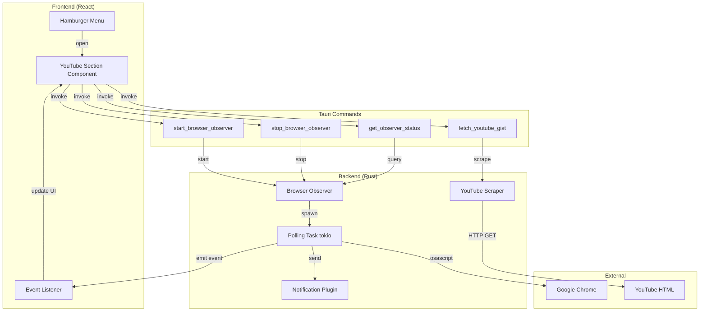

# Design Document: JARVIS Browser Vision

## Overview

The JARVIS Browser Vision module adds passive browser observation capabilities to the JARVIS desktop application. It monitors Chrome's active tab URL via macOS AppleScript polling, detects YouTube videos, sends native notifications, and scrapes video metadata for display in a dedicated UI section.

The architecture follows established patterns from TranscriptionManager (tokio background tasks with watch channels) and Settings component (modal overlay UI). The module is designed for future extensibility to detect other content types beyond YouTube.

### Key Design Decisions

1. **AppleScript over Browser Extension**: Uses macOS `osascript` to query Chrome, avoiding the complexity of browser extension development and distribution
2. **HTML Scraping over API**: Extracts metadata from YouTube's embedded `ytInitialPlayerResponse` JSON, eliminating API key requirements and rate limits
3. **Polling over WebSocket**: 3-second polling interval provides sufficient responsiveness without the complexity of browser automation frameworks
4. **Tokio Background Task**: Follows TranscriptionManager pattern with `tokio::select!` and watch channels for clean shutdown
5. **Modal Overlay UI**: Reuses existing CSS patterns from Settings component for consistency

## Architecture

### Module Structure

```
src-tauri/src/browser/
├── mod.rs           # Module exports and BrowserObserver struct
├── observer.rs      # Chrome polling logic and URL detection
└── youtube.rs       # YouTube page scraping and metadata extraction
```

### Component Diagram



### State Management

The `BrowserObserver` struct manages state following the TranscriptionManager pattern:

```rust
pub struct BrowserObserver {
    app_handle: AppHandle,
    stop_tx: Option<watch::Sender<bool>>,
    is_running: bool,
    last_url: String,
}
```

- **app_handle**: For emitting Tauri events and sending notifications
- **stop_tx**: Watch channel sender for signaling background task shutdown
- **is_running**: Boolean flag to prevent duplicate starts
- **last_url**: Implements URL debouncing to prevent duplicate detections

The observer is stored in Tauri managed state as `Arc<tokio::sync::Mutex<BrowserObserver>>`.

## Components and Interfaces

### BrowserObserver (src/browser/observer.rs)

**Responsibilities:**
- Spawn and manage tokio background polling task
- Execute AppleScript via `std::process::Command`
- Detect YouTube URLs using regex
- Emit Tauri events for detected videos
- Send native macOS notifications
- Handle graceful shutdown via watch channel

**Key Methods:**

```rust
impl BrowserObserver {
    pub fn new(app_handle: AppHandle) -> Self;
    pub async fn start(&mut self) -> Result<(), String>;
    pub async fn stop(&mut self) -> Result<(), String>;
    pub fn is_running(&self) -> bool;
}
```

**Polling Loop Logic:**

```rust
loop {
    tokio::select! {
        biased;
        
        // Prioritize stop signal
        _ = stop_rx.changed() => {
            if *stop_rx.borrow() {
                break;
            }
        }
        
        // Poll Chrome every 3 seconds
        _ = tokio::time::sleep(Duration::from_secs(3)) => {
            match get_chrome_url().await {
                Ok(url) if url != last_url => {
                    last_url = url.clone();
                    if let Some((video_id, full_url)) = detect_youtube(&url) {
                        emit_youtube_event(&app_handle, &video_id, &full_url);
                        send_notification(&app_handle);
                    }
                }
                Err(_) => {
                    // Chrome not running or no windows - continue silently
                }
                _ => {}
            }
        }
    }
}
```

**AppleScript Execution:**

```rust
async fn get_chrome_url() -> Result<String, String> {
    // Timeout after 2 seconds to prevent hanging if Chrome is unresponsive
    let output = tokio::time::timeout(
        Duration::from_secs(2),
        tokio::process::Command::new("osascript")
            .arg("-e")
            .arg("tell application \"Google Chrome\" to return URL of active tab of front window")
            .output()
    )
    .await
    .map_err(|_| "AppleScript execution timed out after 2 seconds".to_string())?
    .map_err(|e| format!("Failed to execute osascript: {}", e))?;
    
    if !output.status.success() {
        return Err("Chrome not running or no windows".to_string());
    }
    
    let url = String::from_utf8_lossy(&output.stdout).trim().to_string();
    Ok(url)
}
```

**YouTube Detection:**

```rust
use std::sync::LazyLock;

// Compile regex once at startup using LazyLock
static YOUTUBE_REGEX: LazyLock<Regex> = LazyLock::new(|| {
    Regex::new(r"(?:youtube\.com/watch\?v=|youtu\.be/)([a-zA-Z0-9_-]{11})").unwrap()
});

fn detect_youtube(url: &str) -> Option<(String, String)> {
    YOUTUBE_REGEX.captures(url).map(|caps| {
        let video_id = caps[1].to_string();
        let full_url = if url.contains("youtube.com") {
            url.to_string()
        } else {
            format!("https://www.youtube.com/watch?v={}", video_id)
        };
        (video_id, full_url)
    })
}
```

### YouTubeScraper (src/browser/youtube.rs)

**Responsibilities:**
- Fetch YouTube page HTML via `reqwest`
- Extract `ytInitialPlayerResponse` JSON from HTML
- Parse metadata fields (title, channel, description, duration)
- Return structured `YouTubeGist` data
- Handle missing fields with fallback values

**Key Function:**

```rust
pub async fn scrape_youtube_gist(url: &str) -> Result<YouTubeGist, String> {
    // Create HTTP client with 10-second timeout
    let client = reqwest::Client::builder()
        .timeout(Duration::from_secs(10))
        .build()
        .map_err(|e| format!("Failed to create HTTP client: {}", e))?;
    
    // Fetch HTML with timeout
    let html = client.get(url)
        .send()
        .await
        .map_err(|e| format!("Failed to fetch YouTube page: {}", e))?
        .text()
        .await
        .map_err(|e| format!("Failed to read response body: {}", e))?;
    
    // Extract video ID from URL
    let video_id = extract_video_id(url)?;
    
    // Extract title from <title> tag
    let title = extract_title(&html);
    
    // Extract ytInitialPlayerResponse JSON
    let player_response = extract_player_response(&html)?;
    
    // Parse JSON fields
    let channel = extract_channel(&player_response);
    let description = extract_description(&player_response);
    let duration_seconds = extract_duration(&player_response);
    
    Ok(YouTubeGist {
        url: url.to_string(),
        video_id,
        title,
        channel,
        description,
        duration_seconds,
    })
}
```

**Regex Patterns:**

```rust
// Extract ytInitialPlayerResponse JSON from HTML
// Note: ytInitialPlayerResponse is a large multi-line JSON blob, so we use a different strategy:
// 1. Find the start marker "var ytInitialPlayerResponse = "
// 2. Count braces to find the matching closing brace
fn extract_player_response(html: &str) -> Result<String, String> {
    let start_marker = "var ytInitialPlayerResponse = ";
    let start_pos = html.find(start_marker)
        .ok_or_else(|| "Failed to find ytInitialPlayerResponse in page HTML".to_string())?;
    
    let json_start = start_pos + start_marker.len();
    let remaining = &html[json_start..];
    
    // Count braces to find the matching closing brace
    let mut brace_count = 0;
    let mut in_string = false;
    let mut escape_next = false;
    let mut json_end = 0;
    
    for (i, ch) in remaining.chars().enumerate() {
        if escape_next {
            escape_next = false;
            continue;
        }
        
        match ch {
            '\\' if in_string => escape_next = true,
            '"' => in_string = !in_string,
            '{' if !in_string => brace_count += 1,
            '}' if !in_string => {
                brace_count -= 1;
                if brace_count == 0 {
                    json_end = i + 1;
                    break;
                }
            }
            _ => {}
        }
    }
    
    if json_end == 0 {
        return Err("Failed to find closing brace for ytInitialPlayerResponse".to_string());
    }
    
    Ok(remaining[..json_end].to_string())
}

// Extract shortDescription from JSON
static DESCRIPTION_REGEX: LazyLock<Regex> = LazyLock::new(|| {
    Regex::new(r#""shortDescription":"((?:[^"\\]|\\.)*)""#).unwrap()
});

fn extract_description(json: &str) -> String {
    DESCRIPTION_REGEX.captures(json)
        .and_then(|caps| caps.get(1))
        .map(|m| unescape_json(m.as_str()))
        .unwrap_or_else(|| String::new())
}

// Extract ownerChannelName from JSON
static CHANNEL_REGEX: LazyLock<Regex> = LazyLock::new(|| {
    Regex::new(r#""ownerChannelName":"((?:[^"\\]|\\.)*)""#).unwrap()
});

fn extract_channel(json: &str) -> String {
    CHANNEL_REGEX.captures(json)
        .and_then(|caps| caps.get(1))
        .map(|m| unescape_json(m.as_str()))
        .unwrap_or_else(|| "Unknown".to_string())
}

// Extract lengthSeconds from JSON
static DURATION_REGEX: LazyLock<Regex> = LazyLock::new(|| {
    Regex::new(r#""lengthSeconds":"(\d+)""#).unwrap()
});

fn extract_duration(json: &str) -> u32 {
    DURATION_REGEX.captures(json)
        .and_then(|caps| caps.get(1))
        .and_then(|m| m.as_str().parse().ok())
        .unwrap_or(0)
}
```

### Tauri Commands (src/commands.rs)

The browser observer commands should be added to the existing `src/commands.rs` file alongside other commands:

```rust
// Add to src/commands.rs

use crate::browser::BrowserObserver;

#[tauri::command]
pub async fn start_browser_observer(
    observer: State<'_, Arc<tokio::sync::Mutex<BrowserObserver>>>,
) -> Result<(), String> {
    observer.lock().await.start().await
}

#[tauri::command]
pub async fn stop_browser_observer(
    observer: State<'_, Arc<tokio::sync::Mutex<BrowserObserver>>>,
) -> Result<(), String> {
    observer.lock().await.stop().await
}

#[tauri::command]
pub async fn fetch_youtube_gist(url: String) -> Result<YouTubeGist, String> {
    crate::browser::youtube::scrape_youtube_gist(&url).await
}

#[tauri::command]
pub async fn get_observer_status(
    observer: State<'_, Arc<tokio::sync::Mutex<BrowserObserver>>>,
) -> Result<bool, String> {
    Ok(observer.lock().await.is_running())
}
```

These commands must also be added to the `invoke_handler` in `lib.rs`:

```rust
.invoke_handler(tauri::generate_handler![
    // ... existing commands ...
    commands::start_browser_observer,
    commands::stop_browser_observer,
    commands::fetch_youtube_gist,
    commands::get_observer_status,
])
```

### Frontend Components

**YouTubeSection Component (src/components/YouTubeSection.tsx):**

```typescript
import { useState, useEffect, useCallback } from 'react';
import { invoke } from '@tauri-apps/api/core';
import { useTauriEvent } from '../hooks/useTauriEvent';

interface YouTubeGist {
  url: string;
  video_id: string;
  title: string;
  channel: string;
  description: string;
  duration_seconds: number;
}

interface DetectedVideo {
  url: string;
  video_id: string;
  gist?: YouTubeGist;
  loading?: boolean;
  error?: string;
}

interface YouTubeDetectedEvent {
  url: string;
  video_id: string;
}

// VideoCard sub-component
interface VideoCardProps {
  video: DetectedVideo;
  onPrepareGist: () => void;
  onDismiss: () => void;
  onCopy: () => void;
}

function VideoCard({ video, onPrepareGist, onDismiss, onCopy }: VideoCardProps) {
  const formatDuration = (seconds: number): string => {
    const minutes = Math.floor(seconds / 60);
    const secs = seconds % 60;
    return `${minutes}:${secs.toString().padStart(2, '0')}`;
  };

  return (
    <div className="video-card">
      <div className="video-url">{video.url}</div>
      
      {!video.gist && !video.loading && !video.error && (
        <button onClick={onPrepareGist} className="prepare-gist-button">
          Prepare Gist
        </button>
      )}
      
      {video.loading && (
        <div className="loading-state">Loading gist...</div>
      )}
      
      {video.error && (
        <div className="error-state">Error: {video.error}</div>
      )}
      
      {video.gist && (
        <div className="gist-display">
          <div className="gist-header">Gist of {video.url}</div>
          <div className="gist-field">
            <span className="gist-label">Title:</span> {video.gist.title}
          </div>
          <div className="gist-field">
            <span className="gist-label">Channel:</span> {video.gist.channel}
          </div>
          <div className="gist-field">
            <span className="gist-label">Duration:</span> {formatDuration(video.gist.duration_seconds)}
          </div>
          <div className="gist-description">
            <div className="gist-label">Description:</div>
            <div className="gist-description-text">{video.gist.description}</div>
          </div>
          <div className="gist-actions">
            <button onClick={onCopy} className="copy-button">Copy</button>
            <button onClick={onDismiss} className="dismiss-button">Dismiss</button>
          </div>
        </div>
      )}
    </div>
  );
}

export function YouTubeSection({ onClose }: { onClose: () => void }) {
  const [isRunning, setIsRunning] = useState(false);
  const [videos, setVideos] = useState<DetectedVideo[]>([]);
  
  // Load observer status on mount
  useEffect(() => {
    invoke<boolean>('get_observer_status').then(setIsRunning);
  }, []);
  
  // Listen for youtube-video-detected events using the hook
  useTauriEvent<YouTubeDetectedEvent>(
    'youtube-video-detected',
    useCallback((payload) => {
      setVideos(prev => [{
        url: payload.url,
        video_id: payload.video_id,
      }, ...prev]);
    }, [])
  );
  
  const handleToggleObserver = async () => {
    try {
      if (isRunning) {
        await invoke('stop_browser_observer');
        setIsRunning(false);
      } else {
        await invoke('start_browser_observer');
        setIsRunning(true);
      }
    } catch (err) {
      console.error('Failed to toggle observer:', err);
    }
  };
  
  const handlePrepareGist = async (index: number) => {
    const video = videos[index];
    setVideos(prev => prev.map((v, i) => 
      i === index ? { ...v, loading: true } : v
    ));
    
    try {
      const gist = await invoke<YouTubeGist>('fetch_youtube_gist', { 
        url: video.url 
      });
      setVideos(prev => prev.map((v, i) => 
        i === index ? { ...v, gist, loading: false } : v
      ));
    } catch (err) {
      setVideos(prev => prev.map((v, i) => 
        i === index ? { ...v, error: String(err), loading: false } : v
      ));
    }
  };
  
  const handleDismiss = (index: number) => {
    setVideos(prev => prev.filter((_, i) => i !== index));
  };
  
  const formatGist = (gist: YouTubeGist): string => {
    const minutes = Math.floor(gist.duration_seconds / 60);
    const seconds = gist.duration_seconds % 60;
    const duration = `${minutes}:${seconds.toString().padStart(2, '0')}`;
    
    return `Gist of ${gist.url}

Title: ${gist.title}
Channel: ${gist.channel}
Duration: ${duration}

Description:
${gist.description}`;
  };
  
  const handleCopy = (gist: YouTubeGist) => {
    const text = formatGist(gist);
    navigator.clipboard.writeText(text);
  };
  
  return (
    <div className="youtube-section">
      <div className="youtube-header">
        <h2>YouTube</h2>
        <button onClick={onClose} className="close-button">×</button>
      </div>
      <div className="youtube-content">
        <div className="observer-status">
          <span>Observer: {isRunning ? 'Running' : 'Stopped'}</span>
          <button onClick={handleToggleObserver}>
            {isRunning ? 'Stop' : 'Start'}
          </button>
        </div>
        <div className="videos-list">
          {videos.map((video, index) => (
            <VideoCard
              key={video.video_id}
              video={video}
              onPrepareGist={() => handlePrepareGist(index)}
              onDismiss={() => handleDismiss(index)}
              onCopy={() => video.gist && handleCopy(video.gist)}
            />
          ))}
        </div>
      </div>
    </div>
  );
}
```

**Hamburger Menu (App.tsx):**

```typescript
import { useTauriEvent } from './hooks/useTauriEvent';

function App() {
  const [showYouTube, setShowYouTube] = useState(false);
  const [showHamburgerMenu, setShowHamburgerMenu] = useState(false);
  const [youtubeNotification, setYoutubeNotification] = useState(false);
  
  // Listen for youtube-video-detected events using the hook
  useTauriEvent<{ url: string; video_id: string }>(
    'youtube-video-detected',
    useCallback(() => {
      if (!showYouTube) {
        setYoutubeNotification(true);
      }
    }, [showYouTube])
  );
  
  const handleOpenYouTube = () => {
    setShowYouTube(true);
    setShowHamburgerMenu(false);
    setYoutubeNotification(false);
  };
  
  return (
    <div className="app">
      <header>
        <button 
          className="hamburger-button" 
          onClick={() => setShowHamburgerMenu(!showHamburgerMenu)}
        >
          ☰
          {youtubeNotification && <span className="notification-badge" />}
        </button>
        
        {showHamburgerMenu && (
          <div className="hamburger-dropdown">
            <button onClick={handleOpenYouTube}>
              📹 YouTube
            </button>
          </div>
        )}
        
        {/* ... existing header content ... */}
      </header>
      
      {showYouTube && (
        <>
          <div className="dialog-overlay" onClick={() => setShowYouTube(false)} />
          <YouTubeSection onClose={() => setShowYouTube(false)} />
        </>
      )}
    </div>
  );
}
```

## Data Models

### Rust Structs

```rust
#[derive(Debug, Clone, Serialize, Deserialize)]
pub struct YouTubeGist {
    pub url: String,
    pub video_id: String,
    pub title: String,
    pub channel: String,
    pub description: String,
    pub duration_seconds: u32,
}

#[derive(Debug, Clone, Serialize, Deserialize)]
pub struct YouTubeDetectedEvent {
    pub url: String,
    pub video_id: String,
}
```

### TypeScript Interfaces

```typescript
interface YouTubeGist {
  url: string;
  video_id: string;
  title: string;
  channel: string;
  description: string;
  duration_seconds: number;
}

interface YouTubeDetectedEvent {
  url: string;
  video_id: string;
}

interface DetectedVideo {
  url: string;
  video_id: string;
  gist?: YouTubeGist;
  loading?: boolean;
  error?: string;
}
```

## Correctness Properties

*A property is a characteristic or behavior that should hold true across all valid executions of a system—essentially, a formal statement about what the system should do. Properties serve as the bridge between human-readable specifications and machine-verifiable correctness guarantees.*


### Property Reflection

After analyzing all acceptance criteria, I've identified the following consolidations:

- **Redundancy**: Requirements 11.1-11.5 duplicate error handling properties from Requirements 1.4, 1.5, 3.6, 4.8, and 4.9
- **Consolidation**: Properties 1.6 and 1.7 (URL debouncing) can be combined into a single property about URL change detection
- **Consolidation**: Properties 2.1 and 2.2 (YouTube detection and extraction) can be combined into a single property about YouTube URL parsing
- **Consolidation**: Properties 4.2-4.6 (metadata extraction) can be combined into a single comprehensive property about gist completeness
- **Consolidation**: Properties 5.6 and 5.7 (start/stop errors) can be combined into a single property about state validation

After reflection, we have 18 unique testable properties that provide comprehensive validation coverage.

### Correctness Properties

Property 1: Observer spawns background task on start
*For any* BrowserObserver instance, when start() is called, a tokio background task should be spawned that polls Chrome's active tab URL
**Validates: Requirements 1.1**

Property 2: Observer polls at correct interval
*For any* running BrowserObserver, the time between consecutive Chrome URL polls should be approximately 3 seconds (±100ms tolerance)
**Validates: Requirements 1.3**

Property 3: Observer handles Chrome unavailability gracefully
*For any* BrowserObserver instance, when Chrome is not running or has no windows, the observer should continue polling without emitting error events or panicking
**Validates: Requirements 1.4, 1.5**

Property 4: URL debouncing prevents duplicate processing
*For any* BrowserObserver instance, when the same URL is returned by Chrome consecutively, only the first occurrence should trigger URL classification and event emission
**Validates: Requirements 1.6, 2.5**

Property 5: URL changes trigger processing
*For any* BrowserObserver instance, when Chrome returns a different URL than the previous poll, the observer should update its last_url state and proceed with URL classification
**Validates: Requirements 1.7**

Property 6: Observer stops cleanly
*For any* running BrowserObserver, when stop() is called, the background task should terminate within one poll interval (3 seconds) and reset internal state
**Validates: Requirements 1.9, 12.6**

Property 7: YouTube URL detection and extraction
*For any* URL matching the patterns `youtube.com/watch?v=` or `youtu.be/`, the observer should correctly detect it as a YouTube video and extract the 11-character video ID
**Validates: Requirements 2.1, 2.2**

Property 8: YouTube detection emits correct event
*For any* detected YouTube video URL, the observer should emit a `youtube-video-detected` Tauri event with payload containing both the full URL and extracted video_id
**Validates: Requirements 2.3**

Property 9: Non-YouTube URLs don't emit events
*For any* non-YouTube URL, the observer should update last_url but should not emit any youtube-video-detected events
**Validates: Requirements 2.6**

Property 10: YouTube detection triggers notification
*For any* detected YouTube video, the observer should send a native macOS notification with title "YouTube Video Detected" and body "Open JarvisApp to prepare a gist"
**Validates: Requirements 3.1, 3.2, 3.3**

Property 11: Notification failures don't crash observer
*For any* BrowserObserver instance, when the notification system is unavailable or fails, the observer should log a warning and continue operating normally
**Validates: Requirements 3.6**

Property 12: YouTube gist contains all required fields
*For any* successfully scraped YouTube video, the returned YouTubeGist should contain non-empty values for url, video_id, title, channel, and a non-negative duration_seconds
**Validates: Requirements 4.2, 4.3, 4.4, 4.5, 4.6**

Property 13: Scraper handles network errors gracefully
*For any* YouTube URL, when the page cannot be fetched due to network errors or HTTP errors, the scraper should return a descriptive error message rather than panicking
**Validates: Requirements 4.8**

Property 14: Scraper uses fallback values for missing fields
*For any* YouTube page HTML, when specific metadata fields cannot be extracted, the scraper should use fallback values ("Unknown" for strings, 0 for duration) rather than failing the entire operation
**Validates: Requirements 4.9**

Property 15: Commands validate observer state
*For any* BrowserObserver instance, start_browser_observer should return an error if already running, and stop_browser_observer should return an error if not running
**Validates: Requirements 5.6, 5.7**

Property 16: Frontend events update UI state
*For any* youtube-video-detected event received by the frontend, the YouTubeSection component should add the detected video to the displayed list with the most recent at the top
**Validates: Requirements 7.4, 7.11**

Property 17: Hamburger menu badge reflects detection state
*For any* youtube-video-detected event, when the YouTubeSection is not open, the hamburger button should display a notification badge, and the badge should be cleared when the section is opened
**Validates: Requirements 8.4, 8.5**

Property 18: Observer doesn't block other subsystems
*For any* BrowserObserver instance, the polling loop should run in a separate tokio task that does not block the main thread or interfere with recording/transcription operations
**Validates: Requirements 12.1, 12.5**

Property 19: AppleScript execution times out
*For any* AppleScript command execution, if Chrome is unresponsive, the command should timeout after 2 seconds and return an error
**Validates: Requirements 12.2**

Property 20: YouTube fetch times out
*For any* YouTube page fetch, if the connection is slow or unresponsive, the request should timeout after 10 seconds and return an error
**Validates: Requirements 12.4**

Property 21: Background task panics don't corrupt state
*For any* BrowserObserver instance, if the background task panics, the system should catch the error and set is_running to false, preventing inconsistent state
**Validates: Requirements 11.6**

## Error Handling

### Error Categories

1. **Chrome Unavailability**
   - Chrome not running
   - Chrome has no windows or tabs
   - AppleScript execution timeout
   - **Strategy**: Silent continuation with logging to stderr, no error events to frontend

2. **Network Errors**
   - YouTube page fetch timeout (10s)
   - HTTP errors (404, 500, etc.)
   - DNS resolution failures
   - **Strategy**: Return descriptive error messages to frontend for display to user

3. **Parsing Errors**
   - ytInitialPlayerResponse not found in HTML
   - Specific metadata fields missing
   - Invalid JSON structure
   - **Strategy**: Use fallback values for missing fields, only fail if critical data (video_id) is missing

4. **State Errors**
   - Starting already-running observer
   - Stopping non-running observer
   - **Strategy**: Return error from command, frontend displays error message

5. **Notification Errors**
   - Notification permission denied
   - Notification plugin unavailable
   - **Strategy**: Log warning to stderr, continue operating without notifications

### Error Propagation

```rust
// Command errors return Result<T, String> for frontend display
#[tauri::command]
pub async fn fetch_youtube_gist(url: String) -> Result<YouTubeGist, String> {
    youtube::scrape_youtube_gist(&url).await
        .map_err(|e| format!("Failed to fetch YouTube gist: {}", e))
}

// Internal errors use Result<T, Box<dyn Error>> for flexibility
async fn scrape_youtube_gist(url: &str) -> Result<YouTubeGist, String> {
    let html = reqwest::get(url)
        .await
        .map_err(|e| format!("Network error: {}", e))?
        .text()
        .await
        .map_err(|e| format!("Failed to read response: {}", e))?;
    
    // ... extraction logic with fallback values
}

// Background task errors are logged, not propagated
loop {
    match get_chrome_url().await {
        Ok(url) => { /* process */ }
        Err(e) => {
            eprintln!("BrowserObserver: Chrome unavailable: {}", e);
            // Continue polling
        }
    }
}
```

### Timeout Configuration

```rust
// AppleScript timeout
let output = tokio::time::timeout(
    Duration::from_secs(2),
    tokio::process::Command::new("osascript")
        .arg("-e")
        .arg("tell application \"Google Chrome\" to return URL of active tab of front window")
        .output()
).await??;

// HTTP request timeout
let client = reqwest::Client::builder()
    .timeout(Duration::from_secs(10))
    .build()?;
let html = client.get(url).send().await?.text().await?;
```

## Testing Strategy

### Dual Testing Approach

The Browser Vision module requires both unit tests and property-based tests for comprehensive coverage:

- **Unit tests**: Verify specific examples, edge cases, and integration points
- **Property tests**: Verify universal properties across randomized inputs
- Both are complementary and necessary for correctness

### Unit Testing Focus

Unit tests should focus on:
- Specific YouTube URL formats (youtube.com, youtu.be, with/without www)
- Regex pattern matching for ytInitialPlayerResponse extraction
- Fallback value behavior when fields are missing
- Error message formatting
- Integration between observer and scraper components
- UI component rendering and event handling

Example unit tests:
```rust
#[test]
fn test_detect_youtube_standard_url() {
    let url = "https://www.youtube.com/watch?v=dQw4w9WgXcQ";
    let result = detect_youtube(url);
    assert_eq!(result, Some(("dQw4w9WgXcQ".to_string(), url.to_string())));
}

#[test]
fn test_detect_youtube_short_url() {
    let url = "https://youtu.be/dQw4w9WgXcQ";
    let result = detect_youtube(url);
    assert!(result.is_some());
    let (video_id, _) = result.unwrap();
    assert_eq!(video_id, "dQw4w9WgXcQ");
}

#[test]
fn test_extract_title_with_suffix() {
    let html = "<title>Test Video - YouTube</title>";
    let title = extract_title(html);
    assert_eq!(title, "Test Video");
}

#[test]
fn test_fallback_on_missing_channel() {
    let json = r#"{"videoDetails":{"title":"Test"}}"#;
    let channel = extract_channel(json);
    assert_eq!(channel, "Unknown");
}
```

### Property-Based Testing

Property tests should verify universal behaviors across randomized inputs. Each property test must:
- Run minimum 100 iterations (due to randomization)
- Reference its design document property via comment tag
- Use a property-based testing library (e.g., `proptest` for Rust, `fast-check` for TypeScript)

Example property tests:
```rust
use proptest::prelude::*;

proptest! {
    // Feature: jarvis-browser-vision, Property 7: YouTube URL detection and extraction
    #[test]
    fn prop_youtube_url_detection(video_id in "[a-zA-Z0-9_-]{11}") {
        let url1 = format!("https://www.youtube.com/watch?v={}", video_id);
        let url2 = format!("https://youtu.be/{}", video_id);
        
        let result1 = detect_youtube(&url1);
        let result2 = detect_youtube(&url2);
        
        prop_assert!(result1.is_some());
        prop_assert!(result2.is_some());
        prop_assert_eq!(result1.unwrap().0, video_id);
        prop_assert_eq!(result2.unwrap().0, video_id);
    }
    
    // Feature: jarvis-browser-vision, Property 9: Non-YouTube URLs don't emit events
    #[test]
    fn prop_non_youtube_urls_not_detected(domain in "[a-z]{3,10}", path in "[a-z/]{5,20}") {
        let url = format!("https://{}.com/{}", domain, path);
        let result = detect_youtube(&url);
        prop_assert!(result.is_none());
    }
    
    // Feature: jarvis-browser-vision, Property 14: Scraper uses fallback values
    #[test]
    fn prop_missing_fields_use_fallbacks(title in ".*", has_channel in proptest::bool::ANY) {
        let json = if has_channel {
            format!(r#"{{"videoDetails":{{"title":"{}","ownerChannelName":"TestChannel"}}}}"#, title)
        } else {
            format!(r#"{{"videoDetails":{{"title":"{}"}}}}"#, title)
        };
        
        let channel = extract_channel(&json);
        if has_channel {
            prop_assert_eq!(channel, "TestChannel");
        } else {
            prop_assert_eq!(channel, "Unknown");
        }
    }
}
```

### Integration Testing

Integration tests should verify:
- Full observer lifecycle (start → detect → emit event → stop)
- Tauri command invocation from frontend
- Event emission and reception
- State management across multiple operations
- Interaction with notification plugin

### Frontend Testing

Frontend tests should verify:
- Component rendering with different states
- Event listener registration and cleanup
- UI interactions (button clicks, modal open/close)
- State updates from Tauri events
- Error display and loading states

### Test Configuration

```toml
# Cargo.toml
[dev-dependencies]
proptest = "1.0"
tokio-test = "0.4"
mockito = "1.0"  # For mocking HTTP requests

[[test]]
name = "integration"
path = "tests/integration.rs"
```

### Manual Testing Checklist

Due to the nature of browser observation and native notifications, some aspects require manual testing:

1. Open Chrome and navigate to a YouTube video
2. Verify notification appears within 3 seconds
3. Open JARVIS app and verify YouTube section shows detected video
4. Click "Prepare Gist" and verify metadata is displayed correctly
5. Test with Chrome closed - verify no errors in console
6. Test with Chrome open but no tabs - verify no errors
7. Test with slow network connection - verify timeout behavior
8. Test notification permission denied - verify app continues working

## Dependencies

### Rust Dependencies (Cargo.toml)

```toml
[dependencies]
tauri = { version = "2", features = ["macos-private-api"] }
tauri-plugin-notification = "2"
tauri-plugin-shell = "2"
tokio = { version = "1", features = ["full"] }
serde = { version = "1", features = ["derive"] }
serde_json = "1"
reqwest = { version = "0.12", features = ["stream", "blocking", "json"] }
regex = "1"  # Moved from dev-dependencies
```

### Frontend Dependencies (package.json)

No new dependencies required. Uses existing:
- `@tauri-apps/api` - For command invocation and event listening
- `react` - For UI components
- `typescript` - For type safety

### Capabilities Configuration (capabilities/default.json)

```json
{
  "permissions": [
    "core:default",
    "shell:default",
    "notification:default"
  ]
}
```

## Future Extensions

The Browser Vision architecture is designed for extensibility:

### Additional Content Detectors

```rust
pub trait ContentDetector {
    fn detect(&self, url: &str) -> Option<ContentType>;
    fn scrape(&self, url: &str) -> Result<ContentGist, String>;
}

enum ContentType {
    YouTube(String),
    Article(String),
    Documentation(String),
    // ... future types
}
```

### Configurable Polling Interval

```rust
pub struct BrowserObserverConfig {
    pub poll_interval_secs: u64,
    pub enable_notifications: bool,
    pub enabled_detectors: Vec<DetectorType>,
}
```

### Multiple Browser Support

```rust
enum Browser {
    Chrome,
    Safari,
    Firefox,
}

impl Browser {
    fn get_active_url(&self) -> Result<String, String> {
        match self {
            Browser::Chrome => get_chrome_url(),
            Browser::Safari => get_safari_url(),
            Browser::Firefox => get_firefox_url(),
        }
    }
}
```

### Content History and Search

```rust
pub struct ContentHistory {
    items: Vec<ContentGist>,
    max_items: usize,
}

impl ContentHistory {
    pub fn search(&self, query: &str) -> Vec<&ContentGist>;
    pub fn filter_by_type(&self, content_type: ContentType) -> Vec<&ContentGist>;
}
```

## Performance Considerations

### Memory Usage

- **Observer State**: Minimal (~100 bytes for struct fields)
- **Event Payloads**: Small (~200 bytes per YouTube detection)
- **Scraped Gists**: Moderate (~2-5 KB per gist, depends on description length)
- **Frontend State**: Grows with detected videos, recommend limiting to 50 most recent

### CPU Usage

- **Polling Overhead**: Negligible (~0.1% CPU for 3-second interval)
- **AppleScript Execution**: ~10-50ms per poll
- **Regex Matching**: ~1-5ms per URL
- **HTTP Fetching**: Async, doesn't block other operations

### Network Usage

- **YouTube Page Fetch**: ~100-500 KB per gist preparation
- **No Background Fetching**: Only fetches when user clicks "Prepare Gist"
- **No Polling of External Services**: All detection is local

### Optimization Opportunities

1. **Caching**: Cache scraped gists by video_id to avoid re-fetching
2. **Batch Processing**: If multiple videos detected rapidly, batch notifications
3. **Lazy Loading**: Only load gist details when user expands a video card
4. **Debouncing**: Add additional debouncing for rapid tab switches

## Security Considerations

### AppleScript Execution

- **Risk**: AppleScript can control applications
- **Mitigation**: Only executes read-only query, no write operations
- **Validation**: URL returned from Chrome is validated before processing

### HTTP Requests

- **Risk**: Fetching arbitrary URLs could expose user to malicious content
- **Mitigation**: Only fetches YouTube URLs (validated by regex)
- **Timeout**: 10-second timeout prevents hanging on slow/malicious servers

### User Privacy

- **No Tracking**: No URLs are sent to external services
- **Local Processing**: All detection and scraping happens locally
- **No Persistence**: Detected videos are only stored in memory (not saved to disk)

### Notification Content

- **No Sensitive Data**: Notifications only contain generic message
- **User Control**: User can disable notifications via macOS System Settings

## Deployment Notes

### macOS Permissions

The application requires:
1. **Accessibility Permission**: For AppleScript to query Chrome (user must grant in System Settings)
2. **Notification Permission**: For native notifications (requested on first notification)

### Chrome Compatibility

- Tested with Chrome 120+
- Should work with Chromium-based browsers (Edge, Brave) with minor AppleScript modifications
- Does not work with Firefox or Safari (different AppleScript syntax required)

### YouTube Page Format

- Scraping relies on `ytInitialPlayerResponse` JSON embedded in page HTML
- If YouTube changes page format, regex patterns may need updates
- Fallback values ensure graceful degradation if fields are missing
