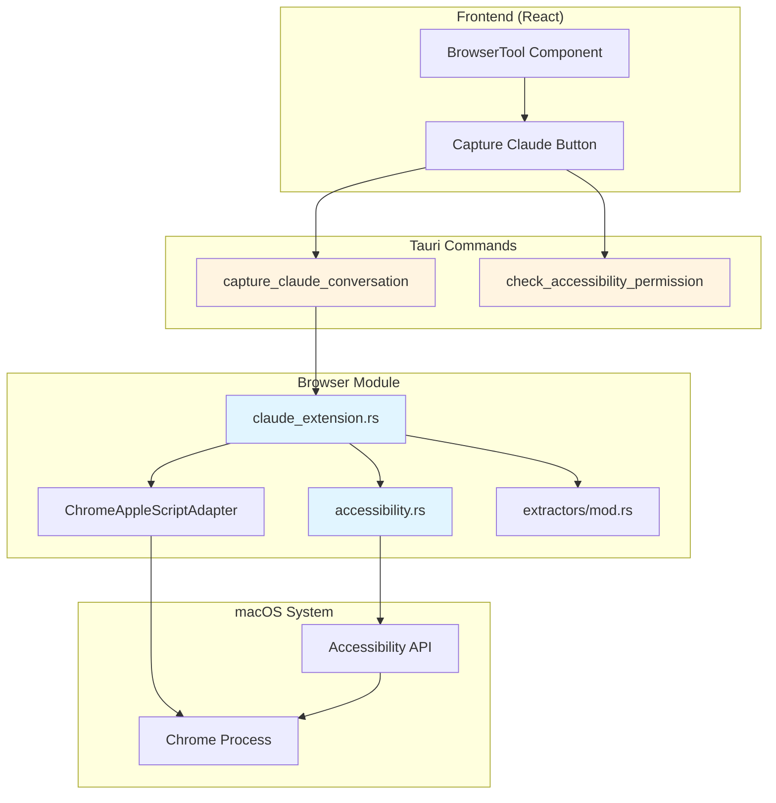

# Design Document: Claude Extension Extractor

## Overview

This feature adds a `claude_extension` extractor to the Jarvis browser module that captures conversations from the Claude Chrome Extension side panel using macOS Accessibility APIs. Unlike existing extractors that use JavaScript execution in the browser DOM, this extractor reads the side panel's accessibility tree because the side panel is a separate browsing context inaccessible to page-level JavaScript.

The extractor follows the established pattern of returning a `PageGist` struct but introduces a new extraction mechanism: AXUIElement APIs instead of AppleScript JavaScript execution. This approach enables Jarvis to capture valuable AI conversations that users have about web pages—conversations that are not synced to claude.ai and exist only in the extension's side panel.

### Key Design Decisions

1. **Accessibility API over DOM scraping**: The Claude side panel is a separate Chrome extension context. Content scripts and AppleScript JavaScript execution cannot access it. The macOS Accessibility API is the only viable extraction method.

2. **Separate command path**: Unlike automatic extractors (YouTube detection), Claude conversation capture is user-initiated via a dedicated Tauri command `capture_claude_conversation`. This avoids unnecessary accessibility tree traversals on every tab change.
   
   **Note**: This is an intentional divergence from Requirement 6.2, which states "THE extractor router (prepare_gist) SHALL be updated to detect when a Claude side panel conversation is available." The design chooses NOT to integrate with `prepare_gist` because:
   - Accessibility tree traversal is expensive (requires iterating through Chrome's entire UI hierarchy)
   - `prepare_gist` is called on every tab change in the browser observer hot path
   - Adding AX tree traversal to `prepare_gist` would introduce 50-200ms latency on every tab change
   - Claude conversation capture is inherently user-initiated (user must explicitly open side panel and start conversation)
   - A dedicated command provides better UX: user clicks "Capture Claude Conversation" when ready, rather than automatic detection
   
   The requirement will be updated to reflect this design decision.

3. **Reuse existing PageGist format**: The extractor returns the same `PageGist` struct as other extractors, using `SourceType::Chat` (same as ChatGPT) to integrate seamlessly with the gem save pipeline.

4. **Platform-specific with graceful degradation**: All AXUIElement code is gated behind `#[cfg(target_os = "macos")]`. On non-macOS platforms, commands return descriptive errors rather than failing to compile.

5. **Permission-aware error handling**: Accessibility permission is required but not automatically prompted. The system checks permission status and provides clear instructions when not granted.

## Architecture

### Component Diagram



### Data Flow

1. **User initiates capture**: Clicks "Capture Claude Conversation" button in BrowserTool
2. **Permission check**: Frontend calls `check_accessibility_permission` to verify access
3. **Extraction request**: Frontend calls `capture_claude_conversation` command
4. **Chrome discovery**: Accessibility module finds Chrome's process ID
5. **Tree traversal**: Module traverses Chrome's accessibility tree to find all AXWebArea elements
6. **Side panel detection**: Identifies Claude side panel by title "Claude for Chrome"
7. **Text extraction**: Recursively extracts text from AXStaticText, AXHeading, AXLink elements
8. **Context pairing**: Uses ChromeAppleScriptAdapter to get active tab URL and title
9. **PageGist construction**: Builds PageGist with conversation text and page context
10. **Return to frontend**: GistCard displays the captured conversation for review/save

### Integration Points

- **Existing extractors**: New `claude_extension` module added to `browser/extractors/mod.rs`
- **Chrome adapter**: Reuses `ChromeAppleScriptAdapter` for active tab URL/title
- **Gem pipeline**: PageGist flows through existing save pipeline with AI enrichment
- **BrowserTool UI**: New button added alongside existing extractor triggers

## Components and Interfaces

### 1. Accessibility Module (`browser/accessibility.rs`)

Wraps macOS AXUIElement APIs for reading Chrome's accessibility tree.

```rust
#[cfg(target_os = "macos")]
pub struct AccessibilityReader;

#[cfg(target_os = "macos")]
impl AccessibilityReader {
    /// Check if accessibility permission is granted
    pub fn check_permission() -> bool;
    
    /// Find Chrome's process ID from running applications
    pub fn find_chrome_pid() -> Result<i32, String>;
    
    /// Find all AXWebArea elements in Chrome's accessibility tree
    pub fn find_web_areas(chrome_pid: i32) -> Result<Vec<WebArea>, String>;
    
    /// Extract structured text content from a web area with depth and role info
    pub fn extract_text_content(web_area: &WebArea) -> Result<Vec<TextBlock>, String>;
}

#[cfg(target_os = "macos")]
pub struct WebArea {
    pub title: String,
    pub element: AXUIElement, // From accessibility-sys crate
}

#[cfg(target_os = "macos")]
pub struct TextBlock {
    pub text: String,
    pub role: String,        // "AXStaticText", "AXHeading", "AXLink", "AXTextField", "AXGroup"
    pub depth: usize,        // Tree depth from web area root (0 = direct child)
    pub parent_role: String, // Role of immediate parent element
}
```

**Key responsibilities**:
- Process discovery via NSWorkspace (find Chrome by bundle ID)
- Accessibility tree traversal (recursive descent through AXChildren)
- Text extraction from AXStaticText, AXHeading, AXLink, AXTextField roles WITH depth tracking
- Group boundary detection via AXGroup elements (used for message separation)
- Permission checking via `AXIsProcessTrusted()`

**Error handling**:
- Chrome not running → descriptive error
- Permission not granted → error with grant instructions
- Accessibility tree not populated → retry once with delay

**Text extraction algorithm**:
```rust
fn extract_recursive(
    element: AXUIElement,
    depth: usize,
    parent_role: &str,
    blocks: &mut Vec<TextBlock>
) {
    let role = get_role(element);
    
    // Collect text from text-bearing elements
    match role.as_str() {
        "AXStaticText" => {
            if let Some(value) = get_value(element) {
                blocks.push(TextBlock {
                    text: value,
                    role: role.clone(),
                    depth,
                    parent_role: parent_role.to_string(),
                });
            }
        }
        "AXHeading" => {
            if let Some(title) = get_title(element) {
                blocks.push(TextBlock {
                    text: format!("## {}", title),
                    role: role.clone(),
                    depth,
                    parent_role: parent_role.to_string(),
                });
            }
        }
        "AXLink" => {
            if let Some(title) = get_title(element) {
                blocks.push(TextBlock {
                    text: format!("[link: {}]", title),
                    role: role.clone(),
                    depth,
                    parent_role: parent_role.to_string(),
                });
            }
        }
        "AXTextField" => {
            // Placeholder text marks conversation boundary
            if let Some(placeholder) = get_placeholder(element) {
                blocks.push(TextBlock {
                    text: format!("[input: {}]", placeholder),
                    role: role.clone(),
                    depth,
                    parent_role: parent_role.to_string(),
                });
            }
        }
        _ => {}
    }
    
    // Recurse into children
    for child in get_children(element) {
        extract_recursive(child, depth + 1, &role, blocks);
    }
}
```

### 2. Claude Extension Extractor (`browser/extractors/claude_extension.rs`)

Implements the extraction logic for Claude side panel conversations.

```rust
use super::PageGist;
use crate::browser::adapters::chrome::ChromeAppleScriptAdapter;
use crate::browser::adapters::BrowserAdapter;
use crate::browser::tabs::SourceType;

#[cfg(target_os = "macos")]
use crate::browser::accessibility::{AccessibilityReader, WebArea};

/// Extract a PageGist from the Claude Chrome Extension side panel
#[cfg(target_os = "macos")]
pub async fn extract() -> Result<PageGist, String> {
    // 1. Check permission
    if !AccessibilityReader::check_permission() {
        return Err("Accessibility permission required. Go to System Settings > Privacy & Security > Accessibility and add Jarvis.".to_string());
    }
    
    // 2. Find Chrome
    let chrome_pid = AccessibilityReader::find_chrome_pid()?;
    
    // 3. Find all web areas
    let web_areas = AccessibilityReader::find_web_areas(chrome_pid)?;
    
    // 4. Find Claude side panel
    let claude_area = find_claude_web_area(&web_areas)?;
    
    // 5. Extract conversation text
    let text_blocks = AccessibilityReader::extract_text_content(&claude_area)?;
    let conversation = reconstruct_conversation(&text_blocks)?;
    
    // 6. Get page context
    let adapter = ChromeAppleScriptAdapter;
    let page_url = adapter.get_active_tab_url().await?;
    let page_title = extract_page_title(&web_areas)?;
    
    // 7. Build PageGist
    build_page_gist(conversation, page_url, page_title)
}

#[cfg(not(target_os = "macos"))]
pub async fn extract() -> Result<PageGist, String> {
    Err("Claude conversation capture is only available on macOS".to_string())
}

/// Find the Claude side panel web area by title
fn find_claude_web_area(web_areas: &[WebArea]) -> Result<WebArea, String>;

/// Reconstruct conversation from text blocks with depth-based message separation
fn reconstruct_conversation(text_blocks: &[TextBlock]) -> Result<ConversationData, String>;

/// Extract page title from non-Claude web area
fn extract_page_title(web_areas: &[WebArea]) -> Result<String, String>;

/// Build PageGist from conversation and page context
fn build_page_gist(
    conversation: ConversationData,
    page_url: String,
    page_title: String,
) -> Result<PageGist, String>;
```

**Key responsibilities**:
- Orchestrate the extraction workflow
- Identify Claude side panel among multiple web areas
- Reconstruct conversation structure from flat text blocks
- Pair conversation with page context
- Format as PageGist with appropriate metadata

**Conversation reconstruction logic**:

The Claude side panel doesn't have explicit role attributes like ChatGPT's `[data-message-author-role]`. Instead, we use depth-based heuristics to identify message boundaries:

1. **Conversation boundary detection**: Text blocks before `[input: Reply to Claude]` are conversation content; blocks after are UI chrome (footer, etc.)

2. **Message separation heuristic**: 
   - **Depth changes indicate message boundaries**: When depth decreases significantly (e.g., from depth 8 back to depth 4), this typically indicates a new message group
   - **First message is always user**: The first text block group (before any depth decrease) is the user's prompt
   - **Alternating pattern**: After the first user message, messages alternate between Claude and user based on depth boundaries
   - **Plan indicators**: Text blocks containing "steps", "Created a plan", "Done" at shallow depth (< 6) mark the start of Claude's response

3. **Algorithm**:
```rust
fn reconstruct_conversation(blocks: &[TextBlock]) -> Result<ConversationData, String> {
    let mut conversation = String::new();
    let mut message_count = 0;
    let mut first_prompt = String::new();
    let mut current_author = "You"; // Start with user
    let mut current_message = Vec::new();
    let mut prev_depth = 0;
    
    for block in blocks {
        // Stop at input field boundary
        if block.text.starts_with("[input:") {
            break;
        }
        
        // Detect message boundary: significant depth decrease OR plan indicators
        let is_boundary = (prev_depth > 6 && block.depth < 6) ||
                         (block.depth < 6 && is_plan_indicator(&block.text));
        
        if is_boundary && !current_message.is_empty() {
            // Flush current message
            let separator = format!("--- {} ---\n\n", current_author);
            conversation.push_str(&separator);
            conversation.push_str(&current_message.join("\n"));
            conversation.push_str("\n\n");
            
            if message_count == 0 {
                first_prompt = current_message.join(" ").chars().take(200).collect();
            }
            
            message_count += 1;
            current_message.clear();
            
            // Toggle author (You -> Claude -> You -> Claude...)
            current_author = if current_author == "You" { "Claude" } else { "You" };
        }
        
        current_message.push(block.text.clone());
        prev_depth = block.depth;
    }
    
    // Flush final message
    if !current_message.is_empty() {
        let separator = format!("--- {} ---\n\n", current_author);
        conversation.push_str(&separator);
        conversation.push_str(&current_message.join("\n"));
        message_count += 1;
    }
    
    // Truncate if needed
    if conversation.len() > 50_000 {
        conversation.truncate(50_000);
        conversation.push_str("\n\n[conversation truncated]");
    }
    
    Ok(ConversationData {
        full_text: conversation,
        message_count,
        first_prompt,
    })
}

fn is_plan_indicator(text: &str) -> bool {
    let lower = text.to_lowercase();
    lower.contains("steps") || 
    lower.contains("created a plan") || 
    lower == "done" ||
    lower.contains("extract page text")
}
```

4. **Formatting preservation**:
   - Headings: Already formatted as `## heading` by `extract_text_content`
   - Links: Already formatted as `[link: text]` by `extract_text_content`
   - Paragraphs: Separated by newlines based on text block boundaries

5. **Edge cases**:
   - Single-turn conversation (user prompt only, no Claude response): Still produces valid output with one `--- You ---` section
   - Empty conversation: Returns error "Claude conversation is empty"
   - Very long messages: Truncation applies to full conversation, not individual messages

### 3. Tauri Commands

```rust
/// Capture the current Claude conversation from the side panel
#[tauri::command]
pub async fn capture_claude_conversation() -> Result<PageGist, String> {
    claude_extension::extract().await
}

/// Check if accessibility permission is granted
#[tauri::command]
pub fn check_accessibility_permission() -> bool {
    #[cfg(target_os = "macos")]
    {
        crate::browser::accessibility::AccessibilityReader::check_permission()
    }
    #[cfg(not(target_os = "macos"))]
    {
        false
    }
}
```

**Registration in `lib.rs`**:
```rust
.invoke_handler(tauri::generate_handler![
    // ... existing commands
    capture_claude_conversation,
    check_accessibility_permission,
])
```

### 4. Frontend Integration (BrowserTool Component)

```typescript
// New state for Claude conversation capture
const [claudePermission, setClaudePermission] = useState<boolean>(false);
const [capturingClaude, setCapturingClaude] = useState<boolean>(false);

// Check permission on mount (macOS only)
useEffect(() => {
  if (platform === 'macos') {
    invoke<boolean>('check_accessibility_permission')
      .then(setClaudePermission)
      .catch(() => setClaudePermission(false));
  }
}, [platform]);

// Capture Claude conversation
const handleCaptureClaude = async () => {
  setCapturingClaude(true);
  try {
    const gist = await invoke<PageGist>('capture_claude_conversation');
    setCurrentGist(gist); // Display in GistCard
  } catch (error) {
    setError(error as string);
  } finally {
    setCapturingClaude(false);
  }
};

// Render button
<button
  onClick={handleCaptureClaude}
  disabled={!claudePermission || capturingClaude}
  title={!claudePermission ? "Accessibility permission required" : "Capture Claude conversation"}
>
  {capturingClaude ? "Capturing..." : "Capture Claude Conversation"}
</button>
```

## Data Models

### TextBlock (Internal)

```rust
#[cfg(target_os = "macos")]
pub struct TextBlock {
    /// The text content
    pub text: String,
    /// AX role: "AXStaticText", "AXHeading", "AXLink", "AXTextField", "AXGroup"
    pub role: String,
    /// Tree depth from web area root (0 = direct child)
    pub depth: usize,
    /// Role of immediate parent element
    pub parent_role: String,
}
```

**Purpose**: Preserves accessibility tree structure needed for message boundary detection. Depth changes indicate message boundaries in the Claude side panel.

### ConversationData (Internal)

```rust
struct ConversationData {
    /// Full conversation text with separators
    full_text: String,
    /// Number of message turns (user + Claude pairs)
    message_count: u32,
    /// First user prompt (for description)
    first_prompt: String,
}
```

### PageGist (Existing, Extended)

```rust
pub struct PageGist {
    pub url: String,                      // Active tab URL
    pub title: String,                    // "Claude: {page_title}"
    pub source_type: SourceType,          // SourceType::Chat
    pub domain: String,                   // Extracted from page URL
    pub author: Option<String>,           // Some("Claude Extension")
    pub description: Option<String>,      // First user prompt (truncated)
    pub content_excerpt: Option<String>,  // Full conversation text
    pub published_date: Option<String>,   // None
    pub image_url: Option<String>,        // None
    pub extra: serde_json::Value,         // See below
}
```

**Extra metadata fields**:
```json
{
  "page_url": "https://example.com/article",
  "page_title": "Article Title",
  "message_count": 4,
  "extraction_method": "accessibility_api",
  "claude_extension_version": "Claude for Chrome"
}
```

### AXUIElement Bindings

**Crate choice**: Use `core-foundation` + `core-graphics` crates with manual `extern "C"` declarations for Accessibility API functions. This approach is chosen because:
- The `accessibility-sys` crate is unmaintained (last update 2019) and may not work with modern macOS
- The `accessibility` higher-level crate depends on the unmaintained `accessibility-sys`
- Manual FFI gives us full control and is straightforward for the small API surface we need
- `core-foundation` provides the CFString and CFArray types we need for AX API interop

**Dependencies to add to Cargo.toml**:
```toml
[target.'cfg(target_os = "macos")'.dependencies]
core-foundation = "0.9"
core-graphics = "0.23"
```

**FFI declarations**:
```rust
#[cfg(target_os = "macos")]
use core_foundation::{
    base::{CFTypeRef, TCFType},
    string::{CFString, CFStringRef},
    array::{CFArray, CFArrayRef},
};
use core_graphics::base::CGError;

#[cfg(target_os = "macos")]
#[repr(C)]
pub struct __AXUIElement(std::ffi::c_void);

#[cfg(target_os = "macos")]
pub type AXUIElementRef = *const __AXUIElement;

#[cfg(target_os = "macos")]
pub type AXError = i32;

#[cfg(target_os = "macos")]
#[link(name = "ApplicationServices", kind = "framework")]
extern "C" {
    pub fn AXIsProcessTrusted() -> bool;
    
    pub fn AXUIElementCreateApplication(pid: i32) -> AXUIElementRef;
    
    pub fn AXUIElementCopyAttributeValue(
        element: AXUIElementRef,
        attribute: CFStringRef,
        value: *mut CFTypeRef,
    ) -> AXError;
    
    pub fn AXUIElementCopyAttributeNames(
        element: AXUIElementRef,
        names: *mut CFArrayRef,
    ) -> AXError;
}

// Key attribute constants
#[cfg(target_os = "macos")]
pub const kAXRoleAttribute: &str = "AXRole";
#[cfg(target_os = "macos")]
pub const kAXTitleAttribute: &str = "AXTitle";
#[cfg(target_os = "macos")]
pub const kAXValueAttribute: &str = "AXValue";
#[cfg(target_os = "macos")]
pub const kAXChildrenAttribute: &str = "AXChildren";
#[cfg(target_os = "macos")]
pub const kAXPlaceholderValueAttribute: &str = "AXPlaceholderValue";

// Success code
#[cfg(target_os = "macos")]
pub const kAXErrorSuccess: AXError = 0;
```


## Correctness Properties

*A property is a characteristic or behavior that should hold true across all valid executions of a system—essentially, a formal statement about what the system should do. Properties serve as the bridge between human-readable specifications and machine-verifiable correctness guarantees.*

### Property Reflection

After analyzing all acceptance criteria, I identified the following testable properties and performed redundancy elimination:

**Redundancies identified**:
- Properties 2.1 and 2.2: "Identify Claude panel by title" and "Distinguish from regular web areas" are the same—distinction IS the title matching
- Properties 3.3 and 3.4: Both are format preservation properties that can be combined into a single "preserve element formatting" property
- Properties 5.4 and 5.5: URL passthrough and domain extraction can be combined—domain is derived from URL
- Properties 5.6 and 3.2: Both test conversation structure with separators—redundant
- Properties 4.3 and 5.9: Both test metadata inclusion in extra field—can be combined
- Error handling properties 1.6, 1.7, 2.4, 2.5, 9.1-9.5: All are edge cases handled by generators and error path testing, not separate properties

**Consolidated properties** (after removing redundancy):

### Property 1: Chrome Process Discovery

*For any* system state where Chrome is running with bundle ID "com.google.Chrome", the `find_chrome_pid()` function should return a positive process ID that corresponds to the Chrome process.

**Validates: Requirements 1.2**

### Property 2: Web Area Discovery Completeness

*For any* Chrome instance with at least one open tab, the `find_web_areas()` function should return a non-empty list of AXWebArea elements.

**Validates: Requirements 1.3**

### Property 3: Text Content Extraction Completeness

*For any* AXWebArea containing AXStaticText, AXHeading, AXLink, or AXTextField elements, the `extract_text_content()` function should return all text values from those elements with correct depth and role information.

**Validates: Requirements 1.4, 3.1**

### Property 4: Claude Panel Identification

*For any* set of web areas where exactly one has a title containing "Claude", the `find_claude_web_area()` function should identify that web area as the Claude side panel.

**Validates: Requirements 2.1**

### Property 5: Claude Panel Detection Boolean

*For any* system state, the detection function should return true if and only if a web area with "Claude" in its title exists in Chrome's accessibility tree.

**Validates: Requirements 2.3**

### Property 6: Conversation Structure Preservation

*For any* extracted text blocks from a Claude conversation with depth information, the `reconstruct_conversation()` function should produce output containing "--- You ---" and "--- Claude ---" separators to distinguish message authors, using depth changes to identify message boundaries.

**Validates: Requirements 3.2**

### Property 7: Element Formatting Preservation

*For any* conversation containing AXHeading elements with text H or AXLink elements with text L, the reconstructed conversation should contain "## H" for headings and "[link: L]" for links.

**Validates: Requirements 3.3, 3.4**

### Property 8: Conversation Boundary Detection

*For any* text block sequence containing the marker "Reply to Claude", the extraction should include only text blocks appearing before this marker in the conversation content.

**Validates: Requirements 3.5**

### Property 9: Multi-Turn Conversation Completeness

*For any* Claude conversation with N user prompts and N Claude responses, the extracted conversation should contain all N user prompts and all N Claude responses.

**Validates: Requirements 3.6**

### Property 10: Conversation Length Truncation

*For any* conversation text exceeding 50,000 characters, the `content_excerpt` field should contain exactly the first 50,000 characters followed by "\n\n[conversation truncated]".

**Validates: Requirements 3.7**

### Property 11: Message Count Accuracy

*For any* extracted conversation, the `message_count` metadata should equal the actual number of user/Claude message turn pairs in the conversation.

**Validates: Requirements 3.8**

### Property 12: Active Tab URL Extraction

*For any* Chrome state with an active tab at URL U, the extraction should produce a PageGist where the `url` field equals U.

**Validates: Requirements 4.1, 5.4**

### Property 13: Active Tab Title Extraction

*For any* Chrome state with an active tab having title T, the extraction should produce a PageGist where the page context includes title T.

**Validates: Requirements 4.2**

### Property 14: PageGist Title Formatting

*For any* page title T, the resulting PageGist title should be formatted as "Claude: " + T.

**Validates: Requirements 5.3**

### Property 15: Domain Extraction from URL

*For any* URL U, the PageGist domain field should equal the result of applying the existing `extract_domain()` function to U.

**Validates: Requirements 5.5**

### Property 16: Description from First Prompt

*For any* conversation where the first user prompt is P, the PageGist description should be P truncated to 200 characters.

**Validates: Requirements 5.8**

### Property 17: Metadata Completeness

*For any* extracted conversation with page URL U, page title T, and message count N, the PageGist extra field should contain keys "page_url" (value U), "page_title" (value T), "message_count" (value N), "extraction_method" (value "accessibility_api"), and "claude_extension_version".

**Validates: Requirements 4.3, 5.9**

### Property 18: Frontmost Window Selection

*For any* Chrome state with multiple windows, the extraction should read the active tab from the frontmost window.

**Validates: Requirements 4.4**

### Property 19: Permission Check Precedes Extraction

*For any* call to the `extract()` function, the accessibility permission check should execute before any accessibility tree traversal operations.

**Validates: Requirements 7.1**

### Property 20: Error Handling Without Panics

*For any* accessibility API failure (Chrome not running, permission denied, tree not populated, etc.), the system should return `Result::Err` with a descriptive error message and never panic.

**Validates: Requirements 9.6**


## Error Handling

### Error Categories

1. **Permission Errors**
   - Accessibility permission not granted
   - Return: `"Accessibility permission required. Go to System Settings > Privacy & Security > Accessibility and add Jarvis."`
   - User action: Grant permission in System Settings

2. **Chrome Availability Errors**
   - Chrome not running
   - Return: `"Chrome is not running"`
   - User action: Launch Chrome

3. **Content Availability Errors**
   - No Claude side panel found
   - Return: `"No Claude conversation found. Open the Claude Chrome Extension side panel first."`
   - User action: Open Claude extension side panel
   
   - Claude side panel empty (no messages)
   - Return: `"Claude conversation is empty"`
   - User action: Start a conversation with Claude

4. **Chrome State Errors**
   - No active tab found
   - Return: `"No active tab found"`
   - User action: Open a tab in Chrome
   
   - Accessibility tree not fully populated
   - Behavior: Retry once after 500ms delay, then return error
   - Return: `"Failed to read Chrome accessibility tree. Try again in a moment."`

5. **Platform Errors**
   - Non-macOS platform
   - Return: `"Claude conversation capture is only available on macOS"`
   - User action: None (feature unavailable)

### Error Propagation Strategy

All errors are propagated as `Result<T, String>` through the call stack:

```
extract() -> Result<PageGist, String>
  ├─> AccessibilityReader::check_permission() -> bool
  ├─> AccessibilityReader::find_chrome_pid() -> Result<i32, String>
  ├─> AccessibilityReader::find_web_areas() -> Result<Vec<WebArea>, String>
  ├─> find_claude_web_area() -> Result<WebArea, String>
  ├─> AccessibilityReader::extract_text_content() -> Result<Vec<TextBlock>, String>
  ├─> reconstruct_conversation() -> Result<ConversationData, String>
  ├─> ChromeAppleScriptAdapter::get_active_tab_url() -> Result<String, String>
  └─> extract_page_title() -> Result<String, String>
```

No panics, no unwraps. All errors are descriptive and actionable.

### Logging Strategy

All errors are logged to stderr with `[ClaudeExtractor]` prefix before being returned:

```rust
eprintln!("[ClaudeExtractor] Error: {}", error_message);
Err(error_message)
```

This provides debugging visibility while keeping stdout clean for potential future piping scenarios.

### Retry Logic

Only one operation has retry logic: accessibility tree traversal.

**Rationale**: Chrome's accessibility tree may not be fully populated immediately after launch or after opening the side panel. A single retry with a short delay handles this transient state.

**Implementation**:
```rust
let web_areas = match AccessibilityReader::find_web_areas(chrome_pid) {
    Ok(areas) if !areas.is_empty() => areas,
    _ => {
        // Retry once after delay
        tokio::time::sleep(Duration::from_millis(500)).await;
        AccessibilityReader::find_web_areas(chrome_pid)?
    }
};
```

No other operations have retry logic. Permission errors, Chrome not running, and content not found are all stable states that won't resolve with retries.

## Testing Strategy

### Dual Testing Approach

This feature requires both unit tests and property-based tests:

- **Unit tests**: Verify specific examples, edge cases, error conditions, and UI integration
- **Property tests**: Verify universal properties across randomized inputs

Together they provide comprehensive coverage: unit tests catch concrete bugs, property tests verify general correctness.

### Property-Based Testing

**Library**: `proptest` crate (Rust's property-based testing library)

**Configuration**: Minimum 100 iterations per property test (due to randomization)

**Test Organization**: Each correctness property from the design document maps to one property-based test.

**Tag Format**: Each test includes a comment referencing the design property:
```rust
// Feature: jarvis-claude-extension-extractor, Property 3: Text Content Extraction Completeness
#[test]
fn prop_text_extraction_completeness() { ... }
```

**Key Property Tests**:

1. **Text Extraction Completeness** (Property 3)
   - Generate: Random accessibility tree with text elements at various depths
   - Test: All text values appear in extracted output with correct depth and role
   - Validates: No text is lost during extraction, depth tracking is accurate

2. **Conversation Structure Preservation** (Property 6)
   - Generate: Random sequence of text blocks with varying depths simulating user/Claude message patterns
   - Test: Output contains correct number of "--- You ---" and "--- Claude ---" separators based on depth boundaries
   - Validates: Message authorship is correctly inferred from depth changes

3. **Element Formatting Preservation** (Property 7)
   - Generate: Random mix of headings and links
   - Test: All headings formatted as "## text", all links as "[link: text]"
   - Validates: Formatting rules are consistently applied

4. **Conversation Length Truncation** (Property 10)
   - Generate: Random conversation text of varying lengths
   - Test: Output length ≤ 50,000 + truncation marker length
   - Validates: Truncation prevents unbounded memory usage

5. **Message Count Accuracy** (Property 11)
   - Generate: Random conversation with N turns
   - Test: message_count metadata equals N
   - Validates: Counting logic is correct

6. **PageGist Title Formatting** (Property 14)
   - Generate: Random page titles (including edge cases: empty, very long, special chars)
   - Test: PageGist title = "Claude: " + page_title
   - Validates: Title formatting is consistent

7. **Domain Extraction** (Property 15)
   - Generate: Random URLs (various schemes, subdomains, paths)
   - Test: Domain extraction matches existing `extract_domain()` function
   - Validates: Domain parsing is consistent with existing code

8. **Metadata Completeness** (Property 17)
   - Generate: Random conversation data
   - Test: All required keys present in extra field with correct values
   - Validates: No metadata is missing

9. **Error Handling Without Panics** (Property 20)
   - Generate: Random error conditions (simulated failures)
   - Test: All code paths return Result::Err, never panic
   - Validates: Robustness under failure

### Unit Testing

**Test Organization**: Tests in `src-tauri/src/browser/extractors/claude_extension.rs` (inline tests) and `src-tauri/src/browser/accessibility.rs` (inline tests)

**Key Unit Tests**:

1. **Permission Check**
   - Test: `check_permission()` returns boolean
   - Validates: Permission API is callable

2. **Chrome Not Running**
   - Test: `find_chrome_pid()` returns error when Chrome not running
   - Validates: Error message is descriptive

3. **No Claude Panel**
   - Test: `find_claude_web_area()` returns error when no Claude web area exists
   - Validates: Error message guides user to open side panel

4. **Empty Conversation**
   - Test: `reconstruct_conversation()` returns error when text blocks are empty
   - Validates: Empty state is handled gracefully

5. **Conversation Boundary Detection**
   - Test: Text blocks with `[input: Reply to Claude]` marker are excluded from conversation
   - Validates: Boundary detection works with specific example

6. **Multi-Turn Conversation with Depth Changes**
   - Test: Conversation with 3 user prompts and 3 Claude responses (simulated with depth patterns) is correctly separated
   - Validates: Depth-based message separation works with concrete example

7. **PageGist Construction**
   - Test: All PageGist fields are populated correctly for a sample conversation
   - Validates: Data mapping is correct

8. **Non-macOS Platform**
   - Test: `extract()` returns platform error on non-macOS
   - Validates: Graceful degradation on unsupported platforms

9. **Tauri Command Registration**
   - Test: Commands are callable from frontend (integration test)
   - Validates: Tauri command wiring is correct

### Frontend Testing

**Test Organization**: Tests in `jarvis-app/src/components/BrowserTool.test.tsx`

**Key Frontend Tests**:

1. **Button Visibility**
   - Test: "Capture Claude Conversation" button appears when Chrome is active
   - Validates: UI element exists

2. **Button Disabled State**
   - Test: Button is disabled when permission is not granted
   - Validates: Permission check controls button state

3. **Loading State**
   - Test: Button shows "Capturing..." during async operation
   - Validates: Loading feedback is visible

4. **Success Flow**
   - Test: Successful capture displays GistCard with conversation
   - Validates: Success path renders correctly

5. **Error Display**
   - Test: Error message appears inline when capture fails
   - Validates: Error feedback is visible

### Manual Testing Checklist

Due to the nature of accessibility APIs and Chrome integration, manual testing is essential:

- [ ] Grant accessibility permission in System Settings
- [ ] Verify permission check command returns true
- [ ] Open Chrome with a web page (e.g., Medium article)
- [ ] Open Claude Chrome Extension side panel
- [ ] Start a conversation with Claude about the page
- [ ] Click "Capture Claude Conversation" button in Jarvis
- [ ] Verify GistCard displays with correct title "Claude: {page_title}"
- [ ] Verify conversation text includes user prompts and Claude responses
- [ ] Verify metadata includes page URL and title
- [ ] Save as gem and verify it appears in gem list
- [ ] Test error cases:
  - [ ] Chrome not running → descriptive error
  - [ ] Claude side panel closed → descriptive error
  - [ ] Permission not granted → descriptive error with instructions
  - [ ] Empty conversation → descriptive error
- [ ] Test on non-macOS platform (if available) → platform error

### Test Coverage Goals

- **Accessibility module**: 80%+ line coverage (core extraction logic)
- **Claude extractor**: 80%+ line coverage (conversation reconstruction)
- **Tauri commands**: 100% coverage (simple wrappers)
- **Frontend component**: 80%+ coverage (UI states and interactions)

### Continuous Integration

All tests (unit + property) run on every commit:
```bash
cargo test --package jarvis-app
npm test -- --run  # Frontend tests
```

Property tests run with default 100 iterations in CI. Developers can run with more iterations locally for deeper validation:
```bash
PROPTEST_CASES=1000 cargo test
```

