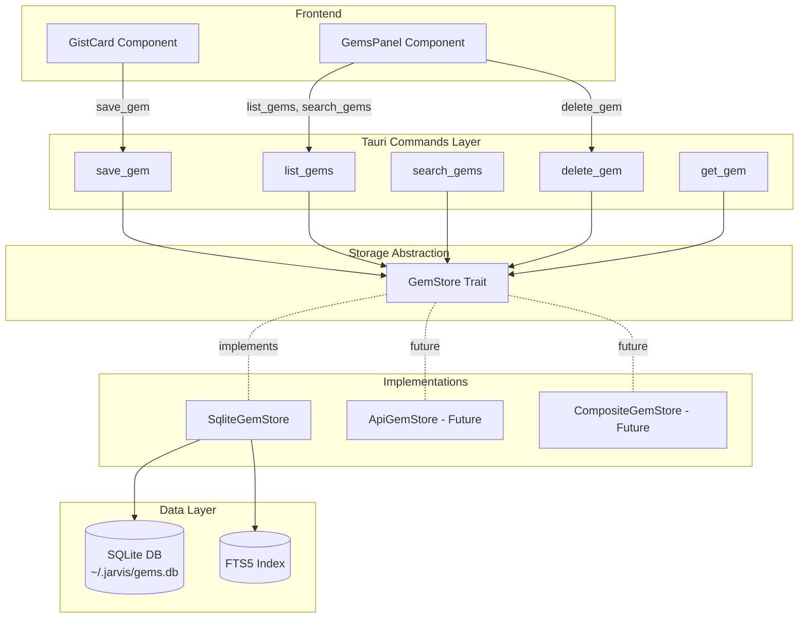

# Design Document: JARVIS Gems

## Overview

The JARVIS Gems module transforms ephemeral browser extractions into a persistent, searchable knowledge base. When users extract gists from YouTube videos, Medium articles, Gmail threads, ChatGPT conversations, or any web page, those insights currently disappear unless manually exported to flat markdown files. Gems solves this by introducing a structured persistence layer with full-text search capabilities.

The architecture follows a trait-based abstraction pattern: a `GemStore` trait defines the storage interface (save, get, list, search, delete), allowing implementations to be swapped without changing command or frontend code. The default implementation uses SQLite with FTS5 full-text search stored at `~/.jarvis/gems.db`, but the design supports future backends like remote APIs, cloud databases, or composite stores that sync across multiple sources.

The module integrates seamlessly into the existing browser tool workflow: users extract a gist as usual, then click "Save Gem" to persist it. A new GemsPanel component provides browsing, searching, and management of the accumulated knowledge collection.

## Architecture

### Component Diagram



### Layer Responsibilities

**Frontend Layer**
- GistCard: Displays extracted gist with "Save Gem" button
- GemsPanel: Browsable/searchable list of saved gems with delete capability

**Command Layer**
- Tauri commands depend on `GemStore` trait (via `Arc<dyn GemStore>` or generic)
- Commands map between frontend types (PageGist) and storage types (Gem)
- Commands handle UUID generation, timestamp recording, and error translation

**Storage Abstraction Layer**
- `GemStore` trait: Defines async interface for all storage operations
- `Gem` struct: Backend-agnostic data model (no SQLite-specific types)
- Trait allows swapping implementations at app startup without code changes

**Implementation Layer**
- `SqliteGemStore`: Default implementation using local SQLite + FTS5
- Future implementations: `ApiGemStore`, `CompositeGemStore` (SQLite + API sync)

**Data Layer**
- SQLite database at `~/.jarvis/gems.db`
- FTS5 virtual table for full-text search on title, description, content

### Data Flow

**Save Flow:**
1. User clicks "Save Gem" in GistCard
2. Frontend calls `save_gem(PageGist)` command
3. Command generates UUID, captures timestamp
4. Command maps PageGist → Gem struct
5. Command calls `gem_store.save(gem)`
6. SqliteGemStore performs upsert (by source_url)
7. SqliteGemStore updates FTS5 index
8. Saved Gem (with id, timestamp) returned to frontend
9. Button changes to "Saved" (disabled)

**Search Flow:**
1. User types in GemsPanel search input (debounced 300ms)
2. Frontend calls `search_gems(query)` command
3. Command calls `gem_store.search(query)`
4. SqliteGemStore queries FTS5 index with MATCH operator
5. Results ranked by relevance, content truncated to 200 chars
6. Results returned to frontend
7. GemsPanel updates list display

## Components and Interfaces

### Core Data Types

```rust
/// Backend-agnostic gem representation
#[derive(Debug, Clone, Serialize, Deserialize)]
pub struct Gem {
    /// Unique identifier (UUID v4)
    pub id: String,
    
    /// Source classification (YouTube, Article, Email, Chat, etc.)
    pub source_type: String,
    
    /// Original URL (unique constraint)
    pub source_url: String,
    
    /// Domain extracted from URL (e.g., "youtube.com", "medium.com")
    pub domain: String,
    
    /// Page/video/article title
    pub title: String,
    
    /// Author/channel name (optional)
    pub author: Option<String>,
    
    /// Short description or summary (optional)
    pub description: Option<String>,
    
    /// Full extracted content (optional)
    pub content: Option<String>,
    
    /// Source-specific metadata (JSON, e.g., video duration, email thread ID)
    pub source_meta: serde_json::Value,
    
    /// ISO 8601 timestamp when gem was captured
    pub captured_at: String,
}

/// Lightweight gem for list/search results
#[derive(Debug, Clone, Serialize, Deserialize)]
pub struct GemPreview {
    pub id: String,
    pub source_type: String,
    pub source_url: String,
    pub domain: String,
    pub title: String,
    pub author: Option<String>,
    pub description: Option<String>,
    
    /// Content truncated to 200 characters
    pub content_preview: Option<String>,
    
    pub captured_at: String,
}
```

### GemStore Trait

```rust
use async_trait::async_trait;

/// Storage interface for gems - implementations are swappable
#[async_trait]
pub trait GemStore: Send + Sync {
    /// Save or update a gem (upsert by source_url)
    async fn save(&self, gem: Gem) -> Result<Gem, String>;
    
    /// Get a gem by ID
    async fn get(&self, id: &str) -> Result<Option<Gem>, String>;
    
    /// List gems with pagination (ordered by captured_at DESC)
    async fn list(&self, limit: usize, offset: usize) -> Result<Vec<GemPreview>, String>;
    
    /// Search gems by keyword (FTS on title, description, content)
    async fn search(&self, query: &str, limit: usize) -> Result<Vec<GemPreview>, String>;
    
    /// Delete a gem by ID
    async fn delete(&self, id: &str) -> Result<(), String>;
}
```

### SqliteGemStore Implementation

```rust
use rusqlite::{Connection, params, OptionalExtension};
use std::sync::{Arc, Mutex};

pub struct SqliteGemStore {
    conn: Arc<Mutex<Connection>>,
}

impl SqliteGemStore {
    /// Initialize store at ~/.jarvis/gems.db
    pub fn new() -> Result<Self, String> {
        let home = dirs::home_dir()
            .ok_or("Could not find home directory")?;
        let db_path = home.join(".jarvis").join("gems.db");
        
        // Ensure parent directory exists
        if let Some(parent) = db_path.parent() {
            std::fs::create_dir_all(parent)
                .map_err(|e| format!("Failed to create .jarvis directory: {}", e))?;
        }
        
        let conn = Connection::open(&db_path)
            .map_err(|e| format!("Failed to open database: {}", e))?;
        
        let store = Self {
            conn: Arc::new(Mutex::new(conn)),
        };
        
        store.initialize_schema()?;
        Ok(store)
    }
    
    /// Initialize in-memory store for testing
    #[cfg(test)]
    pub fn new_in_memory() -> Result<Self, String> {
        let conn = Connection::open_in_memory()
            .map_err(|e| format!("Failed to open in-memory database: {}", e))?;
        
        let store = Self {
            conn: Arc::new(Mutex::new(conn)),
        };
        
        store.initialize_schema()?;
        Ok(store)
    }
    
    fn initialize_schema(&self) -> Result<(), String> {
        let conn = self.conn.lock()
            .map_err(|e| format!("Failed to acquire lock: {}", e))?;
        
        // Main gems table
        conn.execute(
            "CREATE TABLE IF NOT EXISTS gems (
                id TEXT PRIMARY KEY,
                source_type TEXT NOT NULL,
                source_url TEXT NOT NULL UNIQUE,
                domain TEXT NOT NULL,
                title TEXT NOT NULL,
                author TEXT,
                description TEXT,
                content TEXT,
                source_meta TEXT NOT NULL,
                captured_at TEXT NOT NULL
            )",
            [],
        ).map_err(|e| format!("Failed to create gems table: {}", e))?;
        
        // FTS5 virtual table for full-text search
        conn.execute(
            "CREATE VIRTUAL TABLE IF NOT EXISTS gems_fts USING fts5(
                title,
                description,
                content,
                content=gems,
                content_rowid=rowid
            )",
            [],
        ).map_err(|e| format!("Failed to create FTS5 table: {}", e))?;
        
        // Triggers to keep FTS5 in sync
        conn.execute(
            "CREATE TRIGGER IF NOT EXISTS gems_ai AFTER INSERT ON gems BEGIN
                INSERT INTO gems_fts(rowid, title, description, content)
                VALUES (new.rowid, new.title, new.description, new.content);
            END",
            [],
        ).map_err(|e| format!("Failed to create insert trigger: {}", e))?;
        
        conn.execute(
            "CREATE TRIGGER IF NOT EXISTS gems_ad AFTER DELETE ON gems BEGIN
                INSERT INTO gems_fts(gems_fts, rowid, title, description, content)
                VALUES('delete', old.rowid, old.title, old.description, old.content);
            END",
            [],
        ).map_err(|e| format!("Failed to create delete trigger: {}", e))?;
        
        conn.execute(
            "CREATE TRIGGER IF NOT EXISTS gems_au AFTER UPDATE ON gems BEGIN
                INSERT INTO gems_fts(gems_fts, rowid, title, description, content)
                VALUES('delete', old.rowid, old.title, old.description, old.content);
                INSERT INTO gems_fts(rowid, title, description, content)
                VALUES (new.rowid, new.title, new.description, new.content);
            END",
            [],
        ).map_err(|e| format!("Failed to create update trigger: {}", e))?;
        
        Ok(())
    }
    
    fn gem_to_preview(gem: &Gem) -> GemPreview {
        GemPreview {
            id: gem.id.clone(),
            source_type: gem.source_type.clone(),
            source_url: gem.source_url.clone(),
            domain: gem.domain.clone(),
            title: gem.title.clone(),
            author: gem.author.clone(),
            description: gem.description.clone(),
            content_preview: gem.content.as_ref().map(|c| {
                // Safe UTF-8 truncation by character count, not byte offset
                if c.chars().count() > 200 {
                    format!("{}...", c.chars().take(200).collect::<String>())
                } else {
                    c.clone()
                }
            }),
            captured_at: gem.captured_at.clone(),
        }
    }
    
    fn row_to_gem(row: &rusqlite::Row) -> rusqlite::Result<Gem> {
        Ok(Gem {
            id: row.get(0)?,
            source_type: row.get(1)?,
            source_url: row.get(2)?,
            domain: row.get(3)?,
            title: row.get(4)?,
            author: row.get(5)?,
            description: row.get(6)?,
            content: row.get(7)?,
            source_meta: serde_json::from_str(&row.get::<_, String>(8)?)
                .unwrap_or(serde_json::Value::Null),
            captured_at: row.get(9)?,
        })
    }
}

#[async_trait]
impl GemStore for SqliteGemStore {
    async fn save(&self, gem: Gem) -> Result<Gem, String> {
        let conn = self.conn.lock()
            .map_err(|e| format!("Failed to acquire lock: {}", e))?;
        
        conn.execute(
            "INSERT INTO gems (id, source_type, source_url, domain, title, author, 
                description, content, source_meta, captured_at)
            VALUES (?1, ?2, ?3, ?4, ?5, ?6, ?7, ?8, ?9, ?10)
            ON CONFLICT(source_url) DO UPDATE SET
                title = excluded.title,
                author = excluded.author,
                description = excluded.description,
                content = excluded.content,
                source_meta = excluded.source_meta,
                captured_at = excluded.captured_at",
            params![
                gem.id,
                gem.source_type,
                gem.source_url,
                gem.domain,
                gem.title,
                gem.author,
                gem.description,
                gem.content,
                gem.source_meta.to_string(),
                gem.captured_at,
            ],
        ).map_err(|e| format!("Failed to save gem: {}", e))?;
        
        // Query back the actual row to get the correct ID (in case of conflict, the original ID is kept)
        let mut stmt = conn.prepare(
            "SELECT id, source_type, source_url, domain, title, author, 
                description, content, source_meta, captured_at
            FROM gems WHERE source_url = ?1"
        ).map_err(|e| format!("Failed to prepare query: {}", e))?;
        
        let saved_gem = stmt.query_row(params![gem.source_url], Self::row_to_gem)
            .map_err(|e| format!("Failed to query saved gem: {}", e))?;
        
        Ok(saved_gem)
    }
    
    async fn get(&self, id: &str) -> Result<Option<Gem>, String> {
        let conn = self.conn.lock()
            .map_err(|e| format!("Failed to acquire lock: {}", e))?;
        
        let mut stmt = conn.prepare(
            "SELECT id, source_type, source_url, domain, title, author, 
                description, content, source_meta, captured_at
            FROM gems WHERE id = ?1"
        ).map_err(|e| format!("Failed to prepare statement: {}", e))?;
        
        let gem = stmt.query_row(params![id], Self::row_to_gem)
            .optional()
            .map_err(|e| format!("Failed to query gem: {}", e))?;
        
        Ok(gem)
    }
    
    async fn list(&self, limit: usize, offset: usize) -> Result<Vec<GemPreview>, String> {
        let conn = self.conn.lock()
            .map_err(|e| format!("Failed to acquire lock: {}", e))?;
        
        // NOTE: This fetches full content and truncates in Rust. For large gems (50K+ chars),
        // this is wasteful. Could optimize with SUBSTR(content, 1, 600) in SQL (600 bytes ~= 200 UTF-8 chars),
        // but SUBSTR works on bytes, not characters, risking mid-character splits.
        // Current approach prioritizes correctness over performance.
        let mut stmt = conn.prepare(
            "SELECT id, source_type, source_url, domain, title, author, 
                description, content, source_meta, captured_at
            FROM gems
            ORDER BY captured_at DESC
            LIMIT ?1 OFFSET ?2"
        ).map_err(|e| format!("Failed to prepare statement: {}", e))?;
        
        let gems = stmt.query_map(params![limit, offset], Self::row_to_gem)
            .map_err(|e| format!("Failed to query gems: {}", e))?
            .collect::<Result<Vec<_>, _>>()
            .map_err(|e| format!("Failed to collect gems: {}", e))?;
        
        Ok(gems.iter().map(Self::gem_to_preview).collect())
    }
    
    async fn search(&self, query: &str, limit: usize) -> Result<Vec<GemPreview>, String> {
        if query.trim().is_empty() {
            return self.list(limit, 0).await;
        }
        
        let conn = self.conn.lock()
            .map_err(|e| format!("Failed to acquire lock: {}", e))?;
        
        // NOTE: Same performance consideration as list() - fetches full content for truncation.
        let mut stmt = conn.prepare(
            "SELECT g.id, g.source_type, g.source_url, g.domain, g.title, g.author,
                g.description, g.content, g.source_meta, g.captured_at
            FROM gems g
            INNER JOIN gems_fts fts ON g.rowid = fts.rowid
            WHERE gems_fts MATCH ?1
            ORDER BY rank
            LIMIT ?2"
        ).map_err(|e| format!("Failed to prepare statement: {}", e))?;
        
        let gems = stmt.query_map(params![query, limit], Self::row_to_gem)
            .map_err(|e| format!("Failed to search gems: {}", e))?
            .collect::<Result<Vec<_>, _>>()
            .map_err(|e| format!("Failed to collect gems: {}", e))?;
        
        Ok(gems.iter().map(Self::gem_to_preview).collect())
    }
    
    async fn delete(&self, id: &str) -> Result<(), String> {
        let conn = self.conn.lock()
            .map_err(|e| format!("Failed to acquire lock: {}", e))?;
        
        let rows_affected = conn.execute(
            "DELETE FROM gems WHERE id = ?1",
            params![id],
        ).map_err(|e| format!("Failed to delete gem: {}", e))?;
        
        if rows_affected == 0 {
            return Err(format!("Gem with id '{}' not found", id));
        }
        
        Ok(())
    }
}
```

### Tauri Commands

```rust
use uuid::Uuid;
use chrono::Utc;

/// Save a PageGist as a Gem
#[tauri::command]
pub async fn save_gem(
    gist: crate::browser::extractors::PageGist,
    gem_store: State<'_, Arc<dyn GemStore>>,
) -> Result<Gem, String> {
    let gem = Gem {
        id: Uuid::new_v4().to_string(),
        source_type: format!("{:?}", gist.source_type),
        source_url: gist.url,
        domain: gist.domain,
        title: gist.title,
        author: gist.author,
        description: gist.description,
        content: gist.content_excerpt,
        source_meta: gist.extra,
        captured_at: Utc::now().to_rfc3339(),
    };
    
    gem_store.save(gem).await
}

/// List gems with pagination
#[tauri::command]
pub async fn list_gems(
    limit: Option<usize>,
    offset: Option<usize>,
    gem_store: State<'_, Arc<dyn GemStore>>,
) -> Result<Vec<GemPreview>, String> {
    gem_store.list(limit.unwrap_or(50), offset.unwrap_or(0)).await
}

/// Search gems by keyword
#[tauri::command]
pub async fn search_gems(
    query: String,
    limit: Option<usize>,
    gem_store: State<'_, Arc<dyn GemStore>>,
) -> Result<Vec<GemPreview>, String> {
    gem_store.search(&query, limit.unwrap_or(50)).await
}

/// Delete a gem by ID
#[tauri::command]
pub async fn delete_gem(
    id: String,
    gem_store: State<'_, Arc<dyn GemStore>>,
) -> Result<(), String> {
    gem_store.delete(&id).await
}

/// Get a gem by ID
#[tauri::command]
pub async fn get_gem(
    id: String,
    gem_store: State<'_, Arc<dyn GemStore>>,
) -> Result<Option<Gem>, String> {
    gem_store.get(&id).await
}
```

### Tauri Application Integration

**Dependencies (Cargo.toml):**
```toml
[dependencies]
# Existing dependencies...
tauri = { version = "2.1", features = ["..." ] }
serde = { version = "1", features = ["derive"] }
serde_json = "1"

# Gems module dependencies
async-trait = "0.1"           # For async trait methods
uuid = { version = "1", features = ["v4"] }  # UUID generation
rusqlite = { version = "0.32", features = ["bundled"] }  # SQLite with bundled library for cross-platform
dirs = "5"                    # Home directory detection
chrono = "0.4"                # ISO 8601 timestamps
```

**Note on rusqlite bundled feature:** The `bundled` feature compiles SQLite from source and statically links it, ensuring consistent behavior across platforms (macOS, Windows, Linux) without requiring system SQLite installation.

**lib.rs setup() function:**
```rust
use std::sync::Arc;
use crate::gems::{GemStore, SqliteGemStore};

#[cfg_attr(mobile, tauri::mobile_entry_point)]
pub fn run() {
    tauri::Builder::default()
        .setup(|app| {
            // Initialize GemStore (SqliteGemStore as default implementation)
            let gem_store = SqliteGemStore::new()
                .map_err(|e| format!("Failed to initialize gem store: {}", e))?;
            
            // Manage as trait object for swappable implementations
            app.manage(Arc::new(gem_store) as Arc<dyn GemStore>);
            
            // ... other setup code (recording manager, browser observer, etc.)
            
            Ok(())
        })
        .invoke_handler(tauri::generate_handler![
            // Existing commands
            start_recording,
            stop_recording,
            list_browser_tabs,
            prepare_tab_gist,
            export_gist,
            // ... other existing commands
            
            // Gems commands
            save_gem,
            list_gems,
            search_gems,
            delete_gem,
            get_gem,
        ])
        .run(tauri::generate_context!())
        .expect("error while running tauri application");
}
```

**Module structure (src/lib.rs):**
```rust
mod gems;  // New module

use gems::{GemStore, SqliteGemStore, Gem, GemPreview};
```

**New module file (src/gems/mod.rs):**
```rust
mod store;
mod sqlite_store;

pub use store::{GemStore, Gem, GemPreview};
pub use sqlite_store::SqliteGemStore;
```

**File organization:**
```
src/
├── lib.rs                    # App setup, manages GemStore
├── commands.rs               # Tauri commands (save_gem, list_gems, etc.)
├── gems/
│   ├── mod.rs               # Module exports
│   ├── store.rs             # GemStore trait + Gem/GemPreview structs
│   └── sqlite_store.rs      # SqliteGemStore implementation
├── browser/
│   └── ...
└── ...
```

### Frontend Components

**TypeScript Type Definitions (src/state/types.ts):**
```typescript
// Gem types matching Rust backend
export interface Gem {
  id: string;
  source_type: string;
  source_url: string;
  domain: string;
  title: string;
  author: string | null;
  description: string | null;
  content: string | null;
  source_meta: Record<string, any>;
  captured_at: string;
}

export interface GemPreview {
  id: string;
  source_type: string;
  source_url: string;
  domain: string;
  title: string;
  author: string | null;
  description: string | null;
  content_preview: string | null;
  captured_at: string;
}
```

**GistCard Enhancement:**
```typescript
interface GistCardProps {
  gist: PageGist;
  onSave?: (gem: Gem) => void;
}

function GistCard({ gist, onSave }: GistCardProps) {
  const [saved, setSaved] = useState(false);
  const [saving, setSaving] = useState(false);
  const [error, setError] = useState<string | null>(null);
  
  const handleSave = async () => {
    setSaving(true);
    setError(null);
    
    try {
      const gem = await invoke<Gem>('save_gem', { gist });
      setSaved(true);
      onSave?.(gem);
    } catch (err) {
      setError(String(err));
    } finally {
      setSaving(false);
    }
  };
  
  return (
    <div className="gist-card">
      {/* Existing gist display */}
      
      <div className="actions">
        <button onClick={handleCopy}>Copy</button>
        <button 
          onClick={handleSave} 
          disabled={saved || saving}
        >
          {saved ? 'Saved' : saving ? 'Saving...' : 'Save Gem'}
        </button>
      </div>
      
      {error && <div className="error">{error}</div>}
    </div>
  );
}
```

**GemsPanel Component:**
```typescript
interface GemsPanelProps {
  onClose: () => void;
}

function GemsPanel({ onClose }: GemsPanelProps) {
  const [gems, setGems] = useState<GemPreview[]>([]);
  const [loading, setLoading] = useState(true);
  const [searchQuery, setSearchQuery] = useState('');
  const [error, setError] = useState<string | null>(null);
  
  // Debounced search
  useEffect(() => {
    const timer = setTimeout(async () => {
      setLoading(true);
      try {
        const results = searchQuery.trim()
          ? await invoke<GemPreview[]>('search_gems', { query: searchQuery })
          : await invoke<GemPreview[]>('list_gems', {});
        setGems(results);
      } catch (err) {
        setError(String(err));
      } finally {
        setLoading(false);
      }
    }, 300);
    
    return () => clearTimeout(timer);
  }, [searchQuery]);
  
  const handleDelete = async (id: string) => {
    if (!confirm('Delete this gem?')) return;
    
    try {
      await invoke('delete_gem', { id });
      setGems(gems.filter(g => g.id !== id));
    } catch (err) {
      setError(String(err));
    }
  };
  
  return (
    <div className="gems-panel">
      <div className="header">
        <h2>Gems</h2>
        <button onClick={onClose}>×</button>
      </div>
      
      <input
        type="search"
        placeholder="Search gems..."
        value={searchQuery}
        onChange={(e) => setSearchQuery(e.target.value)}
      />
      
      {loading && <div>Loading...</div>}
      {error && <div className="error">{error}</div>}
      
      {!loading && gems.length === 0 && (
        <div className="empty-state">
          No gems yet. Extract a gist from the Browser tool and save it.
        </div>
      )}
      
      <div className="gems-list">
        {gems.map(gem => (
          <GemCard key={gem.id} gem={gem} onDelete={handleDelete} />
        ))}
      </div>
    </div>
  );
}

function GemCard({ gem, onDelete }: { gem: GemPreview; onDelete: (id: string) => void }) {
  return (
    <div className="gem-card">
      <div className="badge">{gem.source_type}</div>
      <h3>{gem.title}</h3>
      <div className="meta">
        <span className="domain">{gem.domain}</span>
        {gem.author && <span className="author">by {gem.author}</span>}
        <span className="date">{new Date(gem.captured_at).toLocaleDateString()}</span>
      </div>
      {gem.description && <p className="description">{gem.description}</p>}
      {gem.content_preview && <p className="preview">{gem.content_preview}</p>}
      <div className="actions">
        <a href={gem.source_url} target="_blank">Open</a>
        <button onClick={() => onDelete(gem.id)}>Delete</button>
      </div>
    </div>
  );
}
```

## Data Models

### Database Schema

**gems table:**
```sql
CREATE TABLE gems (
    id TEXT PRIMARY KEY,              -- UUID v4
    source_type TEXT NOT NULL,        -- "YouTube", "Article", "Email", etc.
    source_url TEXT NOT NULL UNIQUE,  -- Original URL (unique constraint)
    domain TEXT NOT NULL,             -- "youtube.com", "medium.com", etc.
    title TEXT NOT NULL,              -- Page/video/article title
    author TEXT,                      -- Author/channel name (nullable)
    description TEXT,                 -- Short description (nullable)
    content TEXT,                     -- Full extracted content (nullable)
    source_meta TEXT NOT NULL,        -- JSON string with source-specific metadata
    captured_at TEXT NOT NULL         -- ISO 8601 timestamp
);
```

**gems_fts virtual table (FTS5):**
```sql
CREATE VIRTUAL TABLE gems_fts USING fts5(
    title,             -- Searchable
    description,       -- Searchable
    content,           -- Searchable
    content=gems,      -- External content table
    content_rowid=rowid
);
```

**Triggers for FTS5 sync:**
```sql
-- Insert trigger
CREATE TRIGGER gems_ai AFTER INSERT ON gems BEGIN
    INSERT INTO gems_fts(rowid, title, description, content)
    VALUES (new.rowid, new.title, new.description, new.content);
END;

-- Delete trigger (external content FTS5 requires 'delete' command with old values)
CREATE TRIGGER gems_ad AFTER DELETE ON gems BEGIN
    INSERT INTO gems_fts(gems_fts, rowid, title, description, content)
    VALUES('delete', old.rowid, old.title, old.description, old.content);
END;

-- Update trigger (delete old, insert new)
CREATE TRIGGER gems_au AFTER UPDATE ON gems BEGIN
    INSERT INTO gems_fts(gems_fts, rowid, title, description, content)
    VALUES('delete', old.rowid, old.title, old.description, old.content);
    INSERT INTO gems_fts(rowid, title, description, content)
    VALUES (new.rowid, new.title, new.description, new.content);
END;
```

### Mapping: PageGist → Gem

```rust
// PageGist (existing, from browser extractors)
pub struct PageGist {
    pub url: String,
    pub title: String,
    pub source_type: SourceType,  // enum
    pub domain: String,
    pub author: Option<String>,
    pub description: Option<String>,
    pub content_excerpt: Option<String>,
    pub published_date: Option<String>,
    pub image_url: Option<String>,
    pub extra: serde_json::Value,
}

// Mapping in save_gem command:
Gem {
    id: Uuid::new_v4().to_string(),           // Generated
    source_type: format!("{:?}", gist.source_type),  // Enum → String
    source_url: gist.url,                     // Direct
    domain: gist.domain,                      // Direct
    title: gist.title,                        // Direct
    author: gist.author,                      // Direct
    description: gist.description,            // Direct
    content: gist.content_excerpt,            // Renamed field
    source_meta: gist.extra,                  // Direct (already JSON)
    captured_at: Utc::now().to_rfc3339(),    // Generated
}
```

### FTS5 Query Examples

**Basic keyword search:**
```sql
SELECT g.* FROM gems g
INNER JOIN gems_fts fts ON g.rowid = fts.rowid
WHERE gems_fts MATCH 'rust async'
ORDER BY rank;
```

**Phrase search:**
```sql
WHERE gems_fts MATCH '"property based testing"'
```

**Boolean operators:**
```sql
WHERE gems_fts MATCH 'rust AND (async OR tokio)'
```

**Column-specific search:**
```sql
WHERE gems_fts MATCH 'title: "AWS Lambda"'
```


## Correctness Properties

A property is a characteristic or behavior that should hold true across all valid executions of a system—essentially, a formal statement about what the system should do. Properties serve as the bridge between human-readable specifications and machine-verifiable correctness guarantees.

### Property 1: Save-Retrieve Round Trip

For any valid PageGist, saving it as a Gem and then retrieving it by ID should return a Gem with equivalent data (same title, author, description, content, source_url, domain, source_type, and source_meta).

**Validates: Requirements 3.1, 3.6, 4.4**

### Property 2: UUID Generation Validity

For any PageGist saved as a Gem, the generated `id` field should be a valid UUID v4 format and should be unique across all saved gems.

**Validates: Requirements 3.2**

### Property 3: ISO 8601 Timestamp Validity

For any PageGist saved as a Gem, the generated `captured_at` field should be a valid ISO 8601 timestamp and should be within a reasonable time window (e.g., ±5 seconds) of the current time.

**Validates: Requirements 3.3**

### Property 4: PageGist to Gem Field Mapping

For any PageGist, the resulting Gem should correctly map fields: `title` → `title`, `author` → `author`, `description` → `description`, `content_excerpt` → `content`, `extra` → `source_meta`, `url` → `source_url`, `domain` → `domain`, and `source_type` enum → `source_type` string.

**Validates: Requirements 3.4**

### Property 5: Upsert Behavior

For any PageGist with a given `source_url`, saving it twice should result in exactly one Gem in the database with that URL, and the second save should update the existing record rather than creating a duplicate.

**Validates: Requirements 3.5**

### Property 6: List Ordering

For any set of saved Gems, calling `list_gems` should return them ordered by `captured_at` in descending order (most recent first), such that for any two adjacent gems in the result, the first has a `captured_at` >= the second.

**Validates: Requirements 4.1**

### Property 7: Pagination Limit

For any set of N saved Gems where N > limit, calling `list_gems` with a given `limit` parameter should return exactly `limit` gems, and those should be the most recent `limit` gems by `captured_at`.

**Validates: Requirements 4.2**

### Property 8: Pagination Offset

For any set of saved Gems, calling `list_gems` with `offset=K` should return the same gems as calling `list_gems` with `offset=0` and then skipping the first K results.

**Validates: Requirements 4.3**

### Property 9: Content Truncation

For any Gem with `content` longer than 200 characters, the `content_preview` field in list/search results should contain exactly the first 200 characters followed by "...", and for content ≤ 200 characters, `content_preview` should equal `content`.

**Validates: Requirements 4.5**

### Property 10: Search Field Coverage

For any Gem with a unique keyword K appearing in its `title`, `description`, or `content` field, searching for K should return that Gem in the results.

**Validates: Requirements 5.2, 5.6**

### Property 11: Delete Removes Gem

For any saved Gem with ID, calling `delete_gem(id)` followed by `get_gem(id)` should return None, indicating the gem no longer exists.

**Validates: Requirements 6.2, 6.4**

### Property 12: Delete Non-Existent Errors

For any non-existent gem ID (e.g., a random UUID that was never saved), calling `delete_gem(id)` should return an error indicating the gem was not found.

**Validates: Requirements 6.3**

## Error Handling

### Database Initialization Errors

**Scenario:** Database file cannot be created (permission denied, disk full)
**Handling:** SqliteGemStore::new() returns Err with descriptive message including the path and OS error. Application startup should fail gracefully with user-facing error.

**Scenario:** Database file is corrupted
**Handling:** SqliteGemStore::new() attempts to open the database. If SQLite returns a corruption error, return Err with message: "Database file at ~/.jarvis/gems.db is corrupted. Please delete it and restart the application." (Validates Requirement 2.6)

### Save Errors

**Scenario:** Invalid PageGist data (e.g., empty title, malformed URL)
**Handling:** save_gem command validates input and returns Err with specific field error: "Invalid gem: title cannot be empty"

**Scenario:** Database write fails (disk full, connection lost)
**Handling:** SqliteGemStore::save() returns Err with SQLite error details. Command propagates error to frontend for display.

**Scenario:** JSON serialization fails for source_meta
**Handling:** Should not occur since PageGist.extra is already serde_json::Value, but if it does, return Err: "Failed to serialize source metadata"

### List/Search Errors

**Scenario:** Database query fails (corrupted index, connection lost)
**Handling:** Return Err with SQLite error details. Frontend displays error message and allows retry.

**Scenario:** Invalid FTS5 query syntax (e.g., unmatched quotes)
**Handling:** SqliteGemStore::search() catches SQLite error and returns Err: "Invalid search query: [error details]"

**Scenario:** Empty query string
**Handling:** Not an error - search_gems treats empty query as list_gems (Requirement 5.5)

### Delete Errors

**Scenario:** Gem ID does not exist
**Handling:** SqliteGemStore::delete() checks rows_affected and returns Err: "Gem with id '{id}' not found" (Validates Requirement 6.3)

**Scenario:** Database delete fails (connection lost)
**Handling:** Return Err with SQLite error details. Frontend displays error and allows retry.

### Concurrency Considerations

**Scenario:** Multiple saves to same source_url simultaneously
**Handling:** SQLite's UNIQUE constraint on source_url + upsert logic ensures only one record exists. Last write wins. Mutex on Connection prevents race conditions.

**Scenario:** Delete while search is in progress
**Handling:** SQLite transaction isolation ensures search sees consistent snapshot. Deleted gem won't appear in results if delete commits before search starts.

## Testing Strategy

### Dual Testing Approach

The Gems module requires both unit tests and property-based tests for comprehensive coverage:

**Unit Tests** focus on:
- Specific examples of PageGist → Gem mapping with known values
- Edge cases: empty optional fields, very long content, special characters in titles
- Error conditions: corrupted database, invalid IDs, permission errors
- Integration points: Tauri command invocation, frontend state updates
- Schema initialization: verify tables and triggers are created correctly

**Property-Based Tests** focus on:
- Universal properties that hold for all inputs (see Correctness Properties section)
- Comprehensive input coverage through randomization
- Round-trip properties (save→retrieve, serialize→deserialize)
- Invariants (ordering, uniqueness, truncation rules)

### Property-Based Testing Configuration

**Library:** Use `proptest` for Rust property-based testing

**Test Configuration:**
- Minimum 100 iterations per property test (due to randomization)
- Each property test must reference its design document property via comment
- Tag format: `// Feature: jarvis-gems, Property {number}: {property_text}`

**Example Property Test:**
```rust
use proptest::prelude::*;

// Feature: jarvis-gems, Property 1: Save-Retrieve Round Trip
#[tokio::test]
async fn prop_save_retrieve_round_trip() {
    proptest!(ProptestConfig::with_cases(100), |(
        title in "[a-zA-Z0-9 ]{1,100}",
        url in "https://[a-z]+\\.com/[a-z]+",
        domain in "[a-z]+\\.com",
    )| {
        let store = SqliteGemStore::new_in_memory().unwrap();
        
        let gist = PageGist {
            url: url.clone(),
            title: title.clone(),
            source_type: SourceType::Article,
            domain: domain.clone(),
            author: None,
            description: None,
            content_excerpt: None,
            published_date: None,
            image_url: None,
            extra: serde_json::json!({}),
        };
        
        let saved = store.save(gist_to_gem(gist)).await.unwrap();
        let retrieved = store.get(&saved.id).await.unwrap().unwrap();
        
        prop_assert_eq!(saved.title, retrieved.title);
        prop_assert_eq!(saved.source_url, retrieved.source_url);
        prop_assert_eq!(saved.domain, retrieved.domain);
    });
}
```

### Unit Test Examples

**Schema Initialization:**
```rust
#[tokio::test]
async fn test_schema_initialization() {
    let store = SqliteGemStore::new_in_memory().unwrap();
    
    // Verify gems table exists
    let conn = store.conn.lock().unwrap();
    let table_exists: bool = conn
        .query_row(
            "SELECT 1 FROM sqlite_master WHERE type='table' AND name='gems'",
            [],
            |_| Ok(true),
        )
        .unwrap_or(false);
    assert!(table_exists);
    
    // Verify FTS5 table exists
    let fts_exists: bool = conn
        .query_row(
            "SELECT 1 FROM sqlite_master WHERE type='table' AND name='gems_fts'",
            [],
            |_| Ok(true),
        )
        .unwrap_or(false);
    assert!(fts_exists);
}
```

**Upsert Behavior:**
```rust
#[tokio::test]
async fn test_upsert_same_url() {
    let store = SqliteGemStore::new_in_memory().unwrap();
    
    let gem1 = Gem {
        id: Uuid::new_v4().to_string(),
        source_url: "https://example.com/article".to_string(),
        title: "Original Title".to_string(),
        // ... other fields
    };
    
    let gem2 = Gem {
        id: Uuid::new_v4().to_string(),
        source_url: "https://example.com/article".to_string(),
        title: "Updated Title".to_string(),
        // ... other fields
    };
    
    store.save(gem1).await.unwrap();
    store.save(gem2).await.unwrap();
    
    let all_gems = store.list(100, 0).await.unwrap();
    assert_eq!(all_gems.len(), 1);
    assert_eq!(all_gems[0].title, "Updated Title");
}
```

**Content Truncation:**
```rust
#[test]
fn test_content_truncation() {
    let long_content = "a".repeat(300);
    let gem = Gem {
        content: Some(long_content.clone()),
        // ... other fields
    };
    
    let preview = SqliteGemStore::gem_to_preview(&gem);
    
    assert_eq!(preview.content_preview.unwrap().chars().count(), 203); // 200 + "..."
    assert!(preview.content_preview.unwrap().ends_with("..."));
}

#[test]
fn test_content_truncation_multibyte() {
    // Test with multi-byte UTF-8 characters (emoji, Chinese)
    let long_content = "你好世界🌍".repeat(50); // 250 characters
    let gem = Gem {
        content: Some(long_content.clone()),
        // ... other fields
    };
    
    let preview = SqliteGemStore::gem_to_preview(&gem);
    
    assert_eq!(preview.content_preview.unwrap().chars().count(), 203); // 200 + "..."
    assert!(preview.content_preview.unwrap().ends_with("..."));
}
```

**Error Handling:**
```rust
#[tokio::test]
async fn test_delete_nonexistent_gem() {
    let store = SqliteGemStore::new_in_memory().unwrap();
    
    let result = store.delete("nonexistent-uuid").await;
    
    assert!(result.is_err());
    assert!(result.unwrap_err().contains("not found"));
}
```

### Integration Testing

**Frontend-Backend Integration:**
- Test GistCard "Save Gem" button triggers save_gem command
- Test GemsPanel loads gems on mount
- Test search input debouncing (300ms delay)
- Test delete confirmation dialog

**Database Migration Testing:**
- Test that existing databases without FTS5 tables are migrated correctly
- Test that schema changes are applied idempotently

### Manual Testing Checklist

- [ ] Save a YouTube gist, verify it appears in GemsPanel
- [ ] Save a Medium article, verify metadata is correct
- [ ] Save the same URL twice, verify only one gem exists
- [ ] Search for a keyword in title, verify gem is found
- [ ] Search for a keyword in content, verify gem is found
- [ ] Delete a gem, verify it disappears from list
- [ ] Test with empty database (empty state message)
- [ ] Test with 100+ gems (pagination works)
- [ ] Test search with special characters (quotes, ampersands)
- [ ] Test with very long content (>10KB)
- [ ] Restart app, verify gems persist across sessions
- [ ] Test on fresh install (database initializes correctly)

