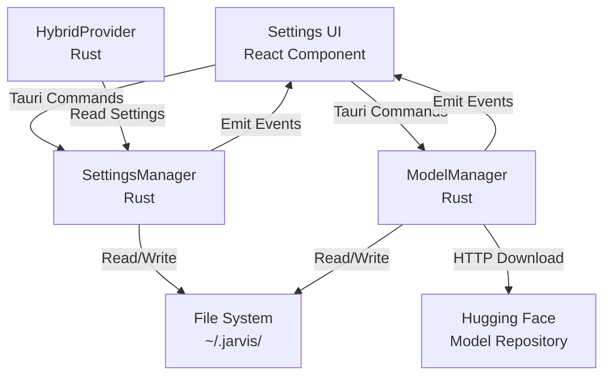

# Design Document: JARVIS Settings Module

## Overview

The JARVIS Settings Module provides persistent configuration management for the transcription pipeline. It consists of three main components:

1. **SettingsManager** (Rust): Manages settings persistence, validation, and provides Tauri commands
2. **ModelManager** (Rust): Handles Whisper model discovery, download, and status tracking
3. **SettingsUI** (React/TypeScript): Provides user interface for configuration

The module integrates with the existing transcription system by modifying HybridProvider initialization to read from settings instead of hardcoded values.

## Architecture

### Component Diagram



### Data Flow

1. **Application Startup**:
   - SettingsManager loads settings from `~/.jarvis/settings.json`
   - If file doesn't exist, creates it with defaults
   - HybridProvider reads settings during initialization
   - Conditionally initializes VAD/Vosk based on settings

2. **Settings Update**:
   - User modifies setting in UI
   - UI calls `update_settings` Tauri command
   - SettingsManager validates and persists to disk FIRST
   - Then updates in-memory state
   - Emits `settings-changed` event to UI
   - HybridProvider reinitializes affected components

3. **Model Download**:
   - User clicks download button in UI
   - UI calls `download_model` Tauri command
   - ModelManager starts async download
   - Emits progress events during download
   - On completion, saves to `~/.jarvis/models/`
   - Validates GGML file format
   - Updates model status

## Components and Interfaces

### SettingsManager (Rust)

**Location**: `jarvis-app/src-tauri/src/settings/manager.rs`

**Responsibilities**:
- Load/save settings from/to `~/.jarvis/settings.json`
- Validate settings schema
- Provide thread-safe access to current settings
- Emit events on settings changes

**Structure**:
```rust
pub struct SettingsManager {
    settings_path: PathBuf,
    current_settings: Arc<RwLock<Settings>>,
}

#[derive(Debug, Clone, Serialize, Deserialize)]
pub struct Settings {
    pub transcription: TranscriptionSettings,
}

#[derive(Debug, Clone, Serialize, Deserialize)]
pub struct TranscriptionSettings {
    pub vad_enabled: bool,
    pub vad_threshold: f32,
    pub vosk_enabled: bool,
    pub whisper_enabled: bool,
    pub whisper_model: String,
}
```

**Methods**:
```rust
impl SettingsManager {
    /// Creates a new SettingsManager and loads settings from disk
    pub fn new() -> Result<Self, String>;
    
    /// Returns a clone of the current settings
    pub fn get(&self) -> Settings;
    
    /// Updates settings (validates, persists to disk, then updates in-memory)
    pub fn update(&self, settings: Settings) -> Result<(), String>;
    
    /// Validates settings schema and constraints
    fn validate(settings: &Settings) -> Result<(), String>;
    
    /// Loads settings from disk
    fn load_from_file(&self) -> Result<Settings, String>;
    
    /// Saves settings to disk atomically
    fn save_to_file(&self, settings: &Settings) -> Result<(), String>;
    
    /// Returns default settings
    fn default_settings() -> Settings;
}
```

**Atomic File Operations**:
- Write to temporary file: `~/.jarvis/settings.json.tmp`
- Validate write succeeded
- Atomic rename to `~/.jarvis/settings.json`
- This prevents partial writes and corruption

### ModelManager (Rust)

**Location**: `jarvis-app/src-tauri/src/settings/model_manager.rs`

**Responsibilities**:
- Discover installed Whisper models
- Download models from Hugging Face
- Track download progress and errors
- Validate GGML file format

**Structure**:
```rust
pub struct ModelManager {
    models_dir: PathBuf,
    app_handle: AppHandle,
    download_queue: Arc<tokio::sync::Mutex<HashMap<String, DownloadState>>>,
    error_states: Arc<tokio::sync::Mutex<HashMap<String, String>>>,
}

#[derive(Debug, Clone, Serialize, Deserialize)]
pub struct ModelInfo {
    pub filename: String,
    pub status: ModelStatus,
}

#[derive(Debug, Clone, Serialize, Deserialize)]
#[serde(tag = "type", rename_all = "lowercase")]
pub enum ModelStatus {
    Downloaded { size_bytes: u64 },
    Downloading { progress: f32 },
    Error { message: String },
    NotDownloaded,
}

struct DownloadState {
    progress: f32,
    cancel_token: CancellationToken,
}
```

**Methods**:
```rust
impl ModelManager {
    /// Creates a new ModelManager
    pub fn new(app_handle: AppHandle) -> Result<Self, String>;
    
    /// Lists all supported models with their status
    pub async fn list_models(&self) -> Result<Vec<ModelInfo>, String>;
    
    /// Initiates a model download
    pub async fn download_model(&self, model_name: String) -> Result<(), String>;
    
    /// Cancels an in-progress download
    pub async fn cancel_download(&self, model_name: String) -> Result<(), String>;
    
    /// Validates a GGML model file
    fn validate_ggml_file(path: &Path) -> Result<(), String>;
    
    /// Returns the list of supported model names
    fn supported_models() -> Vec<&'static str>;
}
```

**Supported Models**:
```rust
const SUPPORTED_MODELS: &[&str] = &[
    "ggml-tiny.en.bin",
    "ggml-base.en.bin",
    "ggml-small.en.bin",
    "ggml-medium.en.bin",
];
```

**Download Implementation**:
- Uses `reqwest` for HTTP downloads
- Streams response to temporary file
- Emits progress events every 1% or 100KB
- On completion, validates GGML format
- Atomic rename to final location
- On error, cleans up temporary file and stores error message

**GGML Validation**:
- Check file size > 1MB (minimum valid model size)
- Read first 4 bytes and verify GGML magic number: `0x67676d6c` ("ggml")
- If validation fails, delete file and return error

### HybridProvider Integration

**Location**: `jarvis-app/src-tauri/src/transcription/hybrid_provider.rs`

**Changes Required**:

1. Add settings parameter to `new()`:
```rust
impl HybridProvider {
    pub fn new(settings: &TranscriptionSettings) -> Self {
        let vad = if settings.vad_enabled {
            Some(SileroVad::new(None, settings.vad_threshold))
        } else {
            None
        };
        
        let vosk = if settings.vosk_enabled {
            Some(VoskProvider::new(None))
        } else {
            None
        };
        
        Self {
            vad,
            vosk,
            whisper: WhisperProvider::new(),
            audio_buffer: AudioBuffer::new(3.0, 0.5, 16000),
            last_speech_time: Instant::now(),
        }
    }
}
```

2. Add method to reinitialize components:
```rust
impl HybridProvider {
    pub fn update_settings(&mut self, settings: &TranscriptionSettings) {
        // Reinitialize VAD if enabled state changed
        match (&self.vad, settings.vad_enabled) {
            (None, true) => {
                self.vad = Some(SileroVad::new(None, settings.vad_threshold));
            }
            (Some(_), false) => {
                self.vad = None;
            }
            (Some(vad), true) => {
                vad.set_threshold(settings.vad_threshold);
            }
            _ => {}
        }
        
        // Reinitialize Vosk if enabled state changed
        match (&self.vosk, settings.vosk_enabled) {
            (None, true) => {
                self.vosk = Some(VoskProvider::new(None));
            }
            (Some(_), false) => {
                self.vosk = None;
            }
            _ => {}
        }
    }
}
```

3. Update `lib.rs` to inject SettingsManager:
```rust
pub fn run() {
    tauri::Builder::default()
        // ... existing plugins ...
        .setup(|app| {
            // Initialize SettingsManager FIRST
            let settings_manager = SettingsManager::new()
                .map_err(|e| format!("Failed to initialize SettingsManager: {}", e))?;
            let settings = settings_manager.get();
            app.manage(Arc::new(RwLock::new(settings_manager)));
            
            // Initialize ModelManager (no outer mutex - uses internal Arc<Mutex<...>> for mutable state)
            let model_manager = ModelManager::new(app.handle().clone())
                .map_err(|e| format!("Failed to initialize ModelManager: {}", e))?;
            app.manage(Arc::new(model_manager));
            
            // ... existing FileManager and RecordingManager setup ...
            
            // Initialize HybridProvider with settings
            let mut provider = HybridProvider::new(&settings.transcription);
            
            // ... rest of transcription setup ...
            
            Ok(())
        })
        .invoke_handler(tauri::generate_handler![
            // ... existing commands ...
            commands::get_settings,
            commands::update_settings,
            commands::list_models,
            commands::download_model,
            commands::cancel_download,
        ])
        .run(tauri::generate_context!())
        .expect("error while running tauri application");
}
```

### Tauri Commands

**Location**: `jarvis-app/src-tauri/src/commands.rs`

```rust
#[tauri::command]
pub fn get_settings(
    state: State<'_, Arc<RwLock<SettingsManager>>>,
) -> Result<Settings, String> {
    let manager = state.read()
        .map_err(|e| format!("Failed to acquire lock: {}", e))?;
    Ok(manager.get())
}

#[tauri::command]
pub fn update_settings(
    settings: Settings,
    state: State<'_, Arc<RwLock<SettingsManager>>>,
    app_handle: AppHandle,
) -> Result<(), String> {
    let manager = state.write()
        .map_err(|e| format!("Failed to acquire lock: {}", e))?;
    manager.update(settings.clone())?;
    
    // Emit settings-changed event
    app_handle.emit("settings-changed", settings)
        .map_err(|e| format!("Failed to emit event: {}", e))?;
    
    Ok(())
}

#[tauri::command]
pub async fn list_models(
    state: State<'_, Arc<ModelManager>>,
) -> Result<Vec<ModelInfo>, String> {
    state.list_models().await
}

#[tauri::command]
pub async fn download_model(
    model_name: String,
    state: State<'_, Arc<ModelManager>>,
) -> Result<(), String> {
    state.download_model(model_name).await
}

#[tauri::command]
pub async fn cancel_download(
    model_name: String,
    state: State<'_, Arc<ModelManager>>,
) -> Result<(), String> {
    state.cancel_download(model_name).await
}
```

### Settings UI Component

**Location**: `jarvis-app/src/components/Settings.tsx`

**Structure**:
```typescript
interface SettingsProps {
  onClose: () => void;
}

export function Settings({ onClose }: SettingsProps) {
  const [settings, setSettings] = useState<Settings | null>(null);
  const [models, setModels] = useState<ModelInfo[]>([]);
  const [loading, setLoading] = useState(true);
  const [error, setError] = useState<string | null>(null);
  
  // Load settings and models on mount
  useEffect(() => {
    loadSettings();
    loadModels();
  }, []);
  
  // Listen for settings-changed events
  useEffect(() => {
    const unlisten = listen<Settings>("settings-changed", (event) => {
      setSettings(event.payload);
    });
    return () => { unlisten.then(fn => fn()); };
  }, []);
  
  // Listen for model-download-progress events
  useEffect(() => {
    const unlisten = listen<ModelProgressEvent>("model-download-progress", (event) => {
      updateModelProgress(event.payload);
    });
    return () => { unlisten.then(fn => fn()); };
  }, []);
  
  // Render settings form
  return (
    <div className="settings-panel">
      <h2>Transcription Settings</h2>
      
      <section>
        <h3>Voice Activity Detection (VAD)</h3>
        <Toggle
          checked={settings?.transcription.vad_enabled}
          onChange={(enabled) => updateSetting("vad_enabled", enabled)}
          label="Enable VAD"
        />
        <Slider
          value={settings?.transcription.vad_threshold}
          min={0}
          max={1}
          step={0.05}
          onChange={(value) => updateSetting("vad_threshold", value)}
          label={`Threshold: ${(settings?.transcription.vad_threshold * 100).toFixed(0)}%`}
          disabled={!settings?.transcription.vad_enabled}
        />
      </section>
      
      <section>
        <h3>Partial Transcriptions (Vosk)</h3>
        <Toggle
          checked={settings?.transcription.vosk_enabled}
          onChange={(enabled) => updateSetting("vosk_enabled", enabled)}
          label="Enable Vosk"
        />
      </section>
      
      <section>
        <h3>Whisper Model</h3>
        <p className="info">Whisper is always enabled for final transcriptions</p>
        <ModelList
          models={models}
          selectedModel={settings?.transcription.whisper_model}
          onSelectModel={(model) => updateSetting("whisper_model", model)}
          onDownloadModel={downloadModel}
          onCancelDownload={cancelDownload}
        />
      </section>
      
      <button onClick={onClose}>Close</button>
    </div>
  );
}
```

**ModelList Component**:
```typescript
interface ModelListProps {
  models: ModelInfo[];
  selectedModel: string;
  onSelectModel: (model: string) => void;
  onDownloadModel: (model: string) => void;
  onCancelDownload: (model: string) => void;
}

function ModelList({ models, selectedModel, onSelectModel, onDownloadModel, onCancelDownload }: ModelListProps) {
  return (
    <div className="model-list">
      {models.map(model => (
        <div
          key={model.filename}
          className={`model-item ${model.filename === selectedModel ? 'selected' : ''}`}
        >
          <div className="model-info">
            <span className="model-name">{model.filename}</span>
            {model.status.type === 'downloaded' && (
              <span className="model-size">{formatBytes(model.status.size_bytes)}</span>
            )}
          </div>
          
          <div className="model-actions">
            {model.status.type === 'not_downloaded' && (
              <button onClick={() => onDownloadModel(model.filename)}>
                Download
              </button>
            )}
            
            {model.status.type === 'downloading' && (
              <>
                <ProgressBar progress={model.status.progress} />
                <button onClick={() => onCancelDownload(model.filename)}>
                  Cancel
                </button>
              </>
            )}
            
            {model.status.type === 'downloaded' && (
              <button
                onClick={() => onSelectModel(model.filename)}
                disabled={model.filename === selectedModel}
              >
                {model.filename === selectedModel ? 'Selected' : 'Select'}
              </button>
            )}
            
            {model.status.type === 'error' && (
              <div className="error-message">
                Error: {model.status.message}
                <button onClick={() => onDownloadModel(model.filename)}>
                  Retry
                </button>
              </div>
            )}
          </div>
        </div>
      ))}
    </div>
  );
}
```

### State Management Integration

**Location**: `jarvis-app/src/state/types.ts`

Add settings types:
```typescript
export interface Settings {
  transcription: TranscriptionSettings;
}

export interface TranscriptionSettings {
  vad_enabled: boolean;
  vad_threshold: number;
  vosk_enabled: boolean;
  whisper_enabled: boolean;
  whisper_model: string;
}

export interface ModelInfo {
  filename: string;
  status: ModelStatus;
}

export type ModelStatus =
  | { type: "downloaded"; size_bytes: number }
  | { type: "downloading"; progress: number }
  | { type: "error"; message: string }
  | { type: "not_downloaded" };

export interface ModelProgressEvent {
  model_name: string;
  progress: number;
}
```

## Data Models

### Settings File Format

**Location**: `~/.jarvis/settings.json`

```json
{
  "transcription": {
    "vad_enabled": true,
    "vad_threshold": 0.3,
    "vosk_enabled": true,
    "whisper_enabled": true,
    "whisper_model": "ggml-base.en.bin"
  }
}
```

### Model Directory Structure

```
~/.jarvis/
├── settings.json
└── models/
    ├── ggml-tiny.en.bin
    ├── ggml-base.en.bin
    ├── ggml-small.en.bin
    ├── ggml-medium.en.bin
    ├── silero_vad.onnx
    └── vosk-model-small-en-us-0.15/
```

## Correctness Properties

*A property is a characteristic or behavior that should hold true across all valid executions of a system—essentially, a formal statement about what the system should do. Properties serve as the bridge between human-readable specifications and machine-verifiable correctness guarantees.*

### Property 1: Settings Persist Before In-Memory Update

*For any* settings update operation, the settings SHALL be written to disk successfully before the in-memory state is modified.

**Validates: Requirements 1.3, 1.4**

### Property 2: Atomic File Operations

*For any* settings write operation, the file SHALL be written atomically using a temporary file and rename to prevent partial writes.

**Validates: Requirements 1.6**

### Property 3: Validation Before Persistence

*For any* settings update, validation SHALL complete successfully before any disk write occurs.

**Validates: Requirements 1.5**

### Property 4: VAD Conditional Initialization

*For any* HybridProvider initialization with VAD enabled in settings, the Silero_Vad component SHALL be initialized; when VAD is disabled, Silero_Vad SHALL NOT be initialized.

**Validates: Requirements 2.1, 2.2**

### Property 5: VAD Threshold Validation

*For any* VAD threshold value outside the range [0.0, 1.0], validation SHALL fail and the settings update SHALL be rejected.

**Validates: Requirements 2.5**

### Property 6: VAD Threshold Runtime Update

*For any* VAD threshold change, subsequent audio processing SHALL use the new threshold value.

**Validates: Requirements 2.8**

### Property 7: Vosk Conditional Initialization

*For any* HybridProvider initialization with Vosk enabled in settings, the Vosk_Provider component SHALL be initialized; when Vosk is disabled, Vosk_Provider SHALL NOT be initialized.

**Validates: Requirements 3.1, 3.2**

### Property 8: Whisper Always Initialized

*For any* settings configuration, the Whisper_Provider SHALL be initialized regardless of the whisper_enabled flag value.

**Validates: Requirements 4.1**

### Property 9: Whisper Model Runtime Update

*For any* Whisper model change, subsequent transcriptions SHALL use the new model file.

**Validates: Requirements 4.4**

### Property 10: Model Path Validation

*For any* Whisper model selection, if the model file does not exist in `~/.jarvis/models/`, validation SHALL fail and the settings update SHALL be rejected.

**Validates: Requirements 4.5**

### Property 11: Model Discovery Pattern Matching

*For any* file in `~/.jarvis/models/` matching the pattern `ggml-*.bin`, the file SHALL be included in the list of discovered models.

**Validates: Requirements 5.1**

### Property 12: Model Info Completeness

*For any* discovered model file, the returned ModelInfo SHALL include both filename and file size.

**Validates: Requirements 5.2**

### Property 13: Download URL Construction

*For any* supported model name, the download URL SHALL follow the pattern `https://huggingface.co/ggerganov/whisper.cpp/resolve/main/{model_name}`.

**Validates: Requirements 6.1**

### Property 14: Download Progress Reporting

*For any* model download in progress, progress events SHALL be emitted with percentage values between 0.0 and 100.0.

**Validates: Requirements 6.2, 7.4**

### Property 15: Download Completion File Placement

*For any* successfully completed download, the model file SHALL exist at `~/.jarvis/models/{model_name}`.

**Validates: Requirements 6.3**

### Property 16: Download Failure Cleanup

*For any* failed download, partial files SHALL be removed from the file system.

**Validates: Requirements 6.4**

### Property 17: Concurrent Download Prevention

*For any* model currently being downloaded, a second download request for the same model SHALL be rejected.

**Validates: Requirements 6.5**

### Property 18: Download Validation

*For any* completed download, the file SHALL be validated as a GGML model before being marked as complete.

**Validates: Requirements 6.6**

### Property 19: Model Status Completeness

*For any* model status request, all supported models SHALL have a status in the response.

**Validates: Requirements 7.1**

### Property 20: Model Status Enum Values

*For any* model in the status response, the status SHALL be one of: `downloaded`, `downloading`, `error`, or `not_downloaded`.

**Validates: Requirements 7.2**

### Property 21: Downloaded Model File Size

*For any* model with status `downloaded`, the response SHALL include the file size in bytes.

**Validates: Requirements 7.3**

### Property 22: Error Status Message

*For any* model with status `error`, the response SHALL include the error message.

**Validates: Requirements 7.5, 7.6**

### Property 23: Settings Schema Validation

*For any* settings object with invalid field types (non-boolean for enabled flags, non-numeric for threshold, empty string for model name), validation SHALL fail with a descriptive error message.

**Validates: Requirements 8.1, 8.3, 8.4, 8.5, 8.6**

### Property 24: Partial Settings Updates

*For any* subset of settings fields provided to update_settings, only the provided fields SHALL be updated while other fields remain unchanged.

**Validates: Requirements 9.2**

### Property 25: Settings Change Event Emission

*For any* successful settings update via Tauri command, a `settings-changed` event SHALL be emitted to the frontend.

**Validates: Requirements 9.5**

### Property 26: VAD Threshold Percentage Display

*For any* VAD threshold value, the UI SHALL display it as a percentage (value × 100).

**Validates: Requirements 10.3**

### Property 27: Model Status Conditional UI

*For any* model with status `not_downloaded`, a download button SHALL be displayed; for status `downloading`, a progress bar SHALL be displayed; for status `downloaded`, the file size SHALL be displayed.

**Validates: Requirements 10.5, 10.6, 10.7**

### Property 28: Selected Model Highlighting

*For any* model matching the currently selected whisper_model setting, the UI SHALL apply visual highlighting.

**Validates: Requirements 10.8**

### Property 29: Settings Update Command Invocation

*For any* user-initiated setting change in the UI, the appropriate Tauri command SHALL be invoked with the new value.

**Validates: Requirements 10.9**

### Property 30: Runtime Settings Reconfiguration

*For any* settings change at runtime, the HybridProvider SHALL reinitialize affected components (VAD, Vosk) based on the new settings.

**Validates: Requirements 11.4**

### Property 31: Comprehensive Error Reporting

*For any* error condition (file read failure, invalid JSON, download failure, corrupted file, permission error), a descriptive error message SHALL be returned that identifies the error type and context.

**Validates: Requirements 12.1, 12.2, 12.3, 12.4, 12.5**

## Error Handling

### Settings File Errors

1. **File Not Found**: Create new file with defaults
2. **Permission Denied**: Return error with permission details
3. **Invalid JSON**: Return error with parse location
4. **Schema Validation Failure**: Return error with field name and constraint

### Model Download Errors

1. **Network Error**: Return error with network details, store in error_states
2. **HTTP Error**: Return error with status code, store in error_states
3. **Disk Full**: Return error, clean up partial file
4. **Invalid GGML**: Return error, delete corrupted file, store in error_states
5. **Concurrent Download**: Return error indicating download in progress

### Runtime Errors

1. **Model File Missing**: Log warning, continue with degraded functionality
2. **Settings Update Failure**: Rollback to previous state, return error
3. **Event Emission Failure**: Log error, continue operation

## Testing Strategy

### Unit Tests

Unit tests focus on specific examples, edge cases, and error conditions:

- **SettingsManager**:
  - Test loading settings from existing file
  - Test creating settings file when missing
  - Test validation of invalid threshold values
  - Test validation of invalid model paths
  - Test atomic file write operations
  - Test error handling for permission denied
  - Test error handling for invalid JSON

- **ModelManager**:
  - Test model discovery with various file patterns
  - Test download URL construction for each supported model
  - Test GGML validation with valid and invalid files
  - Test cleanup of partial files on download failure
  - Test concurrent download rejection
  - Test error state persistence and retrieval

- **HybridProvider Integration**:
  - Test initialization with VAD enabled/disabled
  - Test initialization with Vosk enabled/disabled
  - Test runtime reconfiguration when settings change
  - Test Whisper always initialized

- **Settings UI**:
  - Test rendering of toggle switches
  - Test rendering of VAD threshold slider
  - Test rendering of model list with various statuses
  - Test event listeners for settings-changed
  - Test event listeners for model-download-progress

### Property-Based Tests

Property tests verify universal properties across all inputs (minimum 100 iterations per test):

- **Property 1**: Settings persist before in-memory update
  - Generate random settings, force disk write failure, verify in-memory unchanged
  - Tag: **Feature: jarvis-settings, Property 1: Settings persist before in-memory update**

- **Property 2**: Atomic file operations
  - Generate random settings, verify temp file used and atomic rename
  - Tag: **Feature: jarvis-settings, Property 2: Atomic file operations**

- **Property 3**: Validation before persistence
  - Generate invalid settings, verify validation fails before disk write
  - Tag: **Feature: jarvis-settings, Property 3: Validation before persistence**

- **Property 5**: VAD threshold validation
  - Generate random threshold values, verify range validation
  - Tag: **Feature: jarvis-settings, Property 5: VAD threshold validation**

- **Property 11**: Model discovery pattern matching
  - Generate random file names, verify pattern matching
  - Tag: **Feature: jarvis-settings, Property 11: Model discovery pattern matching**

- **Property 14**: Download progress reporting
  - Generate random download sizes, verify progress events in range [0.0, 100.0]
  - Tag: **Feature: jarvis-settings, Property 14: Download progress reporting**

- **Property 23**: Settings schema validation
  - Generate random invalid settings, verify validation fails with descriptive error
  - Tag: **Feature: jarvis-settings, Property 23: Settings schema validation**

- **Property 24**: Partial settings updates
  - Generate random partial settings, verify only specified fields updated
  - Tag: **Feature: jarvis-settings, Property 24: Partial settings updates**

### Integration Tests

- Test full settings update flow from UI to disk persistence
- Test model download flow from UI button click to file on disk
- Test HybridProvider reconfiguration when settings change
- Test settings persistence across application restarts

### Manual Testing

- Test UI responsiveness during model downloads
- Test error message clarity for various failure scenarios
- Test settings panel accessibility
- Test model download cancellation
