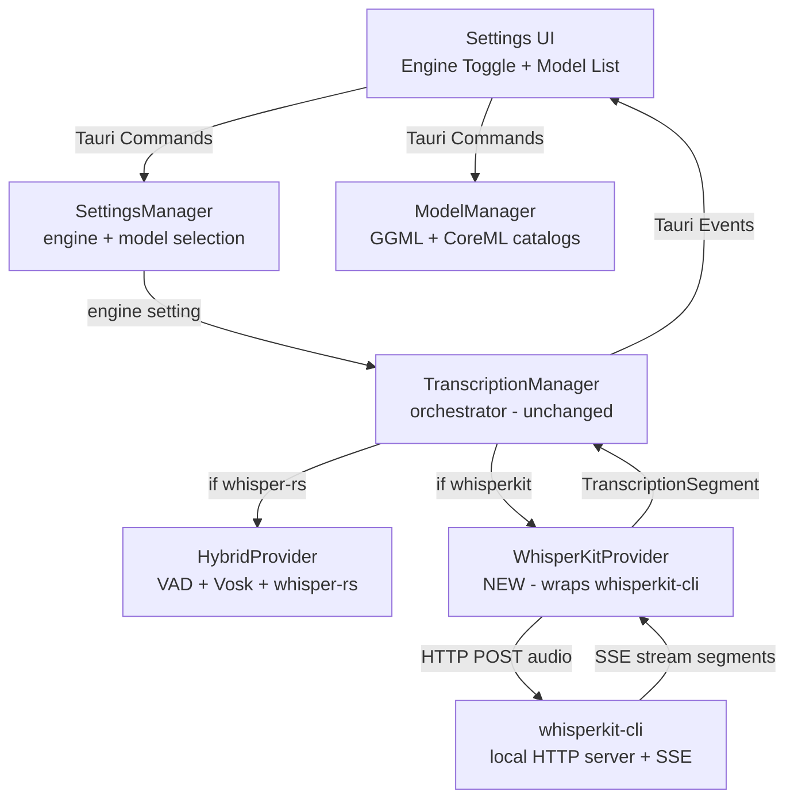

# Design Document: JARVIS WhisperKit Module

## Overview

The JARVIS WhisperKit Module adds WhisperKit (Apple-native ASR) as an alternative transcription engine alongside the existing whisper.cpp (whisper-rs). WhisperKit runs on the Apple Neural Engine via CoreML, providing ~2% WER and ~1.7s confirmed latency versus ~5-6% WER and ~3-5s with whisper.cpp.

The integration uses `whisperkit-cli` as a sidecar process running a local HTTP server. The existing `TranscriptionProvider` trait enables clean engine swapping without changing the `TranscriptionManager` orchestration.

## Architecture

### Component Diagram



### Data Flow (WhisperKit Mode)

1. **App Startup**:
   - SettingsManager loads `transcription_engine` from settings
   - If `"whisperkit"`: Create WhisperKitProvider instead of HybridProvider
   - WhisperKitProvider checks for whisperkit-cli binary
   - If not found: fall back to HybridProvider, log warning

2. **Recording Start → Transcription**:
   - RecordingManager spawns JarvisListen sidecar (unchanged)
   - AudioRouter feeds PCM chunks to TranscriptionManager (unchanged)
   - AudioBuffer accumulates 5s windows (unchanged)
   - TranscriptionManager calls `provider.transcribe(audio)`:
     - **whisper-rs path**: HybridProvider → VAD → Vosk → Whisper (existing)
     - **whisperkit path**: WhisperKitProvider → HTTP POST → whisperkit-cli → SSE response

3. **WhisperKit Transcription Flow**:
   - WhisperKitProvider converts f32 audio to WAV bytes (in-memory)
   - POST to `http://localhost:{port}/v1/audio/transcriptions`
   - whisperkit-cli returns JSON with transcription segments
   - WhisperKitProvider maps response to `Vec<TranscriptionSegment>`
   - TranscriptionManager emits events to frontend (unchanged)

### Engine Switching (Startup Only)

```
lib.rs setup():
  settings = SettingsManager.get()

  if settings.transcription_engine == "whisperkit":
      provider = WhisperKitProvider::new()
      if provider.is_available():
          provider.initialize(config)  // starts whisperkit-cli server
      else:
          log("WhisperKit unavailable, falling back to whisper-rs")
          provider = HybridProvider::new(settings)
          provider.initialize(config)
  else:
      provider = HybridProvider::new(settings)
      provider.initialize(config)

  TranscriptionManager::new(Box::new(provider), app_handle)
```

## Components and Interfaces

### WhisperKitProvider (Rust) — NEW

**Location**: `jarvis-app/src-tauri/src/transcription/whisperkit_provider.rs`

**Responsibilities**:
- Manage whisperkit-cli sidecar lifecycle (start server, health check, shutdown)
- Convert audio to WAV format for HTTP transport
- Send audio to local server, parse JSON response
- Map WhisperKit output to TranscriptionSegment
- Detect availability (binary exists, Apple Silicon, macOS 14+)

**Structure**:
```rust
use std::path::PathBuf;
use std::error::Error;
use std::process::{Child, Command};
use crate::transcription::provider::{TranscriptionProvider, TranscriptionSegment, TranscriptionConfig};

pub struct WhisperKitProvider {
    /// whisperkit-cli child process (the local HTTP server)
    server_process: Option<Child>,
    /// Port the server is listening on
    server_port: u16,
    /// Path to whisperkit-cli binary
    cli_path: Option<PathBuf>,
    /// Selected CoreML model name
    model_name: String,
    /// Whether the provider is available
    available: bool,
    /// Reason if not available
    unavailable_reason: Option<String>,
    /// HTTP client for sending requests
    client: reqwest::blocking::Client,
}
```

**Key Methods**:
```rust
impl WhisperKitProvider {
    /// Create a new WhisperKitProvider
    /// Checks for whisperkit-cli binary and system requirements
    pub fn new(model_name: &str) -> Self;

    /// Check if WhisperKit can run on this system
    /// Returns (available, reason_if_not)
    pub fn is_available(&self) -> bool;

    /// Get reason why WhisperKit is unavailable
    pub fn unavailable_reason(&self) -> Option<&str>;

    /// Find whisperkit-cli binary path
    /// Checks: bundled sidecar path, /opt/homebrew/bin/, /usr/local/bin/, PATH
    fn find_cli() -> Option<PathBuf>;

    /// Check if running on Apple Silicon
    fn is_apple_silicon() -> bool;

    /// Check if macOS version is 14.0+
    fn is_macos_14_or_later() -> bool;

    /// Start the whisperkit-cli local server
    fn start_server(&mut self, model_path: &PathBuf) -> Result<(), Box<dyn Error>>;

    /// Wait for server to become ready (poll health endpoint)
    fn wait_for_server(&self, timeout_secs: u64) -> Result<(), Box<dyn Error>>;

    /// Stop the server process
    fn stop_server(&mut self);

    /// Convert f32 audio samples to WAV bytes (in-memory)
    fn audio_to_wav(audio: &[f32], sample_rate: u32) -> Vec<u8>;

    /// Find available TCP port
    fn find_available_port() -> u16;
}

impl TranscriptionProvider for WhisperKitProvider {
    fn name(&self) -> &str { "whisperkit" }

    fn initialize(&mut self, config: &TranscriptionConfig) -> Result<(), Box<dyn Error>> {
        // Start whisperkit-cli serve --port {port} --model-path {model}
        // Wait for health check
    }

    fn transcribe(&mut self, audio: &[f32]) -> Result<Vec<TranscriptionSegment>, Box<dyn Error>> {
        // Convert audio to WAV
        // POST to localhost:{port}/v1/audio/transcriptions
        // Parse JSON response
        // Map to TranscriptionSegment
    }
}

impl Drop for WhisperKitProvider {
    fn drop(&mut self) {
        self.stop_server(); // Prevent orphaned processes
    }
}
```

**HTTP API (whisperkit-cli server)**:
```
POST /v1/audio/transcriptions
Content-Type: multipart/form-data
Body: file=@audio.wav, model={model_name}

Response (JSON):
{
  "text": "full transcription text",
  "segments": [
    {
      "text": "segment text",
      "start": 0.0,
      "end": 2.5
    }
  ]
}
```

**Segment Mapping**:
```rust
// WhisperKit response segment → TranscriptionSegment
TranscriptionSegment {
    text: segment.text,
    start_ms: (segment.start * 1000.0) as i64,
    end_ms: (segment.end * 1000.0) as i64,
    is_final: true,  // whisperkit-cli batch mode returns final segments
}
```

### Settings Changes

**Location**: `jarvis-app/src-tauri/src/settings/manager.rs`

**New Fields in TranscriptionSettings**:
```rust
#[derive(Debug, Clone, Serialize, Deserialize)]
pub struct TranscriptionSettings {
    // Existing fields (unchanged)
    pub vad_enabled: bool,
    pub vad_threshold: f32,
    pub vosk_enabled: bool,
    pub whisper_enabled: bool,
    pub whisper_model: String,

    // NEW fields
    /// Transcription engine: "whisper-rs" or "whisperkit"
    #[serde(default = "default_engine")]
    pub transcription_engine: String,

    /// WhisperKit CoreML model name
    #[serde(default = "default_whisperkit_model")]
    pub whisperkit_model: String,
}

fn default_engine() -> String { "whisper-rs".to_string() }
fn default_whisperkit_model() -> String { "openai_whisper-large-v3_turbo".to_string() }
```

**Updated settings.json**:
```json
{
  "transcription": {
    "vad_enabled": true,
    "vad_threshold": 0.5,
    "vosk_enabled": true,
    "whisper_enabled": true,
    "whisper_model": "ggml-large-v3-q5_0.bin",
    "transcription_engine": "whisper-rs",
    "whisperkit_model": "openai_whisper-large-v3_turbo"
  }
}
```

**Serde Defaults**: The `#[serde(default)]` attribute ensures existing settings files without the new fields load correctly (backward compatible).

### ModelManager Changes

**Location**: `jarvis-app/src-tauri/src/settings/model_manager.rs`

**New WhisperKit Model Catalog**:
```rust
struct WhisperKitModelEntry {
    name: &'static str,           // e.g. "openai_whisper-large-v3_turbo"
    display_name: &'static str,
    description: &'static str,
    size_estimate: &'static str,
    quality_tier: &'static str,
}

const WHISPERKIT_MODEL_CATALOG: &[WhisperKitModelEntry] = &[
    WhisperKitModelEntry {
        name: "openai_whisper-large-v3_turbo",
        display_name: "Large V3 Turbo",
        description: "Best speed/accuracy balance. Recommended.",
        size_estimate: "~1.5 GB",
        quality_tier: "great",
    },
    WhisperKitModelEntry {
        name: "openai_whisper-large-v3_turbo_632MB",
        display_name: "Large V3 Turbo (Compressed)",
        description: "ANE-optimized compressed. Fastest large model.",
        size_estimate: "~632 MB",
        quality_tier: "great",
    },
    WhisperKitModelEntry {
        name: "openai_whisper-large-v3",
        display_name: "Large V3",
        description: "Highest accuracy. Slower than turbo.",
        size_estimate: "~3.1 GB",
        quality_tier: "best",
    },
    WhisperKitModelEntry {
        name: "openai_whisper-large-v3_947MB",
        display_name: "Large V3 (Compressed)",
        description: "ANE-optimized compressed. Best accuracy in compact form.",
        size_estimate: "~947 MB",
        quality_tier: "best",
    },
    WhisperKitModelEntry {
        name: "openai_whisper-base.en",
        display_name: "Base (English)",
        description: "Small and fast. Good for testing.",
        size_estimate: "~145 MB",
        quality_tier: "basic",
    },
];
```

**Model Storage**:
- GGML models: `~/.jarvis/models/` (existing, unchanged)
- WhisperKit models: `~/.jarvis/models/whisperkit/` (new directory)

**Model Download**:
WhisperKit models are downloaded by `whisperkit-cli` itself (it handles the HuggingFace download and CoreML compilation). The ModelManager only needs to:
1. Check if the model directory exists in `~/.jarvis/models/whisperkit/`
2. Trigger `whisperkit-cli download --model {name}` to download
3. Report progress from CLI stdout

**New Methods**:
```rust
impl ModelManager {
    /// List WhisperKit CoreML models with status
    pub async fn list_whisperkit_models(&self) -> Result<Vec<ModelInfo>, String>;

    /// Download a WhisperKit model via whisperkit-cli
    pub async fn download_whisperkit_model(&self, model_name: String) -> Result<(), String>;

    /// Check if a WhisperKit model is downloaded
    fn whisperkit_model_exists(&self, model_name: &str) -> bool;
}
```

### Frontend Types Changes

**Location**: `jarvis-app/src/state/types.ts`

**New/Updated Types**:
```typescript
/** Updated TranscriptionSettings */
export interface TranscriptionSettings {
  vad_enabled: boolean;
  vad_threshold: number;
  vosk_enabled: boolean;
  whisper_enabled: boolean;
  whisper_model: string;
  transcription_engine: "whisper-rs" | "whisperkit";  // NEW
  whisperkit_model: string;                            // NEW
}

/** WhisperKit availability info */
export interface WhisperKitStatus {
  available: boolean;
  reason?: string;  // e.g. "whisperkit-cli not found", "Requires Apple Silicon"
}
```

### Settings UI Changes

**Location**: `jarvis-app/src/components/Settings.tsx`

**New Engine Section** (rendered above existing model section):
```typescript
// New section in Settings component
<section className="settings-section">
  <h3>Transcription Engine</h3>

  <div className="engine-options">
    <label className="engine-option">
      <input
        type="radio"
        name="engine"
        value="whisper-rs"
        checked={settings.transcription.transcription_engine === "whisper-rs"}
        onChange={() => updateEngine("whisper-rs")}
      />
      <div>
        <strong>whisper.cpp (Metal GPU)</strong>
        <p>Cross-platform. Uses GGML models. Current default.</p>
      </div>
    </label>

    <label className={`engine-option ${!whisperKitStatus.available ? 'disabled' : ''}`}>
      <input
        type="radio"
        name="engine"
        value="whisperkit"
        checked={settings.transcription.transcription_engine === "whisperkit"}
        onChange={() => updateEngine("whisperkit")}
        disabled={!whisperKitStatus.available}
      />
      <div>
        <strong>WhisperKit (Apple Neural Engine)</strong>
        <p>Apple Silicon only. ~2% WER, ~1.7s latency. Recommended.</p>
        {!whisperKitStatus.available && (
          <p className="engine-unavailable">{whisperKitStatus.reason}</p>
        )}
      </div>
    </label>
  </div>

  <p className="engine-note">Engine changes take effect after app restart.</p>
</section>

// Conditionally show model list based on engine
{settings.transcription.transcription_engine === "whisperkit" ? (
  <ModelList models={whisperKitModels} ... />
) : (
  <ModelList models={ggmlModels} ... />
)}
```

### Tauri Commands — NEW

**Location**: `jarvis-app/src-tauri/src/commands.rs`

```rust
/// Check if WhisperKit is available on this system
#[tauri::command]
pub fn check_whisperkit_status() -> Result<WhisperKitStatus, String> {
    // Check: Apple Silicon, macOS 14+, whisperkit-cli binary
}

/// List available WhisperKit CoreML models
#[tauri::command]
pub async fn list_whisperkit_models(
    state: State<'_, Arc<ModelManager>>,
) -> Result<Vec<ModelInfo>, String> {
    state.list_whisperkit_models().await
}

/// Download a WhisperKit CoreML model
#[tauri::command]
pub async fn download_whisperkit_model(
    model_name: String,
    state: State<'_, Arc<ModelManager>>,
) -> Result<(), String> {
    state.download_whisperkit_model(model_name).await
}
```

### lib.rs Changes

**Location**: `jarvis-app/src-tauri/src/lib.rs`

**Engine Selection at Startup**:
```rust
// In setup():
let settings = settings_manager.read().expect("lock").get();
let transcription_config = TranscriptionConfig::from_settings(&settings.transcription);

let provider: Box<dyn TranscriptionProvider> = match settings.transcription.transcription_engine.as_str() {
    "whisperkit" => {
        let mut wk = WhisperKitProvider::new(&settings.transcription.whisperkit_model);
        if wk.is_available() {
            match wk.initialize(&transcription_config) {
                Ok(()) => {
                    eprintln!("Using WhisperKit engine");
                    Box::new(wk)
                }
                Err(e) => {
                    eprintln!("WhisperKit init failed: {}. Falling back to whisper-rs.", e);
                    let mut hp = HybridProvider::new(&settings.transcription, app.handle().clone());
                    hp.initialize(&transcription_config)?;
                    Box::new(hp)
                }
            }
        } else {
            eprintln!("WhisperKit unavailable: {}. Falling back to whisper-rs.",
                      wk.unavailable_reason().unwrap_or("unknown"));
            let mut hp = HybridProvider::new(&settings.transcription, app.handle().clone());
            hp.initialize(&transcription_config)?;
            Box::new(hp)
        }
    }
    _ => {
        let mut hp = HybridProvider::new(&settings.transcription, app.handle().clone());
        hp.initialize(&transcription_config)?;
        Box::new(hp)
    }
};

let transcription_manager = TranscriptionManager::new(provider, app.handle().clone());
```

## Data Models

### WhisperKit Server Response

```json
{
  "text": "Hello, this is a test transcription.",
  "segments": [
    {
      "id": 0,
      "text": " Hello, this is a test transcription.",
      "start": 0.0,
      "end": 2.48,
      "tokens": [50364, 2425, 11, ...],
      "avg_logprob": -0.234,
      "no_speech_prob": 0.012
    }
  ]
}
```

### WhisperKit Status Response

```rust
#[derive(Debug, Clone, Serialize, Deserialize)]
pub struct WhisperKitStatus {
    pub available: bool,
    pub reason: Option<String>,
}
```

### File System Layout

```
~/.jarvis/
├── settings.json                          # Updated with engine + whisperkit_model
├── models/
│   ├── ggml-large-v3-q5_0.bin           # Existing GGML models
│   ├── ggml-base.en.bin
│   └── whisperkit/                       # NEW - WhisperKit CoreML models
│       ├── openai_whisper-large-v3_turbo/
│       │   ├── AudioEncoder.mlmodelc/
│       │   ├── TextDecoder.mlmodelc/
│       │   └── ...
│       └── openai_whisper-base.en/
```

## Correctness Properties

### Property 1: Engine Setting Persistence

*For any* engine selection (`"whisper-rs"` or `"whisperkit"`), the setting SHALL persist to `settings.json` and load correctly on next startup.

**Validates: Requirements 1.1, 1.2**

### Property 2: Backward Compatibility

*For any* existing `settings.json` without `transcription_engine` field, the system SHALL default to `"whisper-rs"` and continue functioning.

**Validates: Requirements 1.2**

### Property 3: Provider Trait Compliance

*For any* audio input, WhisperKitProvider::transcribe() SHALL return `Result<Vec<TranscriptionSegment>, Box<dyn Error>>` matching the TranscriptionProvider trait contract.

**Validates: Requirements 3.1, 3.3**

### Property 4: Segment Format Consistency

*For any* TranscriptionSegment returned by WhisperKitProvider, the `start_ms` and `end_ms` SHALL be non-negative integers representing milliseconds, and `text` SHALL be non-empty.

**Validates: Requirements 3.3, 3.4, 3.5**

### Property 5: Server Lifecycle

*For any* WhisperKitProvider instance, the whisperkit-cli process SHALL be started in `initialize()` and stopped in `Drop`, with no orphaned processes.

**Validates: Requirements 2.3, 2.5, 2.7**

### Property 6: Graceful Fallback

*For any* WhisperKit failure during initialization, the system SHALL fall back to HybridProvider without crashing.

**Validates: Requirements 7.1, 7.2, 7.3**

### Property 7: Availability Detection

*For any* system where whisperkit-cli is not installed, `is_available()` SHALL return `false` with a reason string.

**Validates: Requirements 5.1, 5.2, 5.3**

### Property 8: Model Catalog Separation

*For any* model listing, GGML models and CoreML models SHALL not be mixed — each engine has its own catalog.

**Validates: Requirements 4.1, 4.3**

### Property 9: Engine Selection UI State

*For any* engine selection in the UI, only the model list for the selected engine SHALL be visible.

**Validates: Requirements 6.3, 6.4**

### Property 10: No Runtime Engine Swap

*For any* engine change in settings, the active TranscriptionManager provider SHALL NOT change until app restart.

**Validates: Requirements 1.6**

## Error Handling

### Server Errors

1. **CLI Not Found**: Set `available = false`, reason = "whisperkit-cli not found. Install: brew install whisperkit-cli"
2. **Server Start Failure**: Fall back to HybridProvider, emit transcription-error event
3. **Health Check Timeout**: Fall back to HybridProvider, log timeout duration
4. **HTTP Request Failure**: Return transcription error, TranscriptionManager continues with next window
5. **Invalid JSON Response**: Log error, return empty segments for this window
6. **Server Crash**: Detect via process exit, emit transcription-error, set status to Error

### Model Errors

1. **Model Not Downloaded**: Return error from initialize(), trigger fallback
2. **CoreML Compilation Slow**: First run may take 2-4 minutes (ANE compiles model). Log progress.
3. **Insufficient Disk Space**: Return error from download

## Testing Strategy

### Unit Tests

- **WhisperKitProvider**:
  - Test `is_available()` returns false when CLI not found
  - Test `is_apple_silicon()` detection
  - Test `audio_to_wav()` conversion produces valid WAV header
  - Test `find_cli()` searches expected paths
  - Test provider name returns `"whisperkit"`
  - Test transcribe returns error when not initialized

- **Settings**:
  - Test default `transcription_engine` is `"whisper-rs"`
  - Test backward compatibility with old settings.json (no new fields)
  - Test validation of engine values

- **ModelManager**:
  - Test WhisperKit model catalog has expected entries
  - Test WhisperKit models stored in separate directory
  - Test model existence check

### Integration Tests

- Test full engine selection flow: setting → provider creation → fallback
- Test WhisperKit server start/stop lifecycle (requires whisperkit-cli installed)
- Test audio transcription round-trip (requires whisperkit-cli + model)

### Manual Testing

1. Install whisperkit-cli: `brew install whisperkit-cli`
2. Open Settings → verify engine toggle shows both options
3. Select WhisperKit → verify CoreML model list appears
4. Download a model → verify progress and completion
5. Restart app → start recording → verify transcription works
6. Uninstall whisperkit-cli → restart → verify fallback to whisper-rs
7. Verify no orphaned processes after app exit
