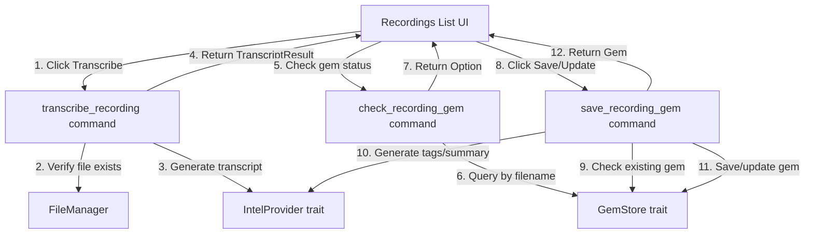

# Design: Transcribe Recordings from Recordings List

## Overview

This feature adds the ability to transcribe raw PCM recording files directly from the recordings list UI, without requiring a gem to exist first. Users can transcribe any recording with a single click, review the transcript inline, and then optionally save it as a gem (or update an existing gem if one was previously created for that recording).

The feature introduces three new backend commands (`transcribe_recording`, `check_recording_gem`, `save_recording_gem`), extends the `GemStore` trait with a new query method, and adds UI components to the recordings list for transcription and gem management.

### Key Design Goals

1. **Decouple transcription from gem creation**: Users can transcribe recordings without committing to saving them as gems
2. **Avoid duplicate gems**: The system detects existing gems for recordings and offers "Update Gem" instead of "Save as Gem"
3. **Graceful degradation**: Transcription and gem saving work even when AI enrichment (tags/summary) is unavailable
4. **Deterministic gem URLs**: Use `jarvis://recording/{filename}` (not timestamp) for idempotent upsert behavior

## Architecture

### Component Diagram



### Data Flow

1. **Transcription Flow**:
   - User clicks "Transcribe" button on a recording row
   - Frontend calls `transcribe_recording(filename)`
   - Backend constructs full path: `dirs::data_dir()/com.jarvis.app/recordings/{filename}`
   - Backend verifies IntelProvider availability and file existence
   - Backend calls `provider.generate_transcript(path)` (MLX Omni)
   - Backend returns `TranscriptResult { language, transcript }` to frontend
   - Frontend displays transcript inline below the recording row

2. **Gem Status Check Flow**:
   - Frontend collects all recording filenames on mount
   - Frontend calls `check_recording_gems_batch(filenames)` once with all filenames
   - Backend queries `GemStore.find_by_recording_filename(filename)` for each filename
   - Backend returns `HashMap<String, GemPreview>` mapping filenames to gem previews
   - Frontend displays gem indicator icon for recordings that have entries in the map

3. **Gem Save/Update Flow**:
   - User clicks "Save as Gem" or "Update Gem" after transcription
   - Frontend calls `save_recording_gem(filename, transcript, language, created_at)` with transcript data and recording timestamp
   - Backend checks for existing gem via `find_by_recording_filename`
   - If gem exists: fetch full gem, update transcript/language, regenerate tags/summary, save
   - If gem doesn't exist: create new gem with deterministic URL `jarvis://recording/{filename}`, format title from `created_at` timestamp, populate transcript, generate tags/summary, save
   - Backend returns saved/updated `Gem` to frontend
   - Frontend updates gem status indicator

## Components and Interfaces

### Backend Commands

#### 1. `transcribe_recording` Command

```rust
#[tauri::command]
pub async fn transcribe_recording(
    filename: String,
    intel_provider: State<'_, Arc<dyn IntelProvider>>,
) -> Result<TranscriptResult, String>
```

**Responsibilities**:
- Construct full recording path from filename
- Verify IntelProvider availability
- Verify recording file exists on disk
- Call `provider.generate_transcript(path)`
- Return transcript result (no gem interaction)

**Error Handling**:
- Provider unavailable: `Err("AI provider not available: {reason}")`
- File not found: `Err("Recording file not found: {path}")`
- Provider doesn't support transcription: `Err("Current AI provider does not support transcription")`

#### 2. `check_recording_gem` Command

```rust
#[tauri::command]
pub async fn check_recording_gem(
    filename: String,
    gem_store: State<'_, Arc<dyn GemStore>>,
) -> Result<Option<GemPreview>, String>
```

**Responsibilities**:
- Query gem store for gems with matching `source_meta.recording_filename`
- Return gem preview if found, None otherwise

**Note**: This command is used for individual checks (e.g., after transcription to determine button label). For initial mount, use `check_recording_gems_batch` instead.

#### 2b. `check_recording_gems_batch` Command

```rust
#[tauri::command]
pub async fn check_recording_gems_batch(
    filenames: Vec<String>,
    gem_store: State<'_, Arc<dyn GemStore>>,
) -> Result<HashMap<String, GemPreview>, String>
```

**Responsibilities**:
- Query gem store for all recordings in batch
- Return HashMap mapping filename to GemPreview for recordings that have gems
- Recordings without gems are not included in the map

**Performance**: Single command invocation for all recordings, avoiding N+1 query problem on mount.

#### 3. `save_recording_gem` Command

```rust
#[tauri::command]
pub async fn save_recording_gem(
    filename: String,
    transcript: String,
    language: String,
    created_at: u64,  // Unix timestamp (seconds) from RecordingMetadata
    gem_store: State<'_, Arc<dyn GemStore>>,
    intel_provider: State<'_, Arc<dyn IntelProvider>>,
    settings_manager: State<'_, Arc<RwLock<SettingsManager>>>,
) -> Result<Gem, String>
```

**Responsibilities**:
- Check for existing gem via `find_by_recording_filename`
- If exists: update transcript, regenerate tags/summary, save
- If not exists: create new gem with deterministic URL, populate transcript, generate tags/summary, save
- Handle graceful degradation when AI enrichment unavailable

**Gem Creation Fields** (when no gem exists):
- `id`: new UUID v4
- `source_url`: `jarvis://recording/{filename}` (deterministic)
- `domain`: `"jarvis-app"`
- `source_type`: `"Other"`
- `title`: `"Audio Transcript - {formatted_timestamp}"` (formatted from `created_at` parameter using `chrono::DateTime::from_timestamp`)
- `content`: `None` (no Whisper real-time transcript)
- `source_meta`: `{ "recording_filename": "{filename}", "source": "recording_transcription" }`
- `transcript`: provided transcript string
- `transcript_language`: provided language string
- `ai_enrichment`: generated tags/summary (or None if unavailable)

### GemStore Trait Extension

```rust
#[async_trait]
pub trait GemStore: Send + Sync {
    // ... existing methods ...
    
    /// Find a gem by recording filename
    /// 
    /// Searches for gems where source_meta.recording_filename matches the provided filename.
    /// If multiple gems exist for the same recording (edge case), returns the most recent one.
    async fn find_by_recording_filename(&self, filename: &str) -> Result<Option<GemPreview>, String>;
}
```

### SqliteGemStore Implementation

```rust
async fn find_by_recording_filename(&self, filename: &str) -> Result<Option<GemPreview>, String> {
    let conn = self.conn.lock()
        .map_err(|e| format!("Failed to acquire lock: {}", e))?;
    
    let mut stmt = conn.prepare(
        "SELECT id, source_type, source_url, domain, title, author, 
            description, content, source_meta, captured_at, ai_enrichment, transcript, transcript_language
        FROM gems
        WHERE json_extract(source_meta, '$.recording_filename') = ?1
        ORDER BY captured_at DESC
        LIMIT 1"
    ).map_err(|e| format!("Failed to prepare query: {}", e))?;
    
    let result = stmt.query_row(params![filename], Self::row_to_gem)
        .optional()
        .map_err(|e| format!("Failed to query gem: {}", e))?;
    
    Ok(result.map(|gem| Self::gem_to_preview(&gem)))
}
```

**Query Logic**:
- Uses `json_extract(source_meta, '$.recording_filename')` to search JSON field
- Orders by `captured_at DESC` to handle edge case of duplicate recording filenames
- Returns most recent gem if multiple exist
- Uses existing helper methods `row_to_gem` and `gem_to_preview` from SqliteGemStore

### Frontend UI Components

#### Recordings List Enhancements

**State Management**:
```typescript
interface RecordingState {
  filename: string;
  metadata: RecordingMetadata;
  transcribing: boolean;
  transcript?: TranscriptResult;
  transcriptError?: string;
  hasGem: boolean;
  savingGem: boolean;
  gemSaved: boolean;
  gemError?: string;
}

// On mount, fetch gem status for all recordings in batch
// Rust HashMap<String, GemPreview> deserializes to plain JS object
const gemStatusMap: Record<string, GemPreview> = await invoke('check_recording_gems_batch', { 
  filenames: recordings.map(r => r.filename) 
});

// Set hasGem for each recording based on batch result
recordings.forEach(recording => {
  recording.hasGem = recording.filename in gemStatusMap;
});

// When saving a gem, pass the created_at timestamp from metadata
await invoke('save_recording_gem', {
  filename: recording.filename,
  transcript: recording.transcript.transcript,
  language: recording.transcript.language,
  created_at: recording.metadata.created_at  // Unix timestamp (seconds)
});
```

**UI Elements**:
1. **Transcribe Button**: Shown when AI available, disabled during transcription
2. **Transcript Display**: Inline text area below recording row (shown after transcription)
3. **Save/Update Gem Button**: Shown after successful transcription, label depends on `hasGem` status
4. **Gem Status Indicator**: Small icon/badge on recording row when gem exists
5. **Loading States**: Spinners for transcription and gem save operations
6. **Error Messages**: Inline error display for failed operations

## Data Models

### TranscriptResult (existing)

```rust
#[derive(Debug, Clone, Serialize, Deserialize)]
pub struct TranscriptResult {
    pub language: String,
    pub transcript: String,
}
```

### RecordingMetadata (existing)

```typescript
interface RecordingMetadata {
  filename: string;
  size_bytes: number;
  created_at: number;        // Unix timestamp (seconds)
  duration_seconds: number;  // Non-optional
}
```

### Gem (existing, no changes)

The `Gem` struct already has `transcript` and `transcript_language` fields added in previous features. No schema changes needed.

### GemPreview (existing, no changes)

Already includes `transcript_language` field for displaying language in previews.

## Correctness Properties

*A property is a characteristic or behavior that should hold true across all valid executions of a system—essentially, a formal statement about what the system should do. Properties serve as the bridge between human-readable specifications and machine-verifiable correctness guarantees.*

### Property 1: Transcription Isolation

*For any* recording filename and transcription operation, calling `transcribe_recording` should not create, modify, or delete any gems in the gem store.

**Validates: Requirements 1.3**

### Property 2: Transcription Path Construction

*For any* valid recording filename, `transcribe_recording` should construct the full path as `dirs::data_dir()/com.jarvis.app/recordings/{filename}` before attempting transcription.

**Validates: Requirements 1.2**

### Property 3: Recording Filename Query Correctness

*For any* recording filename, if a gem exists with `source_meta.recording_filename` equal to that filename, then `find_by_recording_filename` should return that gem; otherwise it should return None.

**Validates: Requirements 2.2**

### Property 4: Save Recording Gem Checks Existing

*For any* call to `save_recording_gem`, the command should first call `find_by_recording_filename` to check for an existing gem before deciding whether to create or update.

**Validates: Requirements 3.2**

### Property 5: Update Existing Gem Preserves ID

*For any* recording that already has an associated gem, calling `save_recording_gem` should update the existing gem's transcript and ai_enrichment fields while preserving the original gem ID and source_url.

**Validates: Requirements 3.3**

### Property 6: Create New Gem Uses Deterministic URL

*For any* recording without an existing gem, calling `save_recording_gem` should create a new gem with `source_url = "jarvis://recording/{filename}"` (deterministic, not timestamp-based).

**Validates: Requirements 3.4**

### Property 7: Save Returns Saved Gem

*For any* call to `save_recording_gem`, the returned `Gem` should match the gem that was saved to the store (verifiable by querying the store with the returned gem's ID).

**Validates: Requirements 3.5**

### Property 8: Transcribe Button Disabled During Operation

*For any* recording being transcribed, the Transcribe button should be disabled until the transcription completes (success or failure).

**Validates: Requirements 4.5**

### Property 9: Button Label Reflects Gem Status

*For any* recording with an existing gem, after transcription completes, the button label should be "Update Gem"; for recordings without an existing gem, the label should be "Save as Gem".

**Validates: Requirements 5.2**

### Property 10: Save Operation Updates UI State

*For any* successful gem save or update operation, the UI should update the gem status indicator to reflect that the recording now has an associated gem.

**Validates: Requirements 5.4**

### Property 11: Gem Status Check After Transcription

*For any* completed transcription, the system should call `check_recording_gem` to determine the correct button label before displaying the save button.

**Validates: Requirements 5.5**

### Property 12: Gem Indicator Reflects Gem Existence

*For any* recording with an associated gem, the recordings list should display a gem indicator icon; for recordings without a gem, no indicator should be displayed.

**Validates: Requirements 6.2, 6.3**

### Property 13: Gem Indicator Updates After Save

*For any* gem save or update operation, the gem status indicator for that recording should update to reflect the new state.

**Validates: Requirements 6.5**

## Error Handling

### Backend Error Scenarios

1. **Provider Unavailable** (transcribe_recording):
   - Check: `intel_provider.check_availability().await`
   - Error: `"AI provider not available: {reason}"`
   - Frontend: Display error message inline, disable Transcribe button

2. **File Not Found** (transcribe_recording):
   - Check: `recording_path.exists()`
   - Error: `"Recording file not found: {path}"`
   - Frontend: Display error message, suggest refreshing recordings list

3. **Provider Doesn't Support Transcription** (transcribe_recording):
   - Check: Provider returns "not supported" error
   - Error: `"Current AI provider does not support transcription"`
   - Frontend: Display error, suggest switching to MLX provider in settings

4. **Transcription Timeout** (transcribe_recording):
   - Timeout: 120 seconds (inherited from MlxProvider)
   - Error: Propagated from provider
   - Frontend: Display timeout error, suggest trying again

5. **Gem Not Found** (save_recording_gem update path):
   - Check: `gem_store.get(&id).await?`
   - Error: `"Gem with id '{id}' not found"`
   - Frontend: Fall back to create flow (should not happen in normal operation)

6. **AI Enrichment Unavailable** (save_recording_gem):
   - Check: `intel_provider.check_availability().await`
   - Behavior: Graceful degradation - save gem with transcript but `ai_enrichment = None`
   - Frontend: Display success with note that tags/summary unavailable

### Frontend Error Handling

1. **Network/IPC Errors**:
   - Catch all `invoke()` errors
   - Display user-friendly error messages
   - Provide retry buttons where appropriate

2. **State Consistency**:
   - Reset loading states on error
   - Clear error messages when retrying operations
   - Maintain transcript data even if gem save fails (allow retry)

3. **Validation**:
   - Ensure transcript exists before enabling Save button
   - Verify filename is valid before calling commands

## Testing Strategy

### Unit Tests

**Backend (Rust)**:
1. Test `transcribe_recording` command with mock IntelProvider
2. Test `check_recording_gem` command with in-memory GemStore
3. Test `save_recording_gem` create flow (no existing gem)
4. Test `save_recording_gem` update flow (existing gem)
5. Test `find_by_recording_filename` SQL query logic
6. Test error handling for each command (provider unavailable, file not found, etc.)
7. Test graceful degradation when AI enrichment unavailable

**Frontend (TypeScript)**:
1. Test Transcribe button visibility based on AI availability
2. Test button state management during transcription
3. Test transcript display after successful transcription
4. Test error message display on transcription failure
5. Test Save/Update button label logic based on gem status
6. Test gem indicator rendering based on gem existence
7. Test state updates after gem save/update

### Property-Based Tests

Each property test should run minimum 100 iterations and be tagged with:
**Feature: transcribe-recordings, Property {number}: {property_text}**

**Property 1: Transcription Isolation**
- Generate: random recording filenames, random gem stores with existing gems
- Test: call `transcribe_recording`, verify gem store unchanged (count, IDs, content)
- Library: proptest (Rust)

**Property 2: Transcription Path Construction**
- Generate: random valid filenames
- Test: verify constructed path matches `dirs::data_dir()/com.jarvis.app/recordings/{filename}`
- Library: proptest (Rust)

**Property 3: Recording Filename Query Correctness**
- Generate: random filenames, random gems with/without matching recording_filename
- Test: `find_by_recording_filename` returns gem if and only if matching gem exists
- Library: proptest (Rust)

**Property 4: Save Recording Gem Checks Existing**
- Generate: random filenames, transcripts, languages
- Test: verify `find_by_recording_filename` is called before create/update decision
- Library: proptest (Rust) with mock GemStore

**Property 5: Update Existing Gem Preserves ID**
- Generate: random existing gems, random new transcripts
- Test: after update, gem ID and source_url unchanged, transcript updated
- Library: proptest (Rust)

**Property 6: Create New Gem Uses Deterministic URL**
- Generate: random filenames, transcripts, languages
- Test: created gem has `source_url = "jarvis://recording/{filename}"`
- Library: proptest (Rust)

**Property 7: Save Returns Saved Gem**
- Generate: random gem data
- Test: returned gem matches gem retrieved from store by ID
- Library: proptest (Rust)

**Property 8: Transcribe Button Disabled During Operation**
- Generate: random recording states
- Test: when `transcribing = true`, button should be disabled
- Library: fast-check (TypeScript) with React Testing Library

**Property 9: Button Label Reflects Gem Status**
- Generate: random recording states with/without gems
- Test: button label is "Update Gem" when `hasGem = true`, "Save as Gem" when `hasGem = false`
- Library: fast-check (TypeScript)

**Property 10: Save Operation Updates UI State**
- Generate: random recording states
- Test: after successful save, `hasGem` should be true and indicator visible
- Library: fast-check (TypeScript)

**Property 11: Gem Status Check After Transcription**
- Generate: random transcription results
- Test: `check_recording_gem` is called after transcription completes
- Library: fast-check (TypeScript) with mock invoke

**Property 12: Gem Indicator Reflects Gem Existence**
- Generate: random recording states with/without gems
- Test: indicator visible if and only if `hasGem = true`
- Library: fast-check (TypeScript)

**Property 13: Gem Indicator Updates After Save**
- Generate: random recording states
- Test: indicator state changes from hidden to visible after successful save
- Library: fast-check (TypeScript)

### Integration Tests

1. **End-to-End Transcription Flow**:
   - Create test recording file
   - Call `transcribe_recording`
   - Verify transcript returned
   - Verify no gem created

2. **End-to-End Gem Creation Flow**:
   - Create test recording file
   - Transcribe recording
   - Call `save_recording_gem`
   - Verify gem created with correct fields
   - Verify gem queryable by filename

3. **End-to-End Gem Update Flow**:
   - Create test recording file
   - Create existing gem for recording
   - Transcribe recording
   - Call `save_recording_gem`
   - Verify gem updated (same ID, new transcript)

4. **UI Integration Test**:
   - Render recordings list with test data
   - Simulate transcribe button click
   - Verify transcript displayed
   - Simulate save button click
   - Verify gem indicator appears

### Edge Cases

1. **Provider unavailable during transcription**: Error message displayed
2. **Recording file deleted between list and transcribe**: File not found error
3. **Provider doesn't support transcription**: Unsupported operation error
4. **Multiple gems for same recording**: Most recent gem returned
5. **AI enrichment unavailable during save**: Gem saved without tags/summary
6. **Concurrent transcription attempts**: Button disabled prevents race conditions
7. **Empty transcript returned**: Handle gracefully (save empty string)
8. **Very long transcripts**: UI should handle large text display
9. **Special characters in filename**: Path construction should handle safely
10. **Gem deleted while transcription in progress**: Save creates new gem (no error)

### Test Configuration

**Property-Based Testing**:
- Minimum iterations: 100 per property
- Shrinking enabled for failure case minimization
- Seed recording for reproducibility

**Unit Testing**:
- Mock IntelProvider for transcription tests
- In-memory SqliteGemStore for database tests
- Mock Tauri invoke for frontend tests

**Integration Testing**:
- Test database in temporary directory
- Test recording files in temporary directory
- Cleanup after each test

## Implementation Notes

### Backend Implementation Order

1. Add `find_by_recording_filename` to GemStore trait
2. Implement `find_by_recording_filename` in SqliteGemStore
3. Implement `transcribe_recording` command
4. Implement `check_recording_gem` command (individual)
5. Implement `check_recording_gems_batch` command (batch)
6. Implement `save_recording_gem` command
7. Register all commands in `lib.rs`
8. Write unit tests for each component
9. Write property-based tests
10. Write integration tests

### Frontend Implementation Order

1. Add TypeScript interfaces for new types
2. Implement batch gem status check on recordings list mount using `check_recording_gems_batch`
3. Add Transcribe button with loading state
4. Add transcript display component
5. Add Save/Update Gem button with conditional label (uses individual `check_recording_gem` after transcription)
6. Add gem status indicator
7. Wire up all event handlers
8. Add error handling and display
9. Write unit tests for components
10. Write property-based tests for state logic

### Database Considerations

- The `json_extract` query is efficient for small-to-medium gem counts (<10K gems)
- For larger datasets, consider adding a dedicated `recording_filename` column with index
- Current approach prioritizes simplicity and avoids schema migration

### Performance Considerations

- Transcription timeout: 120 seconds (MLX Omni processing time)
- Gem status checks: Batched on mount via `check_recording_gems_batch` (single command for all recordings, avoids N+1 queries)
- Individual gem checks: Use `check_recording_gem` after transcription to determine button label
- Transcript display: Consider truncation for very long transcripts (>10K chars)
- UI responsiveness: All operations async with loading states

### Security Considerations

- Path construction: Use `PathBuf::join()` to prevent path traversal
- Filename validation: Ensure filename doesn't contain path separators
- SQL injection: Use parameterized queries (already done)

### Compatibility Notes

- Requires MLX provider for transcription (IntelligenceKit and NoOp providers return "not supported")
- Requires macOS for MLX (Apple Silicon)
- Existing gems created via TranscriptDisplay use timestamp-based URLs (`jarvis://recording/{Date.now()}`), but `find_by_recording_filename` searches `source_meta.recording_filename`, so it finds them correctly
- New gems use deterministic URLs (`jarvis://recording/{filename}`) for idempotent upsert behavior
